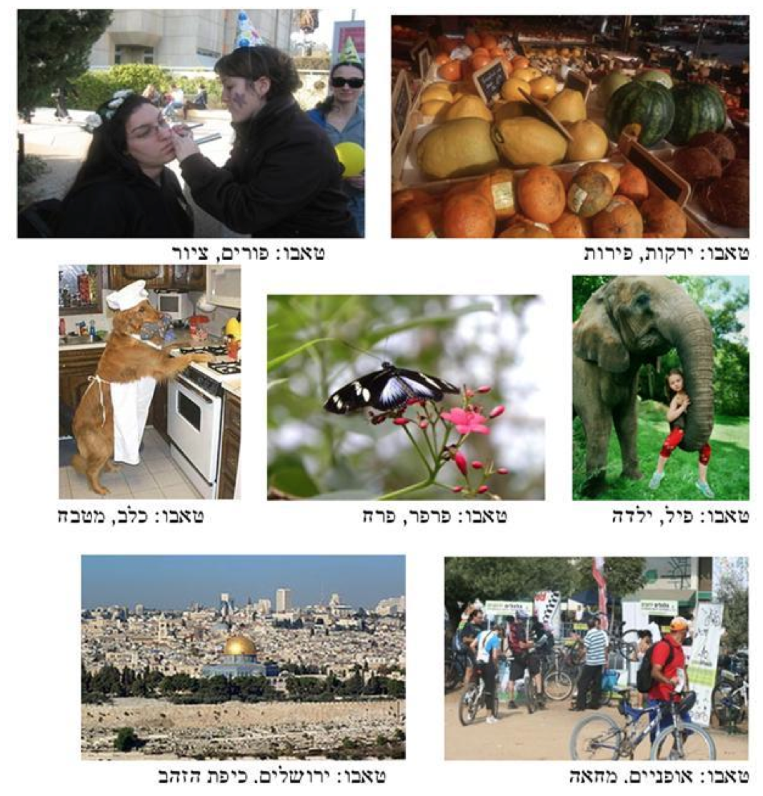
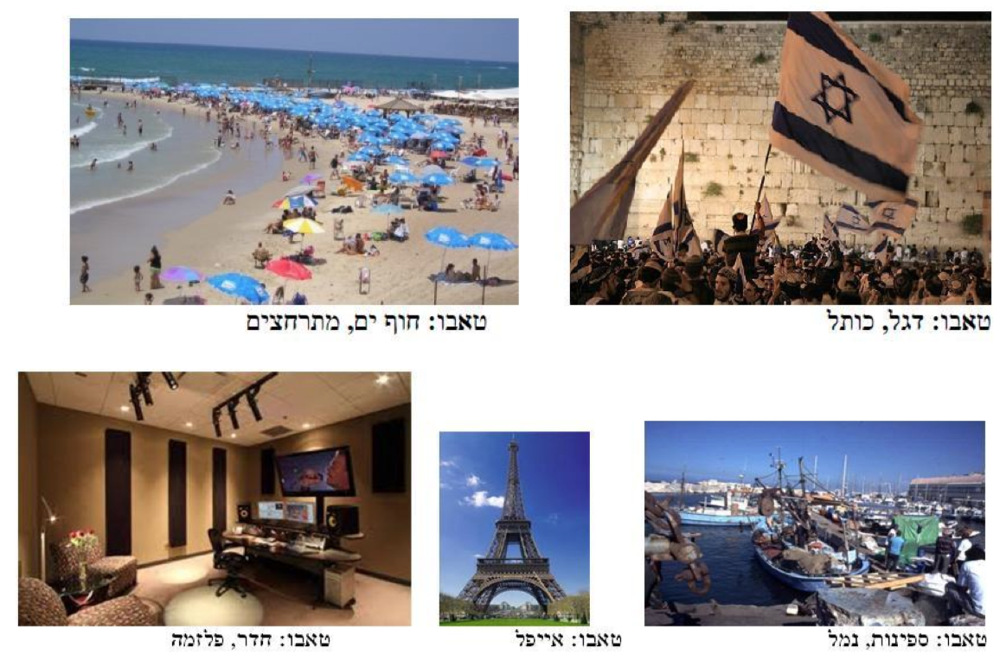

# דף פעילות מס' 1

מדריכים יקרים – אנא גזרו את התמונות הבאות.
תחילה, קפלו את מילות הטאבו לאחור ולאחר מכן הוסיפו אותם למשחק, כמפורט בהוראות.
ניתן להוסיף תמונות או להשתמש בתמונות אחרות כרצונכם.

  

  

  

