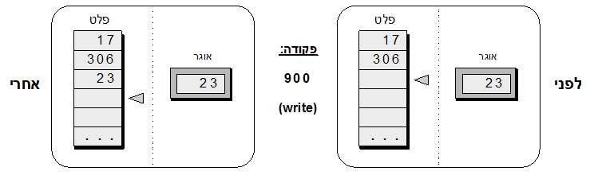

>"לראות עולם בגרגר של חול, וגן עדן בפרח בר; להחזיק אינסוף בכף ידך, ונצח ברגע שעבר" (בלייק)

# הקדמה <a href="#" data-toggle="tooltip" title="חלק מחומרי הפרק מבוססים על מודל LMC של סטוארט מדניק ופרויקט Visual Computer של שמעון שוקן."><sup>1</sup></a>
איך מחשבים עובדים? הדבר הראשון שאפשר לומר, שהוא כבר מעודד, זה שכל המחשבים עובדים באותו אופן. אם חודרים עמוק מספיק לתוך נבכי המחשב – כל מחשב – מגלים אוסף עצום של ביליוני מתגים קטנטנים. כל מתג (switch) יכול להיות באחד משני מצבים שנהוג לכנותם אפס ואחת (bits). אם רוצים, אפשר לקבץ את המתגים הללו לדבוקות של, נניח, 32 מתגים כל אחת, ולהתייחס לכל דבוקה כאל יחידה עצמאית שנהוג לכנותה "תא" (cell). כמו שלמדנו בפרק על מספרים בינאריים, ניתן לפרש תבנית של 32 אפסים ואחדים כמספר עשרוני, ולכן כל תא במחשב יכול לייצג מספר כמו 569 או -17. לכל תא כזה יש כתובת ייחודית, שהיא מספר שנע בין אפס למספר התאים הכולל, ואת אוסף כל התאים נהוג לכנות "זיכרון" (memory).

בהמשך הסיור, המטייל בנבכי המחשב יגלה רכיב שיודע לגשת לתאי זיכרון לפי כתובתם, לקרוא או לשנות את המספרים שכתובים בהם, ולבצע פעולות חשבוניות פשוטות – כל זאת לפי תוכנית שמוכתבת לו מחוץ למחשב. לרכיב הזה קוראים מעבד (processor). לבסוף, המטייל יגלה יחידות "קלט" ו- "פלט" (input/output units), דרכן אפשר להכניס ולהוציא מספרים לתוך ומתוך המחשב, בהתאמה. לכל המכלול הזה – זיכרון, מעבד, ויחידות קלט/פלט -- נהוג לקרוא "חומרה" (hardware), מלשון "חומר", כי אלה הרכיבים הפיזיים מהם המחשב עשוי.

ומה עם המסך, המקלדת, העכבר, המדפסת, ושאר רכיבי החומרה דרכם אנו מתקשרים עם המחשב?  לאלה נהוג לקרוא "רכיבים פריפריאלים" (peripheral units), כי הם לא נמצאים בתוך המחשב, אלא בפריפריה שלו. הרכיבים האלה הרבה פחות מעניינים וחשובים מהמחשב עצמו, ולכן לא נדון בהם.

נשאלת השאלה: איך אותו מחשב, שמבוסס על אוסף קבוע ומוגבל של רכיבים פשוטים להפליא, יכול לספק אינסוף חוויות רבגוניות כמו גלישה באינטרנט, משחק בטטריס, צפייה בסרטון, בניית גיליון נתונים אלקטרוני, צ'יטוט עם חברים, ומה לא? התשובה היא שהמחשב תמיד מריץ תוכנית (program) מסוימת, שנכתבה ע"י אדם מסוים, והתכנית הזאת גורמת למחשב לעשות דברים שונים ומשונים, לפי רצון האדם שכתב אותה. היופי שבסידור הזה הוא שאפשר לכתוב אינסוף תוכניות, כיד הדמיון הטובה עלינו, וכך לגרום למחשב לבצע אינסוף משימות. כותבי התכניות נקראים "מתכנתים" (programmers), האנשים שמריצים את התכניות על המחשב ונהנים משירותיהן נקראים "משתמשים" (users), ואוסף כל התכניות שאפשר להריץ על המחשב נקרא "תוכנה" (software).

בפרק זה נצא למסע בעולם החומרה והתוכנה, ונבין באופן ישיר ומעשי איך מחשבים עובדים. נתחיל עם משחק פשוט, ודרכו ניחשף למספר נושאים מרכזיים כמו מבנה מחשבים, תכנות, ואלגוריתמיקה. המסע הזה דורש קצת סבלנות, אך בסופו תבינו איך פועלת המכונה הכי חשובה שהומצאה על ידי האדם. מוכנים? יצאנו לדרך!

# חוקי המשחק #
ברוכים הבאים לעולמו של רובי הרובוט. במקום לדבר על תכלית קיומו של רובי, ואיך הוא יכול לעזור לנו בחיים, נתאר תחילה איך נראה העולם שלו. במהלך התיאור תשאלו את עצמכם בוודאי שאלות כמו "למה העולם של רובי כל כך מוזר?" או "מי החליט, ולמה, איך העולם הזה יראה?", או "בשביל מה זה טוב?" כל אלה שאלות מצוינות, ואנו מבטיחים לענות עליהן עוד שעה קלה. בשלב זה אנו מבקשים להתייחס לעולם של רובי כאל מונופול או דמקה – משחק לוח עם חוקים שרירותיים שצריך פשוט לקבלם כמו שהם. אנו משוכנעים שלאחר שתלמדו את חוקי המשחק תיהנו מאד לשחק אותו, ותופתעו לגלות איזה דברים מגניבים רובי יכול לעשות בשבילנו.

רובי חי במרחב סגור ואין לנו קשר ישיר איתו. המרחב מורכב בעיקר מתאים. בחלק הימני יש סדרה של מאה תאים ממוספרים שנקראים "תאי זיכרון". חלק מתאי הזיכרון מכילים מספרים, וחלקם ריקים. תא 98 מכיל תמיד את המספר אפס, ותא 99 מכיל תמיד את המספר 1. בצד שמאל יש שתי סדרות תאים שנקראות "קלט" ו- "פלט". כמו כן יש שלושה סמנים -- חיצים קטנים -- שמצביעים על תא זיכרון מסוים, תא קלט מסויים, ותא פלט מסויים. במרכז נמצא תא בודד שנקרא "אוגר". כל התאים בעולמו של רובי הם מאותו סוג בדיוק: בכל תא יש לוח קטן ומחיק שאפשר לכתוב עליו מספר בן שלוש ספרות, מ 999- עד 999.

<div id="container" align="center">

<br>
<h4>מיצג 1: העולם של רובי</h4>
<h5>(כל המספרים שמופיעים במיצג הם דוגמא בלבד)</h5>
</div>

מחוץ לעולם של רובי נמצא העולם שלנו. ומנקודת הראות שלנו, עולמו של רובי נראה כמו קופסא סגורה שיש לה שני פתחים וכפתור הפעלה. אל פתח הקלט מוביל מסוע עם סרט נע, עליו ניתן להניח פתקים שרשומים עליהם מספרים. רובי לוקח את המספרים האלה, לפי סדר הגעתם, וכותב אותם לתוך תאי הקלט שלו. מתוך פתח הפלט יוצא מסוע דומה, שנע כלפי חוץ. כשרובי כותב מספרים לתוך תאי הפלט הוא מעתיק אותם על פתקים שהוא מניח על המסוע הזה, וכך הם מגיעים אלינו.
רגע. איך רובי יודע בכלל מה לעשות? ומי אומר לו מה לעשות? על השאלות האלה נענה בעוד מספר דקות. כללית, רובי הוא רובוט מאד פשוט שבנוי לעשות ארבעה דברים בסיסיים:

- לחבר מספר אחד לשני
- לחסר מספר אחד מהשני
- לקרוא מספר מתא מסוים ולזכור אותו
- לכתוב בתא מסוים את המספר שהוא זוכר

התקשורת עם רובי נעשית באמצעות שפת פקודות. אנחנו נותנים לרובי פקודה, והוא מבצע אותה. נותנים לו פקודה נוספת, והוא מבצע גם אותה. אפשר לתת לרובי כמה פקודות שרוצים, והוא יבצע אותן כלשונן, בלי להתעייף ובלי להתלונן.

# פקודות #
שפת הפקודות שרובי בנוי להבין כוללת שתי פקודות קלט/פלט, שתי פקודות גישה לזיכרון, שתי פקודות חיבור/חיסור, וארבע פקודות בקרה. בגלל שהדבר היחיד שרובי מכיר הם מספרים בני שלוש ספרות, גם הפקודות שאומרות לו מה לעשות מיוצגות ע"י מספרים בני שלוש ספרות. יחד עם זאת, לנוחיותנו, נהוג לכנות כל פקודה גם במילה שקל לזכור אותה. לכן, לכל פקודה יש שתי גרסאות: מספרית ומילולית. כעת נסקור ונדגים את הפקודות האלה, אחת אחרי השנייה.
## פקודות קלט/פלט <a href="#" data-toggle="tooltip" title="בשלב זה מומלץ לקרוא את נספח א', שמסביר איך לערוך הדגמות בכתה."><sup>2</sup></a>
פקודות אלה מצוות על רובי להעביר מספרים מהקלט אל האוגר, ומהאוגר אל הפלט:
<div id="container" align="center">

<br>
</div>

לדוגמא:

<div id="container" align="center">

<br>
</div>

בצע את ההדגמה הזאת לפני הילדים על גבי תמונת הלוח הסטנדרטית שמופיעה במיצג א' [בנספח א'](appendix-a.html ""). את הזזת סמן הקלט אפשר לייצג על הלוח ע"י ציור חץ קטן.

**שאלה נפוצה**: מה קורה למספר שהיה באוגר לפני פעולת הקריאה (למשל, 191 בדוגמא הזאת)?
**תשובה**: פקודת הקריאה מוחקת את המספר הקודם שהיה באוגר. אם המספר הזה חשוב לנו, אזי לפני שנותנים לרובי פקודת  read אפשר לתת לו פקודה שתשמור עותק של המספר הזה בזיכרון, כפי שנראה בהמשך.

**שאלה נפוצה**: למה פקודת הקריאה מיוצגת ע"י המספר 800, ולא, נניח, ע"י 700 או 619?
**תשובה**: למספר שמייצג את הפקודה אין משמעות מספרית ובעצם אין לו שום משמעות בכלל. זהו קוד תלת-ספרתי שנבחר באופן שרירותי ע"י בורא עולמו של רובי. מה שחשוב הוא שכל שחקני המשחק -- רובי ואנחנו -- נדע איזה פעולה הקוד מייצג, ונפעל בהתאם.

הנה דוגמא של פעולת הכתיבה לפלט, שבורא עולמו של רובי החליט לכנותה 900 , או write:

<div id="container" align="center">

<br>
</div>

גם את ההדגמה הזאת, כמו כל יתר ההדגמות בפרק, יש לעשות לפני הילדים על גבי תמונת הלוח הסטנדרטית (מיצג א' [בנספח א'](appendix-a.html "")).

**שאלה נפוצה**: כמה תאי קלט ופלט יש?
**תשובה**: אין מגבלה על כמות הפתקים שאנו יכולים לכתוב ולהניח על מסוע הקלט, ובאופן דומה אין מגבלה על כמות הפתקים שרובי יכול לכתוב ולהניח על מסוע הפלט. לכן אפשר להניח שיש כמה תאי קלט ופלט שרוצים.

**המלצה לשונית**: כשעוסקים בפקודה כמו read, איך צריך לכנות אותה לפני הילדים? האם לומר "פקודת read", או "פקודת קריאה", או "פקודת 800"?  אנו מציעים להשתמש באופן מאוזן בכל שלושת הכינויים. כלומר, לפעמים להגיד "פקודת read", לפעמים "פקודת קריאה", לפעמים "800", וכך לנהוג עם כל פקודות השפה. לפלורליזם הזה יש חשיבות פדגוגית. הילד צריך להבין ששם הפקודה אינו משמעותי; מה שחשוב זה מה הפקודה עושה. חשוב גם שמוח הילד יתרגל לכך שאפשר לכנות אותה פעולה ביותר משם אחד, בדיוק כמו שלכל אחד מאיתנו יש שם פרטי, שם משפחה, ולעיתים גם כינוי. ולבסוף, צריך להשלים עם כך ששפות תכנות כתובות באנגלית, בכל העולם. לכן, זה לא מעשי להתעקש על תרגום מילולי של פקודות מחשב לעברית. אפשר בהחלט לשמור ולטפח עברית תקינה ולהגיד מדי פעם "פקודת read", "עכשיו צריך לעשות write", "goto", וכדומה. ואם הילדים מתקשים באנגלית, זוהי הזדמנות טובה ללמד אותם לקרוא ולכתוב כמה מילים פשוטות בשפה.

## פקודות גישה לזיכרון ##
פקודות אלה מצוות על רובי לקרוא מספר מתא זיכרון מסוים ולכתוב אותו באוגר, ולהיפך, לקרוא מספר מהאוגר, ולכתוב אותו בתא זיכרון מסויים. כתובתו של התא המסוים – מספר בין 00 ל- 99 --  היא חלק ממבנה הפקודה:

<div id="container" align="center">

<br>
</div>

לדוגמא:

<div id="container" align="center">

<br>
</div>

שימו לב לכך שמשמעות הפקודה 393 (או, בגרסתה המילולית, load 93) אינה "כתוב באוגר את המספר 93". במקום זאת, הפקודה מצווה לכתוב באוגר את המספר שמאוחסן כרגע בתא הזיכרון שכתובתו 93.  פקודת store פועלת באופן
דומה:

<div id="container" align="center">

<br>
</div>

תרגום המילים האנגליות  "load" ו- "store" לעברית הוא "טען" ו- "אחסן", בהתאמה. זה בדיוק מה שרובי עושה כשהוא מקבל את הפקודות הללו: הוא טוען את האוגר עם מספר שנמצא בתא זיכרון מסויים, או מאחסן את המספר שנמצא באוגר בתא זיכרון מסויים.

בדומה לפקודת read, פקודת load מוחקת את המספר הקודם שהיה באוגר, ופקודתstore  מוחקת את המספר הקודם שהיה בתא הזיכרון. זיכרו שכל תא בעולמו של רובי יכול להחזיק רק מספר אחד; לכן, כשכותבים מספר בתא כלשהו, המספר הקודם שהיה בתא נמחק.

## פקודות חיבור / חיסור ##
פקודות אלה עוסקות בשתי הפעולות החשבוניות היחידות שרובי יודע לבצע:

<div id="container" align="center">

<br>
</div>

דוגמאות:

<div id="container" align="center">

<br>
</div>

שימו לב לכך שמשמעות הפקודה 294 אינה "חסר 94 מהאוגר", אלא, "חסר מהאוגר את המספר שנמצא בתא זיכרון 94". פקודת החיבור מתנהגת באופן דומה.

# תכניות #
לאחר שהתוודענו לרוב פקודות השפה, אפשר להדגים איך מבצעים פקודות ברצף, אחת אחרי השנייה.  הצג לילדים תמונת מחשב עם דוגמת קלט ורצף פקודות לדוגמא (מיצג 2). הסבר מראש שמדובר ברצף פקודות שרירותי שמטרתו להדגים איך רובי עובד, בלי לגרום לו לעשות שום דבר משמעותי במיוחד.

<div id="container" align="center">

<br>
<h4>מיצג 2: הדגמת ביצוע רצף פקודות</h4>
<br>
</div>

למה רובי לא מופיע בציור? כי במקום לצייר את רובי, מעכשיו ואילך נבחר ילד שישחק את התפקיד של רובי לפני הכתה. יש מתנדבים?

עזור למתנדב לבצע את הפקודות שרשומות על הלוח, אחת אחרי השנייה. יש לעשות זאת לאט וביסודיות, ולוודא שכל הילדים עוקבים אחרי המתרחש. "ביצוע פקודה" היא פעולה מובנית לחלוטין בת שני שלבים. תחילה קוראים את הפקודה בקול רם ומפרשים אותה לפני הכתה. למשל, קוראים בקול רם "read", ואומרים, לעצמכם ולכתה, "קרא את המספר הבא מהקלט", או "הממ... רוצים שאני אקרא עכשיו מספר מהקלט", או משהו כזה. לאחר מכן מבצעים את הפקודה על הלוח. למשל, בדוגמא שמתוארת במיצג 2, אחרי שקוראים בקול רם את הפקודה הראשונה, כותבים באוגר את המספר 3 ומזיזים את סמן הקלט לתא הקלט הבא.

מה עושים כשפקודה דורשת לכתוב מספר בתא שיש בו כבר מספר כלשהו? זה קורה כל הזמן, וכך בדיוק מחשבים עובדים. אם מבצעים את הפקודה על לוח מחיק, אפשר למחוק את המספר הנוכחי ולכתוב את המספר החדש במקומו. אבל, לפחות בחלק מההדגמות עדיף להעביר קו על המספר הקיים ולכתוב את המספר החדש לידו. השיטה הזאת תיצור לוח מקושקש, אבל יש לה שני יתרונות גדולים: (1) היא מאפשרת לעקוב בעין אחרי כל המצבים הקודמים של המחשב, ו- (2) היא מדגימה בדיוק מה הילדים יצטרכו תיכף לעשות בדפי הפעילות שלהם.

לאחר ביצוע כל הפקודות הרשומות על הלוח כדאי לבקש מהילדים להציע פקודות נוספות, לפי בחירתם, ולבצע גם אותן. כפי שבודאי שמתם לב, הגנבנו לדיון כמעט בלי להרגיש את המילה "מחשב". העולם של רובי הרובוט הוא כמובן אנלוגיה למחשב. יתרה מזאת: כל מחשב בעולם, מכל דגם שהוא, פועל באופן עקרוני בדיוק כמו עולמו של רובי. במקום להצניע את האבחנה הזאת עד סוף השיעור, כדאי להזכיר אותה כבר בשלב הזה. מכאן ואילך אפשר להשתמש בכינויים "עולמו של רובי הרובוט" ו- "מחשב" באופן מאוזן, ובשלב מסוים לנטוש את רובי ולהשתמש במילה "מחשב" בלבד.

**תכניות מחשב**: מה ההבדל בין רצף פקודות סתמי לבין תכנית מחשב? בניגוד למה שעשינו עד כה, שהיה להשתעשע עם אוסף שרירותי של פקודות בודדות, "תכנית" היא רצף פקודות מתוכנן בקפדנות שגורם למחשב לבצע משימה מוגדרת היטב שיש לה חשיבות למישהו. המשימות הללו מוגדרות ע"י לקוחות. למשל, מנהלת חברת צעצועים שרוצה לחשב הכנסות ממכירות לפי איזורים ומוצרים, פסיכולוג שרוצה לחפש הבעת פנים מסוימת בצילומי פרצופים של אנשים, מורה שרוצה לתרגל את התלמידים שלו בתכנות, וכן הלאה. הלקוח מגדיר את המשימה למתכנת, המתכנת שואל שאלות הבהרה, ולאחר ששני הצדדים מחליטים מה בדיוק צריך לעשות, המתכנת מתחיל לעבוד.

האתגר שעומד בפני המתכנת אינו פשוט. מצד אחד נתונה משימה שהוגדרה ע"י לקוח שממש לא מעניין אותו איך תבצע אותה. הלקוח מעוניין בדבר אחד בלבד: תוצאות. מצד שני נתון מחשב שיש לו מבחר מוגבל של פקודות. באיזה פקודות צריך להשתמש, ובאיזה סדר, כדי לממש את המשימה הנתונה על המחשב הנתון? זהו אתגר התכנות, על רגל אחת.

בדרך כלל מתחילים בהגדרת הקלט של התכנית העתידית. למשל, נניח שהלקוח אמר: "בהינתן סדרת מספרים כלשהי, אני צריך למצוא את המספר הכי גדול בה". מן הסתם, נחליט שאת סדרת המספרים נכניס למחשב דרך הקלט. ואם מדובר במחשב שלנו, אזי צריך להגביל את הסדרה למספרים בני שלוש ספרות לכל היותר, וצריך לבדוק עם הלקוח אם הוא יכול לחיות עם המגבלה הזאת. אם כן, צריך להחליט איך התכנית תדע מתי סדרת המספרים נגמרה. למשל, אפשר להחליט שבסוף הסדרה נשים את המספר אפס, ונכניס לתכנית פקודה שעוצרת את הריצה ברגע שהיא קוראת אפס.

במקום לכתוב את תכנית חיפוש המספר הגדול ביותר, אליה נחזור בהמשך, הבה נתחיל במשימה יותר פשוטה:
**תכנית ראשונה (חיבור)**: קרא שני מספרים מהקלט, חבר אותם, וכתוב את התוצאה לפלט. המיצג הבא מציג את התכנית, וחשוב יותר, את התהליך המחשבתי שקדם לכתיבתה.

<div id="container" align="center">

<br>
<h4>מיצג 3: תכנית לחיבור שני מספרים</h4>
<br>
</div>

לפני שנמשיך עם התכנית הזאת, חשוב לקרוא את [נספח ב'](appendix-b.html ""), "כתיבת והרצת תוכניות מחשב", שהיא תורה בפני עצמה. כתוב את התכנית על הלוח והרץ אותה לפני התלמידים, לפי הנחיות נספח ב'.

**שאלה נפוצה**: למה כותב התכנית החליט לאחסן את המספר הראשון דווקא בתא זיכרון 90?
**תשובה**: אין לזה שום משמעות. אפשר להשתמש בכל תא זיכרון שהוא, כמו למשל 95, אבל אז צריך לדאוג להחליף את כל המופעים של 90 בתכנית ל- 95. ככלל, אף על פי שזה לא מוכתב בשום מקום, כשכותבים תכניות לרובי נוהגים להשתמש בתאי הזיכרון 90 ואילך לאחסון ערכים שונים.

**שאלה נפוצה**: למה צריך את פקודת stop?
**תשובה**: לפי חוקי המשחק, כל תכנית חייבת להסתיים בפקודת stop, שבורא עולמו של רובי החליט לייצגה ע"י 000. הפקודה הזאת אומרת לרובי שהתכנית הסתיימה והוא יכול ללכת לנוח.

**שאלה**: התכנית שכתבנו חיברה נכון את המספרים 7 ו- 15. האם התכנית תחבר נכון כל שני מספרים שהם?
**תשובה**: כנראה שכן, כל עוד המספרים וסכומם הם בתחום המתאים למחשב הזה, כלומר מספרים בני שלוש ספרות. במובן זה, התכנית מאד חזקה. חוזק התכנית נובע מהכלליות שלה: בשום פקודה בתכנית לא מוזכר איזה מספרים היא אמורה לחבר. לכן התכנית בנויה לחבר כל זוג מספרים בתחום המתאים. זוהי תכונה אופיינית של תכניות מחשב טובות: הן בנויות לעבוד על כל קלט בתחום המתאים, בדיוק כמו שהמוח שלנו בנוי לעבד, למשל, כל תמונה בתחום המתאים שהעיניים שלנו קולטות. גם תמונה היא סוג של קלט, שהתחום המתאים שלו הוא טווח תדרי הצבעים שניתנים לזיהוי ע"י המוח האנושי.

**שאלה**: למה צריך לתרגם את התכנית מפקודות מילוליות לפקודות מספריות?
**תשובה**: כי הפקודות היחידות שרובי יודע לבצע מיוצגות ע"י קודים של שלוש ספרות. לכן, כדי שרובי יוכל להריץ תכנית כלשהי, חייבים לתרגם אותה קודם לשפה שהוא מבין. דרך אגב, זה נכון לכל שפת תכנות שהיא. למשל, תכניות כמו Word ו-  OpenOffice Writer כתובות במקור בשפות תכנות כמו C++ ו- Java. לפני שהחברה שמפתחת את Word משחררת גרסא חדשה שלה, היא מתרגמת את התכנית מ- C++ לשפת המחשב עליו רוצים שהיא תרוץ (לכן יש גרסאות שונות של word למחשבים שונים). תוצאת התרגום היא קובץ פקודות מספריות שהמחשב מבין, למשל word.exe, שנהוג לכנותו "קובץ בינארי".

**שאלה**: למה צריך להעתיק את התכנית המתורגמת לתוך זיכרון המחשב?
**תשובה**: כדי שתכנית כלשהי תרוץ על המחשב, צריך קודם כל לטעון אותה לתוך זיכרון המחשב. אחרת אין למחשב גישה לפקודות התכנית. דרך אגב, זה בדיוק מה שקורה כשאנו לוחצים על הצלמית (icon) של word או על שם תכנית כלשהי במחשב האישי שלנו: מערכת ההפעלה הולכת לדיסק, מוצאת קובץ פקודות מספריות ששמו word.exe, טוענת את הקובץ לתוך זיכרון המחשב, ומורה למעבד להתחיל להריץ אותו. הפקודות הראשונות בקובץ מציירות על המסך את החלון המוכר של תכנית word, והפקודות הבאות מטפלות בטקסט שאנו כותבים בתוך החלון.

איך מריצים תכנית: הפעלת המחשב שלנו מבוססת על המוסכמה הבאה: לפני שמריצים תוכנית כלשהי, טוענים אותה לזיכרון, החל מתא 00 ואילך, ולוחצים על כפתור ההפעלה של המחשב (ראה מיצג 1). הלחיצה הזאת גורמת לשני דברים לקרות: (א) סמני הזיכרון, הקלט והפלט מאותחלים להצביע על התאים הראשונים ביחידות הזיכרון, הקלט, והפלט, ו- (ב) רובי מתעורר והולך לבצע את הפקודה שסמן הזיכרון מצביע עליה. מכאן ואילך, פקודות התכנית אומרות לרובי מה לעשות. כאשר רובי מגיע לפקודת stop, הוא עוזב הכול והולך לישון.

**שאלה נפוצה**: מה עושים אם רוצים להריץ תוכנית שיש בה יותר ממאה פקודות?
**תשובה**: כפי שנראה בהמשך, זאת מגבלה שאפשר בקלות להסיר אותה. בכל מקרה, בכל התוכניות שנשחק איתן יהיו עשרים פקודות לכל היותר.

**פעילות**: כדי להציג את הרעיונות שהוסברו עד כה באופן מעשי, נפעיל את הילדים בביצוע תוכנית מחשב נתונה, ונבקש מהם להסיק ממנה כמה מסקנות כלליות. חלק לילדים את [דף פעילות 1](appendix-c.html ""), והנחה אותם לבצע את הפעילות.

**שאלה** (לאחר סיום הפעילות): האם יש בתכנית של דף פעילות 1 פקודה מיותרת?
תשובה: כן. פקודה 07 היא מיותרת, ואפשר למחוק אותה מהתכנית.

# תכנות #
נניח שהתבקשנו לתכנת רובוט למשימה של הכנת כריך לילד שהולך לבית ספר. נניח שהילד אוהב חמאת בוטנים, אבל מוכן להסתפק גם בממרח שוקולד. התכנית להכנת הכריך תהייה מן הסתם משהו כזה:

```
הכן כריך לבית ספר:
- פקודה 0:  הנח פרוסת לחם על נייר אריזה
- פקודה 1: אם אין חמאת בוטנים, קפוץ לפקודה 4
- פקודה 2: מרח את הפרוסה בחמאת בוטנים
- פקודה 3: קפוץ לפקודה 5
- פקודה 4: מרח את הפרוסה בממרח שוקולד
- פקודה 5: הנח על הפרוסה המרוחה פרוסת לחם נוספת
- פקודה 6: עטוף את הכריך בנייר האריזה.
```

כדי להבין איך התכנית עובדת, שים עצמך בנעליו של הרובוט ובצע את התכנית פעמיים. בפעם הראשונה, הנח שיש בבית חמאת בוטנים. בפעם השנייה, הנח שאין חמאת בוטנים. אם קיבלת כריך חמאת בוטנים בהרצה הראשונה וכריך ממרח שוקולד בהרצה השנייה, כנראה שהתכנית פועלת כהלכה.

כל התכניות שראינו עד כה בוצעו באופן סדרתי, פקודה אחרי פקודה. בתכנית הכנת הכריך, לעומת זאת, יש קפיצות: פקודה 1 מורה שאם מתקיים תנאי מסוים, צריך לקפוץ לפקודה 4, ופקודה 3 מורה לקפוץ לפקודה 5 ללא שום תנאי. שתי השאלות הבאות מספקות רקע טוב לדיון בפקודות החדשות הללו.

**שאלה**: מה יקרה אם נמחק מתכנית הכנת הכריך את פקודה מספר 3? רמז לתשובה: נקבל כריך מעניין.

שימו לב שאפשר בהחלט לקפוץ גם אחורה בתכנית, לפקודה שנמצאת לפני הפקודה הנוכחית. השאלה הבאה מדגימה את היכולת הזאת.

**שאלה**: הבה נוסיף בסוף תכנית הכנת הכריך את "פקודה 7: קפוץ לפקודה 0". מה התכנית תעשה? רמז לתשובה: התכנית תחסל לגמרי ארבעה מצרכים במשק הבית.

## פקודות בקרה ##
בכל שפת מחשב יש פקודות שמאפשרות קפיצות קדימה ואחורה ברצף הפקודות. לפקודות האלה נהוג לקרוא "פקודות בקרה" (control command). בשפה של רובי יש שלוש פקודות קפיצה ופקודה עצירה אחת:

<div id="container" align="center">

<br>
</div>

פקודת ifzgoto xx היא תקציר של if the register is zero, goto command xx ("register" באנגלית זה "אוגר"). באופן דומה, פקודת ifpgoto xx היא תקציר של if the register is positive, goto command xx. דוגמאות:

<div id="container" align="center">

<br>
</div>

הסמן המשולש מראה איזה פקודה המחשב מבצע כרגע. מכיוון שהפקודה היא 504, או "goto 04", המחשב קופץ לבצע את פקודה מספר 4.

כעת נתבונן בפקודה ifzgoto xx , או 6xx, שמשמעותה: "אם ערך האוגר שווה אפס, קפוץ לבצע את פקודה מספר xx". בדוגמא שלפנינו xx הוא 01:

<div id="container" align="center">

<br>
</div>

מכיוון שערך האוגר הוא 0, המחשב קופץ לבצע את פקודה 01. מה קורה אם ערך האוגר שונה מאפס? בואו נראה:

<div id="container" align="center">

<br>
</div>

כאשר פקודת קפיצה מורה למחשב לקפוץ אם תנאי מסוים מתקיים, והתנאי לא מתקיים בפועל, המחשב פשוט ממשיך לבצע את הפקודה הבאה בתכנית.

לסיום, נתבונן בשתי דוגמאות של פקודת ifpgoto xx שמשמעותה "אם ערך האוגר גדול מאפס, קפוץ לבצע את פקודה מספר xx":

<div id="container" align="center">

<br>
</div>

ללא פקודות בקרה, העיסוק בתכנות היה משעמם למדי. מה כבר יכול להיות מעניין בכתיבת רצף מייגע של פקודות שצריך פשוט לבצען אחת אחרי השנייה? פקודות בקרה מאפשרות למתכנת לשבור את החדגוניות הזאת, לצוות על המחשב לבדוק תנאים משתנים, ולהתפצל בהתאם לביצוע קטעי קוד שונים בתכנית ("קטע קוד" הוא כינוי נרדף ל- "רצף פקודות"). היכולת ליצור צמתים כרצונך בזרימת התכנית הופכת את התכנות לעיסוק יצירתי ומאתגר, ומאפשרת כתיבת תוכניות חזקות ומעניינות.

כדי להדגים את השימוש בפקודות בקרה, נתחיל עם המשימה הבאה.

**תכנית שנייה (מקסימום של שני מספרים)**: המקסימום של שני מספרים max(xylem) מוגדר כמספר הגדול בין השניים; אם שני המספרים שווים, המקסימום מוגדר להיות המספר הראשון (או השני ...). למשל, max(5,7) = 7, ו- max(7,7) = 7.  הבה נכתוב ביחד תכנית למציאת המקסימום של שני מספרים נתונים.

בקשו מהילדים לעיין בדף הפקודות ולהציע גישה לפתרון. הדגישו שהפקודות היחידות שעומדות לרשותנו הן אלה שכתובות בדף. איך אפשר לחשב את המקסימום של שני מספרים בעזרת הפקודות האלה, והן בלבד? הרעיון הבסיסי הוא כדלקמן: הבה נקרא למספר אחד x ולשני y, ונתבונן בהפרש
x - y. אם ההפרש גדול מאפס, סימן ש- x  גדול מ- y, ולכן מסיקים ש x הוא המקסימום; אחרת, y הוא המקסימום. זהו הרעיון הבסיסי עליו ניתן לבסס את התכנית כולה. המיצג הבא מציג את התכנית ואת התהליך המחשבתי שליווה את כתיבתה.

<div id="container" align="center">

<br>
<h4>מיצג 4: תכנית למציאת המקסימום של שני מספרים</h4>
<br>
</div>

כתוב את התכנית על הלוח והרץ אותה לפני הכתה, לפי הנחיות הנספח "כתיבת והרצת תכניות" שנמצא בסוף הפרק. את התכנית צריך להריץ שלוש פעמים, על שלושה קלטים מייצגים כמו (7,4), (4,7), ו- (7,7). אם התכנית חישבה נכון את המקסימום בכל אחד מהמקרים האלה, היא כנראה תחשב אותו נכון עבור כל שני מספרים אחרים.

ככלל, פקודות קפיצה מאפשרות למתכנת להורות על המחשב לעשות שני דברים בסיסיים: להתפצל לביצוע קטעי קוד שונים, כפי שעשינו בתכנית לחישוב המקסימום, ולבצע את אותו קטע קוד פעמים רבות. הפעולה האחרונה, שנקראת "לולאה" (loop), היא תבנית עבודה שמופיעה כמעט בכל תכנית מחשב. הפעילות הבאה מדגימה איך עובדת תכנית שיש בה לולאה.

**פעילות**: חלק לילדים את [דף פעילות 2](appendix-d.html ""), והנחה אותם לבצע את הפעילות. בדומה ל[דף פעילות1](appendix-c.html ""), גם כאן הילדים נדרשים להבין ולנתח תכנית נתונה.

**שאלה**: מתכנתת מנוסה שראתה את התכנית מדף פעילות 2 הכריזה: "בתכנית הזאת יש באג (טעות). כשמריצים אותה על קלט כלשהו בפעם הראשונה, היא פועלת כהלכה. לעומת זאת, כל ההרצות הבאות על קלטים אחרים תובלנה לתוצאות שגויות". נכון, או לא נכון? רמז: תא 90 הוא המקור לבעיה.
**תשובה**: אכן, יש בעיה. לאחר סיום הריצה הראשונה, תא 90 יכיל את סכום המספרים בקלט הראשון. אם נריץ את התכנית על קלט אחר, תא 90 יתחיל את הריצה החדשה כאשר הוא מכיל את הסכום הקודם, במקום אפס, ולכן הסכום החדש יהיה שגוי. כדי לתקן זאת, אפשר להוסיף לתחילת התכנית קטע קוד שמאפס את תא 90. איך עושים זאת? ובכן, אחת התכונות של המחשב שלנו היא שתא 98 מכיל תמיד את המספר אפס. לכן, ניתן לאפס כל תא שהוא במחשב ע"י צמד הפקודות load 98 ו- store xx, כאשר xx הוא מספר התא אותו רוצים לאפס. התכנית החדשה תהייה כדלקמן:

<div id="container" style="direction:ltr" align="left">
00:  load 98
01:  store 90
02:  read
03:  ifzgoto 07
04:  add 90
05:  store 90
06:  goto 02
07:  load 90
08:  write
09:  stop
</div>

**שאלה**: האם התכנית תסכם נכון כל סדרת מספרים שמסתיימת באפס?
**תשובה**: כנראה שכן. זה לא משנה אם הקלט מכיל שלושה מספרים או שלושה מיליון מספרים. התכנית בנויה לסכם כל סדרת מספרים שמסתיימת באפס.

**שאלה**: למה מחליטים שהסדרה נגמרת באפס? מה קורה (לאו דווקא בתכנית הזאת) אם אפס צריך להיות אחד המספרים בקלט שצריך לעבד?
**תשובה**: השימוש באפס הוא החלטה שרירותית. אנו זקוקים לערך מוסכם כלשהו שיסמן לנו שהקלט נגמר. בגלל שבשפה יש פקודת קפיצה בתנאי שערך האוגר הוא אפס, נוח להשתמש באפס כדי לסמן את סוף הקלט. אם הלקוח שהזמין את התוכנית אומר לנו שאפס יכול להיות חלק מהקלט, אפשר להחליט שנסמן את סוף הסדרה עם, נניח, שני אפסים עוקבים. קטע הקוד שבודק אם הגענו לסוף הקלט יהיה קצת יותר מסובך, אבל הוא יעבוד.

## אלגוריתמים ##

באחד ממזמורי קבלת שבת מופיעה האמרה "סוף מעשה במחשבה תחילה". הכוונה היא שאם רוצים לבצע משימה כלשהי בצורה מוצלחת, חיוני להקדים ולתכנן מה בדיוק רוצים לעשות. העצה הזאת נכונה במיוחד כשעוסקים בתכנות, כי המחיר של כתיבת תכנית חפוזה הוא מאבק מייגע עם באגים. לכן, אם אנו מתבקשים לכתוב תכנית לפתרון בעיה כלשהי, הדבר הגרוע ביותר שאפשר לעשות הוא להתחיל לכתוב את התכנית. במקום זאת צריך להתרחק מהמחשב, לקחת נייר ועיפרון, לחשוב היטב על הבעיה שעומדת בפנינו, ולתכנן אסטרטגיה כללית לפתרונה. בשלב הבא צריך לתאר את האסטרטגיה בכתב. אפשר לעשות זאת בעברית, או בכל שפה אחרת, אך חשוב להקפיד על דיוק ובהירות (זוהי הזדמנות טובה להקנות לילדים את המונח "אסטרטגיה", שיש לו חשיבות מדעית ופרקטית ממדרגה ראשונה).

במדעי המחשב, "אסטרטגיה לפתרון בעיה" נקראת "אלגוריתם", מילה שמבטאים algoritem ביחיד ו- algoritmim ברבים. המקור של המילה המוזרה הזאת הוא "אל-חריזמי", שמו של מתמטיקאי פרסי שפעל במאה התשיעית לספירה והמציא שיטות מוקדמות לפתרון בעיות חשבוניות. השיטות האלה תורגמו והתגלגלו לאירופה תחת השם "אל-חריזמים", כינוי שעם השנים השתבש ל- "אלגוריתמים" .<a href="#" data-toggle="tooltip" title="כדי לשרש טעות נפוצה, אנו מציינים שלמילה 'אלגוריתם' אין שום קשר לשוני או מתמטי עם המילה 'לוגריתם'."><sup>3</sup></a>
מה ההבדל בין אלגוריתם לבין תכנית מחשב שמבצעת אותו? כדי להדגים זאת, נתבונן במשימה הבאה.

**תכנית שלישית (מקסימום של סדרה)**: המספר הגדול ביותר בסדרת מספרים נקרא "המקסימום של הסדרה". כתוב תכנית שמוצאת וכותבת את המקסימום של סדרה נתונה בכל אורך שהוא. למשל, בהינתן הסדרה 3, 5, 14, 12, 2, 1, 6 התכנית תכתוב 14; בהינתן הסדרה 29, 7, 716, 2, התכנית תכתוב 716, וכן הלאה.

הבה נקרא לסדרה הנתונה "קלט". אחת הבעיות שעומדות בפני מחשבים היא שהם לא מסוגלים להתבונן בקלט "במכה אחת", בפרט אם הוא מכיל מיליון מספרים. במקום זאת, מחשבים בנויים לעבוד באופן סדרתי, כלומר, להיכנס ללולאה שקוראת ומעבדת את הקלט בהדרגה, מספר אחרי מספר. לכן, הבעיה שעומדת בפנינו היא לא רק למצוא את המקסימום, אלא לעשות זאת באופן סדרתי.

הנה אסטרטגיה אפשרית לפתרון הבעיה: נקרא את המספר הראשון ונכתיר אותו להיות המקסימום. כעת נקרא את המספר הבא. אם המספר הזה גדול מהמקסימום, נכתיר אותו להיות המקסימום; אם לא, המקסימום יישאר ללא שינוי. כעת נקרא את המספר הבא ונעשה אותו דבר בדיוק, וכך הלאה. כשנגיע לסוף הקלט, המקסימום יהיה המספר הגדול ביותר בין כל המספרים, כפי שנדרש.

כעת נפנה לממש את האלגוריתם הזה בעזרת השפה והמחשב שלנו. כהרגלנו, נסמן את סוף הסדרה במספר אפס. כלומר, אנו מניחים שנתון קלט בן לפחות מספר אחד ואחריו אפס. נתחיל בזה שנקרא את המספר הראשון בקלט. הבה נאחסן אותו בתא 90 ומעכשיו ואילך נכנה את התא הזה max. כעת נכנסים ללולאה, כדלקמן. בכל צעד בלולאה קוראים את המספר הבא בקלט ומאחסנים אותו בתא 91 – הבה נכנה את התא הזה מעכשיו ואילך x. אם x = 0 (כלומר, אם המספר שקראנו הוא אפס), סימן שהגענו אל סוף הקלט, ולכן צריך לסיים את התכנית: קופצים לקטע קוד שכותב את max (כלומר, את הערך של תא 90) ועוצר את התכנית. אם לא נכון ש- x = 0, מתבוננים בהפרש x - max. אם הערך הזה חיובי, אזי x גדול מ- max ולכן הוא צריך להיות המקסימום החדש שלנו: מאחסנים את x  (הערך של תא 91) ב- max (בתא 90), וקופצים לקרוא את המספר הבא בקלט; אם x - max אינו חיובי, לא עושים כלום וקופצים לקרוא את המספר הבא בקלט.

**פעילות**: [בדף פעילות 3](appendix-e.html "") מופיעה תכנית שמממשת את אלגוריתם המקסימום שהצגנו. בתכנית חסרות מספר פקודות. בקש מהילדים להשלים את הפקודות החסרות בתכנית, לפי הנחיות דף הפעילות.

**שאלה**: מה ההבדל בין אלגוריתם לתכנית מחשב? ומה בדיוק משמעות הביטוי "לממש אלגוריתם"? תשובה: בניגוד לתכנית מחשב, שבה לכל פרט קטן יש חשיבות, אלגוריתם הוא תיאור מופשט לפתרון בעיה – מעין רצפט קצר וקולע שלא נכנס לפרטים טכניים מיותרים. האלגוריתם מספק את הרעיון המרכזי, או ההברקה הנדרשת, לפתרון הבעייה. אם רוצים לנתח את הסיבוכיות של בעיה נתונה, או את זמן הריצה של פתרון מוצע, אזי בדרך כלל אין צורך להסתבך עם כתיבת תכנית -- כל מה שצריך זה להתבונן באלגוריתם. אבל, אם רוצים לספק פתרון ממשי לבעייה, כלומר, ממש לפתור אותה, צריך להפשיל שרוולים ולכתוב תכנית מחשב שמבוססת על האלגוריתם. התהליך הזה – הפיכת האלגוריתם לתכנית ממשית -- נקרא מימוש האלגוריתם. המימוש יהיה תלוי בשלושה דברים: באלגוריתם, בשפת התכנות בה בחרנו להשתמש, ובמחשב עליו בחרנו להריץ את התכנית.

מחשבים ושפות תכנות משתנים כל הזמן. לעומת זאת, אלגוריתמים הם נכסי צאן ברזל: כשהטכנולוגיה משתנה, מממשים אותם מחדש. לכן, מי שממציא אלגוריתם אחד טוב זוכה לתהילת נצח. למשל, תכניות מחשב רבות מחשבות את המכנה המשותף הגדול ביותר של שברים בעזרת אלגוריתם אוקלידס, שהוא בן 2,300 שנים. תכניות אחרות משתמשות באלגוריתם "רבין-קארפ" לזיהוי תבניות, על שם ממציאיו מיכאל רבין וריצ'רד קארפ, באלגוריתם LZW לדחיסת מידע, על שם ממציאיו אברהם למפל, יעקב זיו, וטרי וולץ', וכן הלאה. יש כמאה "אלגוריתמים גדולים" ועוד אלפי אלגוריתמים ידועים פחות או יותר שנמצאים בשימוש במיליוני תכניות מחשב בכל רחבי העולם.

כלי העבודה היחידים שאלגוריתמאים צריכים הם נייר ועיפרון. לכן, מדעני מחשב רבים כלל לא משתמשים במחשבים כדי לעשות את עבודתם, וזאת אחת הסיבות לשמו של הספר הזה: "מדעי המחשב ללא מחשב". לסיכום, נעיר שהמצאת אלגוריתמים מצריכה ברק ויצירתיות, ולא לכולם יש את היכולת השכלית לעשות זאת. אבל, אל דאגה. מי שמתקשה בהמצאת אלגוריתמים יכול עדיין להתפרנס מצוין מהמימוש שלהם!

# תכניות נוספות #

במידה שנשאר זמן ועניין, אפשר לכתוב תכניות רבות ומגוונות למחשב שלנו. לפני כתיבת כל תכנית, כדאי להתחיל בתכנון וניסוח האלגוריתם עליו תתבסס התכנית. הנה מספר דוגמאות:

- **ערך מוחלט (absolute)**: התכנית קוראת מספר וכותבת את הערך המוחלט שלו. למשל, בהינתן הקלט -19 התכנית כותבת 19; בהינתן הקלט 145 התכנית כותבת 145.
- **ספירה (count)**: נתונה סדרה שמסתיימת באפס. התכנית כותבת כמה מספרים יש בסדרה. למשל, בהינתן הקלט0, 23, -7, 128, 5, 19, 5  התכנית כותבת 6.
- **כפל (mult)**: התכנית קוראת שני מספרים לא שליליים וכותבת את המכפלה שלהם. למשל, בהינתן הקלט 3, 8 התכנית כותבת 24; בהינתן 12, 0 התכנית כותבת 0; בהינתן 0, 5 התכנית כותבת 0.
- **חילוק (div)**: התכנית קוראת שני מספרים גדולים מאפס וכותבת את המנה והשארית של חילוק המספר הראשון במספר השני. למשל, בהינתן הקלט 3, 17 (17 הוא המספר הראשון בקלט) התכנית כותבת 5 ו- 2.
- **חיפוש (search)**: נתונה סדרה בת לפחות שני מספרים ובסופה אפס. אם המספר הראשון מופיע אי שם בשאר הסדרה, התכנית כותבת 1; אחרת, היא כותבת 0. למשל, בהינתן הקלט 0, 3, 5, -3, 17, 5 (5 הוא המספר הראשון בקלט) התכנית כותבת 1; בהינתן הקלט 0, 307, 15, 28, 19, 21 התכנית כותבת 0.

הערה: אם יש זמן ועניין, ניתן להריץ תכניות שכתובות בשפת רובי "על אמת".  כדי לעשות זאת, פנו אל האתר <a href="http://www.idc.ac.il/vic">www.idc.ac.il/vic</a> וקראו את ה Vic Tutorial.  אתר זה טרם תורגם לעברית, אבל ילדים יכולים להשתמש בו בקלות כמות שהוא.

# דיון #

- עוד על אלגוריתמים
- ריבוי משימות (multi-tasking)
- הרחבת מודל המחשב הבסיסי למודל מחשב מקובל: יותר זיכרון, אוגרים, יחידות קלט/פלט, פקודות, מהירות, ויעילות.
(חלק זה של הפרק יושלם בהמשך)
