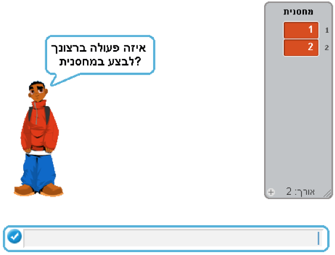

# דף עבודה מספר 3 בנושא מחסנית ותור #

### משימה מספר 1###

בדף זה ניצור את מבנה הנתונים מחסנית בסקראץ'.

בסיום דף עבודה זה נקבל את התוכנית הבאה:

התכנית שלנו עובדת בצורה הבאה: הילד שואל ללא הפסקה איזה פעולה ברצוננו לבצע במחסנית.

**<u>אם נכתוב "הכנסה"</u>**:
כאן נממש פעולת הכנסה למחסנית.
הילד ישאל איזה מספר ברצוננו להכניס למחסנית, ומספר זה יוכנס לראש המחסנית.

**<u>אם נכתוב "הוצאה"</u>**:
כאן נממש פעולת הוצאה מהמחסנית.

**<u>אם נכתוב "בדיקה"</u>**:
הילד יאמר מהו המספר שנמצא כעת בראש המחסנית.

בסיום דף עבודה זה תוכל לבדוק את התשובה שלך לדף העבודה הקודם.

### משימה מספר 2###

שנה את התכנית שכתבת כך שמבנה הנתונים יהפוך ממחסנית לתור:

- פעולת "הכנסה" תכניס מספר לסוף התור
- פעולת "הוצאה" תוציא מספר מראש התור
- פעולת "בדיקה" תחזיר את המספר שבראש התור
