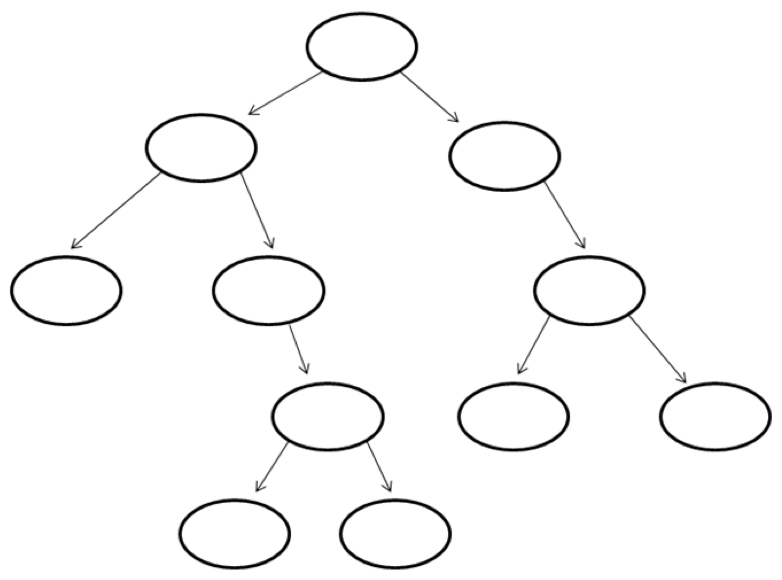

#דף עבודה מספר 4 בנושא עצים בינאריים#

###משימה מספר 1###

הכירו את משפחת לוי.

לאבא פנחס יש שני ילדים - דניאלה ושרה.  
לדניאלה יש ילד אחד ושמו ברק.  
 לברק יש שני ילדים - רותי וזיו.   
לשרה יש שני ילדים - קובי וקרן.   
לקרן יש ילד אחד – רפי.   
לרפי שני ילדים - דבי ורינה.   
לקובי אין ילדים.  

מלא את אילן היוחסין הבא של משפחת לוי.

נרצה להפוך כעת את העץ לעץ חיפוש בינארי.

פנחס הציע שנשתמש באילן היוחסין של משפחת לוי באופן הבא: נחליף כל שם בגיל.   
אם למשל פנחס הוא בן 72, נחליף את השם של הצומת "פנחס", בגילו של פנחס - 72.

פנחס טועה - אם נשתמש בפתרון שלו, לא נקבל עץ חיפוש בינארי.

הסבר מדוע:  

`__________________________________________________________________`

`__________________________________________________________________`

###משימה מספר 2###

נתון עץ חיפוש בינארי.

נרצה לכתוב אלגוריתם לחיפוש מספר כלשהו בעץ.

**השלם את האלגוריתם:**

---

בהינתן מספר כלשהו לחיפוש x,

1. התחל משורש העץ.

2. אם x = שורש העץ, האלגוריתם הסתיים.

3. אם x > שורש העץ לך ל-תת העץ הימני / השמאלי (הקף בעיגול את התשובה הנכונה).

4. אם x < שורש העץ לך ל-תת העץ הימני / השמאלי (הקף בעיגול את התשובה הנכונה).

5. חזור לשלב `__________` של האלגוריתם.
