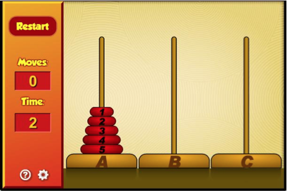
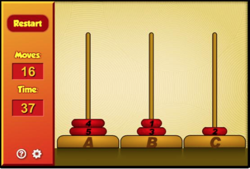
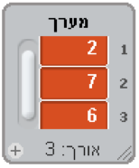
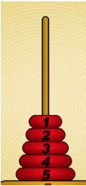
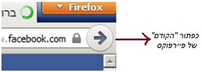
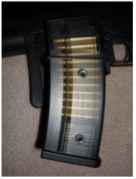
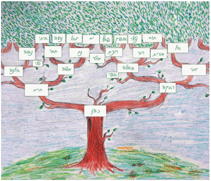
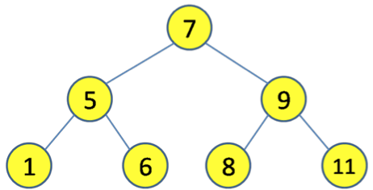
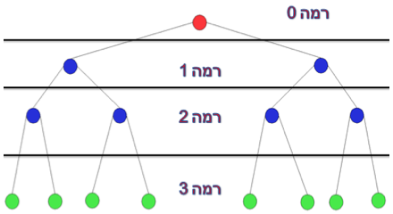
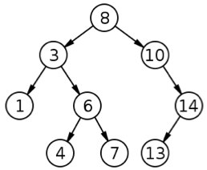

> *״אם זכרוני אינו מטעני, אני לא זוכר״ (עמוס שוסט)*

#הקדמה#

בשיעור הראשון על מספרים בינאריים, הבנו שנתון בודד במחשב נשמר בצורת מספר בינארי, מספר המורכב מאפסים ומאחדים, כאשר 0 או 1 מיוצגים במחשב על ידי זרם חשמלי.
האם קיימת דרך לשמור קבוצה של נתונים בצורה שתקל עלינו את העבודה איתם?
אנו כותבים תוכניות מחשב על מנת לפתור מקרים שקורים בעולם האמיתי. לעיתים יש בעולם האמיתי בעיות שיכולות להיות מאופיינות בדרכים מסוימות. חישבו לדוגמה, איך לשמור במחשב תור של אנשים שמחכים לרופא בקופת חולים ואיך לשמור במחשב את עץ השורשים שלנו לעבודת השורשים בבית הספר.
הבעיות שתיארנו ממודלות באופן שונה, וכדי להכניס ולהוציא נתונים ביעילות אנו נדרשים לייצג ולשמור את הנתונים תחת מבני נתונים ספציפיים.
מסמך זה מציג את עיקרי המצגת
[המצורפת למשימה זו](presentation.pptx ""),
 המיועדת להעברה מול כיתת תלמידים. שימו לב כי המצגת מכילה הערות חשובות (מוטיבציה, נושאים לדיון ועוד).

#מוטיבציה לפרק#

בשיעור זה נלמד את הילדים על מבני הנתונים: מערך, תור, מחסנית ועץ בינארי. זהו בעינינו נושא חשוב ביותר מהסיבות הבאות:
- ניתן ללמידה ולהבנה על ידי ילדים.
- מפתח את החשיבה ואת ההבנה כיצד המחשב שלנו עובד.
- נושא חשוב ובסיסי במדעי המחשב.
במערך זה, ראשית נחדד בפני הילדים את העובדה שהמחשב שלנו צריך לשמור הרבה מאוד מידע, ולאחר מכן נסביר שהמידע הזה נשמר במבני נתונים מיוחדים. ננסה להדגיש בפני הילדים מהם ההבדלים בין מבני הנתונים השונים, ומהם היתרונות והחסרונות שלהם. במערך שיעור זה נשלב בין סוגים שונים של פעילויות בנושא: משחקי מחשב, דפי עבודה, פעילויות בסקראץ' ועוד, וזאת מתוך הניסיון שלנו שהילדים אוהבים גיוון בפעילויות.

#הדגמת פתיחה#

**<u>מטרת המשימה</u>**:
להבין את המשמעות של FIFO ו- LIFO.

**<u>עזרים נדרשים</u>**:
חבילת קלפים.

אנחנו אומרים לילדים שכעת נראה להם קלפים ושהמטרה שלהם היא לזכור אותם בעל פה מהראשון לאחרון. מי שיזכור הכי הרבה קלפים, ינצח (לא חייבים לעשות את ההדגמה בצורת תחרות, אבל מומלץ).
אנחנו בוחרים מתנדב מהילדים ואומרים לו לערבב טוב את חפיסת הקלפים. לאחר מכן אנחנו מניחים את הקלפים בחפיסה הפוכה. אנחנו שולפים כל פעם קלף מראש החבילה ההפוכה, מראים אותו לתלמידים ושמים אותו הפוך בחבילה חדשה (שאנחנו יוצרים כעת). לאחר 7-10 קלפים אנחנו מפסיקים ומבקשים מהתלמידים להגיד מה היה הקלף הראשון ששלפנו, לאחר מכן מה הקלף השני וכו'... סביר להניח שאת הקלפים הראשונים הם יזכרו (כי ביקשנו מהם לזכור) אבל לא יותר מדי. כל פעם שמישהו זוכר את הקלף (צורה ומספר) אנחנו נותנים לו נקודה. המנצח הוא זה שקיבל את מספר הנקודות הגבוה ביותר בסיום.
לאחר מכן אנחנו מבקשים ממתנדב נוסף לערבב שוב את הקלפים. כעת אנחנו אומרים לילדים שהם צריכים לזכור את הקלפים, אבל הפעם מהסוף להתחלה, כלומר מהקלף האחרון שאנחנו מראים להם, עד לקלף הראשון שהראינו להם.

אנחנו שוב נותנים להם לראות 10 קלפים, מוודאים שאף אחד לא רושם אותם (המשחק הוא לזכור מהזכרון). לאחר מכן אנחנו שואלים אותם מה הקלף האחרון שהראנו (סביר להניח שרובם יזכרו), לאחר מכן מה הקלף שלפניו, וכך הלאה.

#משחק פתיחה - מגדלי האנוי#

**<u>המשחק</u>**:
ישנן 5 דיסקיות על מוט A. אנו צריכים להעביר את כולן למוט C. ניתן להניח כל דיסקית רק על גבי
דיסקית שגדולה ממנה.

לדוגמה, המצב הזה הוא מצב אפשרי:

אנחנו נותנים לילדים לשחק במשחק. אפשר למצוא גירסת אינטרנט שלו בכתובת הבאה:
[http://www.novelgames.com/en/spgames/tower](http://www.novelgames.com/en/spgames/tower/ "")

אם אין אינטרנט פעיל אפשר לכתוב על הלוח את השלבים של המשחק.

מטרות המשחק הן:

* לתת לילדים לשחק קצת.
* לתת להם התנסות בשמירת הדיסקיות על מוט (מה שמהווה מימוש של מחסנית, נושא בו נדון
מאוחר יותר בשיעור).

##דוגמאות לבסיסי נתונים##
לאחר משחק הפתיחה נסביר לילדים מהו המושג שנקרא מבני נתונים. לשם כך, נביא את המשפט הממצה מויקפדיה ודוגמאות מוחשיות.
מתוך ויקיפדיה: "במדעי המחשב, מבנה נתונים הוא דרך לאיחסון נתונים במחשב".
**שאלה**: במשחק מגדלי האנוי, אילו נתונים היינו צריכים לאחסן?
**תשובה**: את 5 הדיסקיות.
**תשובה טובה יותר**: את 5 הדיסקיות ואת 3 המוטות.

#דוגמאות חשובות למבני נתונים#

##הכרת המושג מערך##

ניתן לתלמידים את הבעיה הבאה: נניח שאנחנו רוצים ליצור תוכנית ששומרת ציונים של 20 תלמידים
ומחשבת ממוצע אחד של כולם.
**שאלה**: איך נעשה זאת?
**תשובה אפשרית**: נשמור 20 משתנים.
אם התלמידים לא מעלים את התשובה הזו, נעלה אותה בעצמנו: "אפשר לשבת ולהגדיר 20 משתנים
חדשים כל פעם (כמו בסקראצ')".
<u>נציג את הבעיה עם פתרון זה</u>:
  נצטרך לבחור 20 פעם ב"משתנה חדש" ולבחור לכל אחד שם שונה. זה יקח הרבה זמן ובנוסף גם יהיה מסורבל ומבולגן כי יהיו לנו 20 משתנים פזורים על המסך.

**<u>נושא לדיון</u>**:
נדון עם הילדים האם הפתרון הנ"ל מספיק טוב, וננסה לגרום להם להבין שזהו פתרון בעייתי מבחינות שונות:

* זמן
* סרבול
* לא ריאלי עבור כמות גדולה של תלמידים
* לא יעיל מבחינת זיכרון

נאמר לתלמידים שהיה עדיף אם היינו יכולים להגדיר מבנה נתונים אחד גדול שמכיל בתוכו מקום ל 20
מספרים (הציונים של התלמידים).
נסביר להם שמבנה שמכיל מספר קבוע של משתנים, נקרא מערך.

###פעילות בסיסית בסקראץ' בנושא מערך###
**הערה**: מאחר ומערך השיעור מועבר ברובו בכיתה (ולא בחדר המחשבים), ניתן לדלג בשלב זה על פעילויות הסקרץ' ולהעביר אותן בשיעור הבא (כך אנו עשינו כשהעברנו את מערך השיעור).
בעולם האמיתי, שפות התכנות שבהן משתמשים מתכנתים מאפשרות להם להגדיר מבני נתונים שונים. גם בשפת סקראץ' ניתן להגדיר מבני נתונים.
נלמד כעת כיצד ליצור מערכים בסקרץ' וכיצד להשתמש בהם.
בלשונית משתנים, נבחר ב"צור רשימה". נקרא לרשימה זו "מערך".
כעת סיימנו ליצור מערך ריק:

**<u>המשימה</u>**
(דורשת ידע בסיסי קודם בשפת סקראץ'):

* צור מערך בסקראץ' בגודל 10.
* מלא את המערך במספרים אקראיים מ-1 ועד 100.
* חשב כמה מספרים זוגיים קיימים במערך שיצרת.
* אם, לדוגמא, זהו המערך שלנו:

* אז נחזיר 2, כי במערך הזה יש שלושה מספרים ורק שניים מהם זוגיים.

##דוגמאות למבני הנתונים תור ומחסנית##

לפעמים אנו כותבים תוכנית מחשב שנדרשת למבנה נתונים בעל תכונות מסוימות.
לדוגמה, אם היינו רוצים לשמור את הדיסקיות על המוט במגדלי האנוי היה מאוד עוזר לנו אם המוט היה בעל התכונות הבאות:
1. אפשר לשים עליו דיסקית (חוקית, שקטנה מהדיסקית שבראש המוט).
2. בכל שליפה היה אפשר להוציא מהמוט רק את הדיסקית האחרונה.

מבנה נתונים שהאיבר האחרון שנכנס אליו הוא האיבר הראשון שיוצא קוראים מבנה שעובד
בשיטת **LIFO**.
המשמעות של ראשי התיבות באנגלית הם: **L**ast **I**n **F**irst **O**ut. כלומר האיבר האחרון שנכנס למבנה – הוא יהיה הראשון לצאת.
מבנה נתונים שעובד בצורת **F**irst **I**n **F**irst **O**ut – **FIFO**, הוא מבנה נתונים שעובד בצורה
בה האיבר הראשון שנכנס, הוא יהיה הראשון לצאת.
נראה שתי דוגמאות למבני נתונים שעובדים בשיטות אלו שנקראים: "מחסנית" ו- "תור".
#מבנה נתונים - תור#
נניח שאנחנו רוצים ליצור תוכנה שעוזרת לנהל סניף של קופת חולים. בקופת החולים אנשים באים לקבל שירות מרופא. כל אדם שמגיע לקופת חולים לוקח מספר, ואז מחכה על ספסל עד שמגיע תורו. כשמגיע תורו הוא נכנס לרופא והתור מתקדם. אנחנו רוצים לעשות תוכנה שמנהלת את האנשים בקופת חולים, כלומר מוסיפה לסוף התור כל חולה חדש שנכנס, וכל פעם שהרופא מסיים הוא קורא לחולה שהתור שלו הגיע. כשהחולה נכנס לחדר הרופא, הרופא מקדם את התור.
נבקש מהתלמידים להציע רעיונות לניהול התור: לשמור ולהוציא כל פעם את האדם הרלוונטי בתור.
נדריך את התלמידים שמה שבעצם חשוב לנו זה 3 פעולות:
* הכנסת אדם חדש לתור.
* בדיקה מי כרגע הראשון בתור.
* הוצאת האדם שבראש התור (קידום התור באחד).
**שאלות חשיבה נוספות לתלמידים:**
מה עוד חשוב לנו לעשות בתור? לדוגמה, האם צריך לממש פעולה של הוצאת אדם מאמצע התור?
**תשובה:**
 לא, כי אנחנו מניחים שכל בן אדם יצא מהתור רק לאחר שיגיע תורו (כלומר לאחר שיתקדם לראש
התור) ולכן פעולה זו מיותרת.

#מבנה נתונים - מחסנית#

כדי להציג את מבנה נתונים זה, נציג לילדים את הדוגמה הבאה:

###יצירת כפתור "הקודם"###

נניח שאנחנו רוצים ליצור דפדפן (כמו כרום או פיירפוקס). כחלק מיצירת הדפדפן אנחנו צריכים ליצור כפתור "הקודם". כל פעם שנלחץ על הכפתור הזה הדפדפן שלנו יציג את הדף הקודם שהיינו בו (זהו דף האינטרנט שבו היינו לפני שנכנסו לדף שאנחנו נמצאים בו עכשיו).

כדי שכולם יבינו מה עושה הכפתור "הקודם" נעשה דוגמה:
נניח שהתחלנו את הגלישה בגוגל, אחר כך גלשנו לפייסבוק, אחר כך ליו-טיוב, ואחר כך ל YNET.
אם נלחץ כעת על לחצן "הקודם" נגיע ליוטוב (האתר הקודם שהיינו בו).
מה יקרה אם נלחץ לאחר מכן על "הקודם"? ואחר כך?

נבהיר לילדים שלמרות שיש בעיתיות מסוימת אם מסתכלים על הכפתור כחלק מדפדפן אמיתי כיוון שבו אנו יכולים ללכת גם קדימה, או למקום ספציפי בהיסטוריה (בניגוד להגדרת המחסנית), ולכן אנו מסתכלים אך ורק על הכפתור "הקודם" ככפתור בפני עצמו ולא כחלק מדפדפן.

לאחר שכולם יבינו את משמעות כפתור "הקודם", **נשאל** מה אנו צריכים לשמור במבנה נתונים ליצירת הכפתור?
**תשובה**: את כל דפי האינטרנט הקודמים שהיינו בהם.

נשאר את תלמידים האם **האם תור תהיה בחירה טובה?** אם לא, למה?
**תשובה**: תור <u>אינו בחירה טובה</u>, מכיוון שהתור נותן לנו את האתר _הראשון_ שנשמר ואילו אנחנו צריכים להוציא את האתר _האחרון_ שנשמר.

נשאל את התלמידים איך היה כדאי לשמור את הנתונים.

נציג את המבנה מחסנית:

מבנה זה שומר (כמו במחסנית אמיתית ואף אפשר להראות תמונה של מחסנית אמיתית) את הפריטים בו לפי סדר הגעתם כשהפריט האחרון שהגיע יהיה הראשון לצאת.
במקרה של כפתור "הקודם" בדפדפן שלנו, המחסנית תשלוף לנו בכל לחיצה את השם של האתר _האחרון_ אליו נכנסו.

**נשאל** את התלמידים אם ראינו היום בשיעור עוד דוגמה שיכולה להשתמש במבנה מחסנית.
**תשובה**: כן, המוט של מגדלי האנוי הוא בעצם מבנה נתונים שצריך להשתמש במבנה נתונים מסוג מחסנית.

#מבנה נתונים - עץ בינארי#

כרגיל, נפתח בדוגמה מהחיים האמיתיים. נניח ובמסגרת עבודת השורשים, המורה ביקשה מאיתנו להכין אילן יוחסין.
העץ שנבנה יראה בערך כך (תלוי כמה גדולה המשפחה שלכם):

ניתן לראות שבראש משפחת כהן נמצאים רבקה וחיים.
לחיים שני ילדים - משה ואילנה.
לרבקה שלושה ילדים - יוסי גאולה ואפי.
וכך הלאה...

כעת נסתכל כעת על העץ בצורה הפוכה:

לעץ יש שורש, לשורש שני ילדים, לכל אחד מהילדים ילדים משלו, וכך הלאה...

נסביר לילדים שבמדעי המחשב, עץ הוא מבנה נתונים אשר מדמה היררכיה של עץ – לעץ יש שורש ותתי עצים של ילדים.

עץ בינארי הוא עץ שבו לכל צומת יש 2 ילדים לכל היותר.

נשאל את הילדים האם 9 הוא הבן של 7 או 11, ומי האבא של 6.
**מטרת השאלות**: לוודא שהם באמת הבינו את המושגים הבסיסיים.

כעת, נסביר שבעץ בינארי קיים המושג "**רמה**".

נשאל את התלמידים כמה צמתים יש בכל רמה.
ננסה לגרום להם להבין שבכל רמה מספר הצמתים הוא 2 בחזקת מספר הרמה.

**<u>דוגמא בסקראץ'</u>**

  במידה והילדים נמצאים מול מחשב, נבקש מהם להיכנס לכתובת:

[http://scratch.mit.edu/projects/13100004/#editor](http://scratch.mit.edu/projects/13100004/#editor "")

זהו מימוש של עץ בינארי, אשר מצייר את העץ המבוקש בהתאם לרמה שמזינים.
ניתן לילדים לשחק עם זה במטרה שהמושג "רמה של עץ" יהיה כך ברור יותר.

נסביר קצת על המושג "**תת עץ**": תת עץ הוא כל עץ שניתן ליצור מצומת כלשהו של העץ המקורי, הכולל את הצומת עצמו ואת כל הצאצאים שלו (ילדיו, נכדיו וכו').

נסביר מהו עץ חיפוש - במדעי המחשב עץ חיפוש הוא מבנה נתונים ממוין המאפשר הכנסה, הוצאה וחיפוש מהירים.

<u>הכלל הוא כזה</u>: כל צומת חייב להיות גדול מהבן השמאלי שלו ומכל צאצאיו, וקטן מהבן הימני שלו ומכל צאצאיו.

דוגמה לעץ חיפוש:

השורש, שהוא 8, גדול מהבן השמאלי שלו – 3 ומכל ילדיו (הצמתים 1,3,6,4,7), וקטן מהבן הימני שלו – 10 ומכל ילדיו (10,14,13).

פעילות כיתתית משותפת:

נסו למלא את הצמתים הריקים במספרים שימלאו את הכלל שלמדנו

**שאלת מחשבה**: האם ניתן למלא את העץ הבא לפי הכלל שהגדרנו?

**תשובה**: כמובן שלא, למשל כי 6 אינו גדול מ- 12, או כי 14 אינו קטן מ- 12.

**<u>טיול על העץ</u>**

בעזרת אלגוריתם נכון, ניתן לטייל על העץ וכך למעשה לסרוק את כל הצמתים שלו. הטיול יתחיל תמיד משורש העץ.

דוגמא לטיול על העץ: מתחילים בצומת 8, משם פונים ימינה לצומת 10, משם לצומת 14 ומסיימים את הטיול בצומת 13.

#דפי עבודה#

[דף עבודה מספר 1](appendix-a.html "") בנושא מבני נתונים

[דף עבודה מספר 2](appendix-b.html "") בנושא מחסנית

[דף עבודה מספר 3](appendix-c.html "") בנושא מחסנית ותור

[דף עבודה מספר 4](appendix-d.html "") בנושא עצים בינאריים
