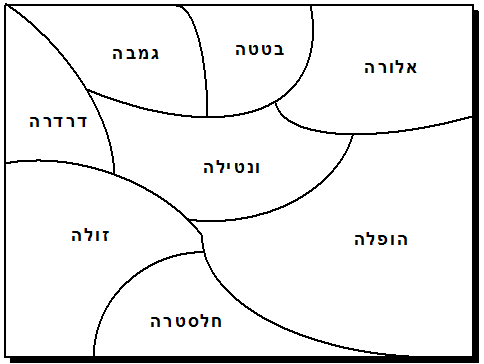
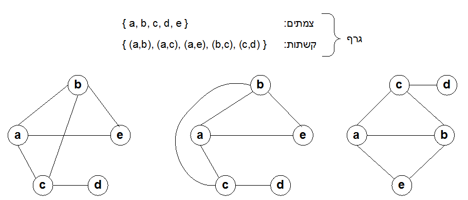

> *""אנחנו יודעים שהגענו לשלמות לא כאשר אין שום דבר שאפשר להוסיף, אלא כשאין שום דבר שאפשר לגרוע (סינט אקזופרי)"*

מתי יצאתם בפעם האחרונה לטיול שנתי? זוכרים כמה קשה להחליט מה לשים בתרמיל ומה לא? הרבה אנשים רוצים לקחת לטיול את כל הבית. אבל, גודל התרמיל מוגבל, ולכן חייבים להחליט איזה חפצים יותר חשובים מאחרים. זוהי דוגמא טיפוסית לבעיה כללית שנקראת "הקצאת משאבים". כל המשאבים שיש לנו בחיים – זמן, כסף, אנרגיה, גודל התרמיל, ובפרט החיים עצמם – הם סופיים ומוגבלים. ההכרה בסופיות הזאת היא מה שעושה את האדם ליצור שהוא גם שפוף וגם נשגב. שפוף, כי מגיל צעיר אנו לומדים שהחיים קצרים ולא נוכל לקבל את כל מה רוצים, ונשגב, כי מחסור הוא אם ההמצאה. ההכרה בכך שכל משאבי החיים מוגבלים דוחפת את רוח האדם לחקור, לגלות, להשתפר, ולהמציא המצאות פנטסטיות מכל הסוגים והמינים.

בפרק זה נעסוק בכמה בעיות תכנון קלאסיות, שבכל אחת מהן יש משאב מוגבל כלשהו שצריך לחסוך בו. לדוגמא, נלמד איך לצבוע מפה בעזרת מספר צבעים קטן ככל האפשר, איך להקצות מספר מוגבל של תדרים לאנטנות סלולאריות, ואיך לתכנן מערכת שיעורים יעילה לבית ספר. מסתבר שהבעיות האלה מאד דומות אחת לשנייה, וניתן לנתחן בכלים של התורה המתמטית הנקראת "תורת הגרפים". לקראת סוף הפרק נתוודע למסקנה כי אפילו בעזרת כלים מתמטיים חזקים ומחשבים מודרניים מהירים, יש בעיות תכנון שלא ניתן למצוא להן את הפתרון המיטבי  בזמן מתקבל על הדעת (מספר שעות, ימים, חדשים, או אפילו שנים). מצד אחד זו כמובן מסקנה פסימית, אך מאידך היא פותחת בפנינו אתגרים מרתקים חדשים.

# צביעת מפות #
הציגי לכתה את המפה ממיצג 0, כבסיס לדיון הבא.
**שאלה**: נתון שרטוט של מפת גבולות, כמו זאת שמוצגת לפניכם, ואנו צריכים ללמד מישהו – נניח רובוט - לצבוע את המפה בצבעים. איך לדעתכם צריך להסביר לו לעשות את זה?
**תשובה סבירה**: כל ארץ צריכה להיצבע בצבע אחר.

 
<h4>מיצג 0: קטע ממפת אירופה</h4>

זוהי תשובה סבירה, אך לא מדויקת. הנה הדרישה המדויקת (כתבי את ההגדרה כלשונה על הלוח):
> צביעה חוקית של מפה היא צביעה שעונה לשתי דרישות:
(א) כל השטח של כל ארץ צריך להיצבע באותו צבע.
(ב) כל שתי ארצות שיש להן גבול משותף צריכות להיצבע בצבעים שונים.

**שאלה**: ובכן, נניח שעומד לרשותכם קלמר עם כל הצבעים בעולם. באיזה צבעים הייתם משתמשים כדי לצבוע את המפה הזאת באופן חוקי?
**תשובה סבירה**: הולנד בירוק, בלגיה באדום, צרפת בחום, ושוויץ בצהוב (או כל ארבעה צבעים אחרים). ייתכן שחלק מהתלמידים ייתנו תשובות יותר יעילות, כמו צביעה עם שלושה צבעים, או אפילו שני צבעים. אלה תשובות שראוי להחמיא להן, אך הן לא בהכרח נכונות יותר, כי בשלב זה לא הטלנו שום אילוצים נוספים על פתרון הבעיה.
כתבי על הלוח, מתחת ובצמוד להגדרת הצביעה החוקית, את ההגדרה הבאה:
צביעה יעילה של מפה היא צביעה חוקית שמשתמשת במספר צבעים קטן ככל האפשר.

**שאלה**: התבוננו שוב במפה שלפנינו (מיצג 0). באיזה צבעים הייתם צובעים אותה באופן יעיל?
**תשובה** הולנד וצרפת אינן חולקות גבול משותף. לכן אפשר לצבוע אותן באותו צבע, למשל ירוק. באופן דומה, לבלגיה ולשווצריה אין גבול משותף, ולכן אפשר לצבוע אותן בצבע אחד, למשל אדום. מסקנה: אפשר לצבוע את כל המפה עם שני צבעים בלבד.
הדגימי את הצביעה על הלוח: השתמשי בשני מרקרים צבעוניים כדי לצבוע את המפה.

**שאלה**: האם זה משנה באיזה שני צבעים משתמשים?
**תשובה**: לא. כל עוד משתמשים בשני צבעים שונים, לא משנה מהם.

**שאלה**: האם אפשר לצבוע את המפה בצבע יחיד? נמקו.
**תשובה**: לא. בגלל שיש במפה לפחות שתי ארצות שגובלות זו בזו, אנו חייבים להשתמש בשני צבעים לפחות.

השאלה האחרונה, כמו הרבה שאלות בספר, נותנת הזדמנות לבצע אקט חינוכי קטן אך משמעותי: במקום לבקש תשובות בעל פה, שבדרך כלל ניתנות באופן בהול ולא מדויק, בקשי מכל ילד לכתוב את התשובה במחברת, ולהצביע כאשר הם מוכנים להקריא אותה לכתה. היכולת לנסח נימוקים בבהירות ובדיוק – אפילו נימוקים פשוטים – היא כישור אינטלקטואלי ממדרגה ראשונה, ובכל הזדמנות שיש כדאי לתרגל אותה.

# פעילות 1#
חלקי את [דף פעילות 1](appendix-a.html "")
 | [(גירסה בערבית)](appendix-l.html "")
. הסבירי שלפי חוקי המשחק שלנו, נקודת מפגש בודדת ביו שתי ארצות אינה נחשבת לגבול משותף. למשל, במפה שלפנינו, לאלורה ולבטטה יש גבול משותף, אבל לאלורה ולגמבה אין. לכן, אם רוצים, אפשר לצבוע את אלורה וגמבה באותו צבע.
הכריזי על תחרות: הילד שיצליח לצבוע את המפה עם מספר צבעים קטן ככל האפשר הוא המנצח.
מסתבר שאת המפה הזאת אפשר לצבוע עם שני צבעים בלבד. זאת לא משימה קשה במיוחד, ולכן יהיו מן הסתם מספר מנצחים. הציגי לכתה את המפה הצבועה של אחד המנצחים, ובדקי את הפתרון יחד עם הילדים<a href="#" data-toggle="tooltip" title="במפות אותן ניתן לצבוע בשני צבעים, יש למעשה רק צורת צביעה אחת המשתמשת בשני צבעים. פתרונות אחרים הם רק החלפה של שני הצבעים, ומבחינתנו כולם שקולים זה לזה">1</a>.

 
<h4>מיצג 1 (דף פעילות 1): מפה הניתנת לצביעה עם שני צבעים בלבד</h4>

# פעילות 2 #
חלקי לילדים את [דף פעילות 2](appendix-b.html "")
 | [(גירסה בערבית)](appendix-m.html "")
. הנחי לצבוע את המפה במספר צבעים קטן ככל האפשר. המפה הזאת ניתנת לצביעה בעזרת שלושה צבעים. הזמיני מתנדב להציג את הפתרון שלו לפני הכתה, ודוני בפתרון עם הילדים.

 
<h4>מיצג 2 (דף פעילות 2): מפה הניתנת לצביעה עם שלושה צבעים בלבד</h4>

**טענה**: את המפה הזאת לא ניתן לצבוע בעזרת שני צבעים בלבד. הוכיחו את הטענה הזאת.
**הוכחה**: כדי לספק הוכחה לטענה, מספיק להראות שיש במפה שלוש ארצות שכל אחת מהן גובלת ברעותה, למשל אלורה, בטטה, וונטילה. קבוצה של שלוש ארצות כאלה מחייבת שימוש בשלושה צבעים.

# פעילות 3#
חלקי לילדים את [דף פעילות 3](appendix-c.html "")
 | [(גירסה בערבית)](appendix-n.html "")
, והנחי לצבוע את המפה במספר צבעים קטן ככל האפשר. המפה הזאת ניתנת לצביעה בעזרת ארבעה צבעים. אם ילדים מציעים צביעות עם שלושה או חמישה צבעים, אפשר להציגן  על הלוח ולנסות לשפר אותן. כל צביעה עם שלושה צבעים תהייה לא חוקית (לשתי ארצות עם גבול משותף יהיה צבע משותף), וכל צביעה עם יותר מארבעה צבעים תהייה בזבזנית באופן שקל להדגים ולשפר אותו.

 
<h4>מיצג 3 (דף פעילות 3): מפה הניתנת לצביעה עם ארבעה צבעים</h4>

# פעילות 4#
חלקי לילדים את [דף פעילות 4](appendix-d.html "")
 | [(גירסה בערבית)](appendix-o.html "")
, והנחי אותם לנסות להמציא מפה שנדרשים חמישה צבעים כדי לצבוע אותה. צפי לקבל פתרונות יצירתיים, מורכבים, ושגויים.

איך אנו יודעים מראש שכל הפתרונות יהיו שגויים? הודות ל- "משפט ארבעת הצבעים" – אחת התגליות המפורסמות ביותר במתמטיקה. בשנת 1852, צעיר בריטי בשם פרנסיס גאתרי ניסה לצבוע את מפת עשרות המחוזות של אנגליה, ונוכח להפתעתו שהוא מסוגל לעשות זאת בעזרת ארבעה צבעים בלבד. הוא שיער, והיום אנו יודעים שהייתה לו אינטואיציה נכונה, שהתכונה הזאת נכונה תמיד: כל מפה שהיא – לא חשוב כמה מבולגנת ומתוסבכת -- ניתנת לצביעה בעזרת ארבעה צבעים בלבד. גאתרי שלח את השערתו לאוגוסטוס דה-מורגן, מתמטיקאי בריטי ידוע, וזה פרסם אותה ללא הוכחה בירחון מדעי. במשך למעלה ממאה ועשרים שנה, טובי המתמטיקאים בעולם ניסו להוכיח את השערת ארבעת הצבעים ללא הצלחה. המשפט הוכח סופית בשנת 1976, על ידי קנת אפל וולפגנג האקן מאוניברסיטת אילינוי. אחד מצעדי ההוכחה כלל את בדיקת נכונות המשפט על כאלף מפות מסוימות, ולמטרה זאת קנת אפל גייס את שלושת ילדיו כדי שיסייעו לו בבדיקה. אחד מהם, אנדרו אפל, הוא היום פרופסור למדעי המחשב באוניברסיטת פרינסטון.

# גרפים #
כדי להבין בצורה עמוקה כמה משאלות הצביעה שנתקלנו בהן, נעשה הכרות עם תחום מרכזי במתמטיקה ומדעי המחשב שנקרא תורת הגרפים (graph theory). למלה "גרף" יש משמעויות שונות בתחומים שונים. בתיכון, כשאומרים "גרף" מתכוונים בדרך כלל לעקומה שמתארת פונקציה כלשהי בצורה ויזואלית. במקצועות כמו כלכלה וסטטיסטיקה, "גרפים" הם ציורים שמתארים קשרים ומגמות בין משתנים. לעומת זאת, במתמטיקה טהורה ובמדעי המחשב, וגם בספר הזה, למלה "גרף" יש משמעות אחרת לגמרי.

מבחינתנו, גרף מוגדר על ידי שתי קבוצות. קבוצה אחת מתארת אוסף של עצמים, כמו {רון, נטע, יאיר, ערן}, והקבוצה השנייה מתארת אוסף זוגות של עצמים, כמו {(רון,ערן), (רון,נטע), (רון,יאיר), (ערן,נטע)}. הזוגות האלה מעידים על קשר בין העצמים שיכולה להיות לו משמעות מסוימת. למשל, שני ילדים קשורים זה לזה אם בשמות שלהם יש אות משותפת, או שהם שייכים לאותה משפחה, או שהם גרים באותו רחוב, או נולדו באותה שנה, וכן הלאה. כל תכונה כזאת תיצור גרף אחר, כי תכונות שונות יוצרות קבוצות שונות של זוגות.

גרף זה דבר שאפשר ונהוג לצייר. העצמים מיוצגים ע"י עיגולים שנהוג לקרוא להם "צמתים", והקשרים שביניהם מיוצגים ע"י קווים שנהוג לקרוא להם "קשתות". לדוגמא, מיצג 4 מדגים גרף מסוים ושלוש דרכים שונות לצייר אותו. שימו לב שאף על פי שהציורים שונים זה מזה, הם מתארים את אותו גרף בדיוק. לכן, בתורת הגרפים, שלושת הציורים נחשבים לייצוגים שקולים של אותו גרף. במילים אחרות, אם ניתן לכמה ילדים משימה לצייר גרף מסויים, אזי כל עוד הציורים ישקפו בדיוק את העצמים והזוגות, כולם יהיו נכונים.

 
<h4>מיצג 4: דוגמא של גרף מסויים, ושלוש דרכים שקולות לצייר אותו</h4>

מסתבר שיש קשר הדוק בין מפות גבולות וגרפים. בפרט, מפת גבולות היא דבר שאפשר לייצג באופן טבעי ופשוט באמצעות גרף. מתחילים בזה שמייצגים כל ארץ ע"י צומת (עיגול). אם יש גבול משותף בין שתי ארצות, מותחים קשת בין שני הצמתים שמייצגים אותן.

הציגי לפני הכתה את המפה ממיצג 5 וציירי לידה את הגרף שמייצג אותה. בשלב זה, ציירי את הגרף האמצעי בלבד.

 
<h4>מיצג 5: מפה וגרף שמייצג אותה (מימין לשמאל)</h4>

**שאלה**: להזכירכם, בצביעה חוקית של מפה, כל שתי ארצות שיש להן גבול משותף צריכות להיצבע בצבעים שונים. אם מפה מיוצגת ע"י גרף, מהי המשמעות הגרפית של צביעה חוקית?
**תשובה**: שני הצמתים בקצה כל קשת חייבים להיות צבועים בצבעים שונים.

באבחנה הזאת אפשר להשתמש כדי לתכנן את תהליך הצביעה של מפה נתונה, למשל המפה ממיצג 5. הסבירי שבמקום צבעים כמו "ירוק, צהוב, אדום", וכולי, נשתמש במספרים 1, 2, 3, וכן הלאה. תהליך הצביעה הוא כדלקמן: מתחילים בצומת כלשהי (נניח "א"), ומסמנים אותו בצבע 1. כעת מתבוננים בכל הצמתים שמקושרים לצומת הזה, ומסמנים אותם בצבעים שונים מ 1, נניח 2. כעת מתבוננים בכל הקשתות שיוצאות מכל אחד מהצמתים האלה, וכן הלאה, עד שכל הגרף צבוע באופן חוקי. אם רוצים להשתמש במספר צבעים קטן ככל האפשר, צריך תמיד לנסות לצבוע צמתים חדשים בעזרת מספרים שכבר נמצאים בגרף.

# פעילות 5#
מטרת הפעילות לתרגל חשיבה אבסטרקטית. בפרט, הפעילות מוליכה את הילדים דרך המעברים החשובים בין (1) תיאור בעיה נתונה (צביעת מפה), (2) תרגום הבעיה לייצוג מופשט (בניית גרף), (3) פתרון הבעיה במרחב המופשט (צביעת הגרף), ו (4) תרגום הפתרון מהמרחב המופשט חזרה לתיאור הבעיה המקורי (העברת הצבעים מהגרף אל המפה).
חלקי לתלמידים עותקים של [דף פעילות 5](appendix-e.html "")
 | [(גירסה בערבית)](appendix-p.html "")
. קראי בקול רם את ההוראות בראש הדף, והנחי אותם לבצע את הפעילות.
**שאלה**: התבוננו במפה בראש דף פעילות 5 ובגרף שציירתם עבורה. האם במעבר מהמפה לגרף הלך מידע כלשהו לאיבוד?
**תשובה**: כן. כל הגיאוגרפיה של המפה נעלמה, פרט למידע על איזה ארצות גובלות זו בזו.

**שאלה**: האם למידע שנעלם יש חשיבות לשאלה איך לצבוע את המפה?
**תשובה**: לא. מבחינת אתגר הצביעה, למידע שנעלם אין שום משמעות.

הדיון הזה מדגים את חשיבות המושג "הפשטה" (אבסטרקציה). כשמנסים לפתור והייה, צריך תמיד לנסות להפשיט ממנה את כל הפרטים שאין להם חשיבות לפתרון. במילים אחרות, ייצוג מופשט של בעיה הוא ייצוג שמתרכז רק בפרטים החשובים באמת לפתרונה. ייצוג כזה יהיה בדרך כלל הרבה יותר פשוט וקומפקטי מתיאור הבעיה המקורית, וככזה הוא יסייע לנו למצוא את הפתרון לבעיה (שימו לב לקשר המילולי בין המילים "מופשט" ל- "פשוט"). ואמנם, בכל תחום מדעי שהוא, היכולת למצוא ייצוג פשוט לבעיה מורכבת הוא הצעד הראשון והמכריע בדרך לפתרונה. גם באמנות, היכולת לתאר את העולם בצורה פשוטה וחסכונית נחשבת להישג חשוב, כי היא מכריחה את הצופה להתמקד ברעיון שהאמן מנסה להביע.

לפני שנמשיך בפעילויות, נשים לב לתכונה מעניינת.

**גרף מישורי**: לגרפים שמייצגים מפות יש כמה תכונות מעניינת. למשל, כשבונים גרף של מפה כלשהי, הגרף המתקבל הוא תמיד "גרף מישורי". בגרף מישורי, אף אחת מהקשתות לא נחתכות זו בזו. לכן, אם בנינו גרף של מפה וחלק מהקשתות שלו נחתכות, אזי מובטח לנו שבקצת מאמץ עם עיפרון ומחק אפשר לסדר מחדש את הצמתים והקשתות באופן שלא יהיו שום חיתוכים (ייתכן שחלק מהקשתות לא תהיינה קוים ישרים – זה בסדר).

חלקי את [דף פעילות 6](appendix-f.html "")
 | [(גירסה בערבית)](appendix-q.html "")
, שהוא משימת צביעה של מפה יותר מעניינת מהקודמת.

חלקי את [דף פעילות 7](appendix-g.html "")
 | [(גירסה בערבית)](appendix-r.html "")
, שהוא משימת צביעה של מפה עוד יותר מעניינת.

# בניית מערכת שעות #
בניית מערכת שעות לבית ספר היא משימה מורכבת. לדוגמא, הבה נתבונן בבית ספר למדעים ואומנויות שמציע לתלמידיו מגוון מקצועות בחירה, ומשתדל לאפשר להם ללמוד את כל המקצועות בהם הם בוחרים. כדי להשיג את היעד הזה, בית הספר משתדל לא לשבץ שיעורים מבוקשים באותו חלון זמן. בפרט, בית הספר פועל לפי הכלל הבא: אם יש שני מקצועות שעשרה תלמידים או יותר מעוניינים בהם, אסור לשבץ את המקצועות האלה באותו חלון זמן. המשמעות היא ששני המקצועות האלה ישובצו בזמנים שונים, וכך התלמידים יוכלו ללמוד את שניהם.

כדי לפשט את הבעייה, נתמקד בבניית מערכת שעות ליום ראשון בלבד. נניח שכדי להתאים את מערכת השעות למורים, הוחלט ללמד ביום ראשון את שבעת המקצועות הבאים: מוסיקה, ריקוד, תכנות, ציור, אנימציה, רובוטיקה, וקולנוע. אורך שיעור בכל מקצוע הוא שעתיים. כמו כן, נניח שלמעלה מעשרה תלמידים רוצים ללמוד את זוגות המקצועות הבאים: מוסיקה וקולנוע, מוסיקה ופיסול, מוסיקה ותכנות, ... שאר הנתונים רשומים בצד ימין של מיצג 6. (הציגי את צידו הימני בלבד של מיצג 6.)

 
<h4>מיצג 6: בעיית מערכת השעות ופתרון אפשרי (מימין לשמאל)</h4>

הפתרון הפשוט ביותר הוא לשבץ את שבעת המקצועות אחד אחרי השני, ללא חפיפה, ולאפשר לכל תלמיד ללמוד איזה מקצועות שהוא רוצה. אבל, מכיוון שכל שיעור אורך שעתיים, שיבוץ כזה ייצור יום לימודים בן 14 שעות -- פתרון בלתי סביר. הדרך היחידה לבנות יום לימודים באורך סביר היא לשבץ מקצועות שונים במקביל, תוך ניסיון לא לשבץ במקביל זוגות של מקצועות מבוקשים. איך עושים זאת?

מסתבר שתורת הגרפים מספקת דרך מצוינת לייצוג הבעיה ולחשיבה על פתרונות אפשריים. בונים גרף באופן הבא: נתחיל ע"י ציור שבעה צמתים, אחד עבור כל מקצוע (ציירי את הצמתים). כעת נצייר קשתות לפי הכלל הבא: אם יש שני מקצועות שאסור לשבצם באותו חלון זמן, נחבר אותם בקשת. בגלל שיש 12 איסורים כאלה, נקבל גרף עם 12 קשתות (ציירי את הקשתות).

בשלב הבא ננסה לצבוע את הגרף עם מספר צבעים קטן ככל האפשר (עשי זאת, יחד עם התלמידים). מסתבר שבמקרה הזה אפשר לעשות זאת עם שלושה צבעים.

כעת מגיע שלב הקסם – בניית מערכת השעות. כל המקצועות שצבועים 1 ישובצו בחלון הזמן הראשון, בין 8 ל 10. כל המקצועות שצבועים 2 ישובצו בחלון הזמן השני, בין 10 ל 12. כל המקצועות שצבועים 3 ישובצו בחלון הזמן השלישי, בין 12 ל 14. (בני את המערכת על הלוח).

שימו לב שקיבלנו פתרון יעיל ומספק. שבעת המקצועות משובצים בשלושה חלונות זמן, יום הלימודים מסתיים ב 2 בצהריים, ולתלמידים אין סיבה להתלונן: צביעת הגרף הפרידה את המקצועות המבוקשים זה מזה, ונוצרה מערכת שעות שמאפשרת ללמוד אותם אחד אחרי השני. הגרף סיפק לנו דרך פשוטה ואלגנטית לייצג את הבעייה, וצביעת הגרף – פעולה שלכאורה אין לה שום קשר לבניית מערכת שעות – סיפקה פתרון.

זוהי דוגמא לדרך פעולה מאד נפוצה במדע. כדי לפתור בעיה לא ידועה, מנסים קודם כל להפשיט ולנסח אותה בשפה מדעית ידועה – במקרה הזה תורת הגרפים. אם הצלחנו לעשות זאת, עומדים לרשותנו כלים חזקים מתורת הגרפים, כמו צביעה, אותם אפשר להפעיל על ייצוג הבעיה המופשט. בשלב הבא מתרגמים את התוצאה שקיבלנו חזרה לעולם הבעייה, ובינגו: יש פתרון.

חשוב לציין שלא תמיד נמצא פתרון יעיל. למשל, כשבונים גרף שמייצג בעיית שיבוץ עם עשרות מקצועות ומאות אילוצים, הגרף יכול להיות מאד מסובך. במקרים כאלה, אפילו אם ניתן לצבוע את הגרף בעזרת מספר צבעים קטן, במקרים רבים לא נצליח למצוא את הפתרון האופטימלי, ונאלץ להסתפק בפתרון פחות מוצלח. ואמנם, לבעיות שיבוץ יש סיבוכיות טבעית מאד גבוהה – נושא שנעסוק בו בפרק אחר בספר.

# הקצאת תדרים #
רשתות הטלפונים הניידים מכסות היום את מרבית האזורים המיושבים בכדור הארץ, וקשה לתאר שרק לפני כעשרים שנה אפשר היה לחיות חיים מלאים ומספקים ללא טלפונים ניידים. אחד מרכיבי הטכנולוגיה שמאפשרת תקשורת סלולארית הוא רשת של אנטנות שידור רבות, שכל אחת מהן "מכסה" שטח גיאוגרפי לא גדול (וזאת בניגוד לשידורי רדיו, שמבוססים על מעט אנטנות שכל אחת מהן מכסה שטח גדול). כשנטע מתקשרת אל דן בטלפון נייד, הטלפון של נטע "מדבר" עם האנטנה הקרובה ביותר אל המקום שבו נטע נמצאת בזמן השיחה. משם, התקשורת עוברת למוקד הרשת, שמעביר את התקשורת אל האנטנה שקרובה ביותר למקום בו נמצא הטלפון של דן. אם נטע (או דן) נמצאים בתנועה ועוברים לתחומי כיסוי אחרים, האנטנות דרכן התקשורת עוברת מתחלפות בהתאם.

מיצג 7 מדגים פריסה גיאוגרפית טיפוסית של אנטנות שידור של רשת סלולארית. אחד המאפיינים של רשת כזאת היא החפיפה שנוצרת בין תחומי הקליטה של אנטנות שונות. למשל, אם נטע נמצאת באיזור החפיפה בין אנטנה B לאנטנה C, הטלפון של נטע "יתבלבל" ולא ידע עם איזה אנטנה לתקשר. כתוצאה מכך, השידור יקפוץ בין אנטנה לאנטנה ויגרום לשיחה מקוטעת. כדי להתמודד עם הבעיה הזאת, יש לוודא שאנטנות שיש ביניהן חפיפה תפעלנה בתדרים שונים זה מזה. לדוגמא, נניח איזור כמו זה המתואר במיצג 7, בו פועלות שבע אנטנות שונות, המסומנות באותיות A עד G. בכמה תדרים שונים צריך להשתמש כדי להבטיח שירות אמין ללא טעויות תקשורת? הפתרון הפשוט ביותר הוא שבעה תדרים – אחד לכל אנטנה. אבל, תדרים הם משאב מוגבל, אותו מוכרת כל מדינה בכסף רב לחברות הטלפונים השונות. לדוגמא, נניח שהמחיר השנתי של שימוש בכל תדר הוא מיליון דולר. האם עדין תציעו לחברת הטלפונים לקנות מהמדינה שבעה תדרים שונים? אולי ניתן להפעיל את התובנות שרכשנו ולצמצם את מספר התדרים, וכך לחסוך
לחברת הטלפונים מיליון דולר או יותר כל שנה?

 
<h4>מיצג 7: שבע אנטנות, ותחומי הקליטה של כל אחת מהן </h4>

חלקי לתלמידים את [דף פעילות 8](appendix-h.html "")
 | [(גירסה בערבית)](appendix-s.html "")
, כחומר רקע לדיון הבא.
**שאלה**: מתי חייבים להקצות לשתי אנטנות שני תדרים שונים?
**תשובה**: כאשר יש חפיפה בין איזורי הקליטה שלהן. למשל במיצג 7, יש חפיפה בין אנטנות A ו- C. לכן חייבים להקצות לשתיהן שני תדרים שונים. לעומת זאת, אין חפיפה בין אנטנות B ו- G, ולכן שתיהן יכולות להשתמש באותו תדר.

הבה נחשוב מעט על בעיית הקצאת התדרים. שימו לב שפרטים כמו האזור המדויק אותו מכסה כל אנטנה, גובה האנטנה, או צבע האנטנה, הם פרטים טפלים וחסרי חשיבות לבעיה. האינפורמציה החשובה היחידה לפתרון הבעיה שלפנינו היא האם לזוג אנטנות יש שטח משותף אותו שתיהן מכסות, או שאין שטח כזה.
בקשי מהתלמידים להציע כיצד ניתן לתאר את הבעיה כבעיית צביעה של גרפים. על פי התפתחות הדיון, ניתן לרמוז, אם יש צורך, כי הצמתים יהיו האנטנות. מתי נחבר שתי אנטנות בקשת? תשובה: נחבר שני צמתים (אנטנות) בקשת אם יש ביניהן חפיפה. בקשי מהילדים לצייר על דף פעילות 8 את הגרף המתאים לבעיה. שאלי כמה קשתות יש בציור שלהם (תשובה: 15 קשתות).

כדי לפתור את בעיית הקצאת התדרים, יש להקצות לצמתים שכנים, דהיינו צמתים המחוברים בקשת, תדרים שונים. אבל, כזכור, השאלה החשובה היא כדלקמן: מה מספר התדרים הקטן ביותר הנדרש לפתרון הבעיה? הפתרון פשוט באופן מפליא: כל צביעה חוקית של הגרף במספר נתון של צבעים משרה הקצאה של תדרים: לצמתים הצבועות באותו צבע נקצה אותו תדר, ורק להן. לכן, השאלה "מה מספר התדרים לו נזדקק בפריסת אנטנות נתונה" שקולה בדיוק לשאלה "מה מספר הצבעים הקטן ביותר בו ניתן לצבוע את הגרף שמתאר את הפריסה הנתונה". שימו לב להפשטה שהשגנו – ממפת אנטנות רווית פרטים לגרף רזה ותמציתי שמספק את כל המידע הדרוש לפתרון הבעיה.

המשימה האחרונה בדף פעילות 8 היא לצבוע את הגרף שהתקבל במספר צבעים קטן ביותר. התשובה היא שניתן לצבוע את הגרף בחמישה צבעים, אך לא פחות מכך. חסכנו לחברה שני מיליון דולר ביחס לפתרון ההקצאה הפשוט המקורי!

# דיון #
בפרק זה התוודענו לבעיית הצביעה של מפות ולמושג המתמטי של גרפים. למדנו כיצד לבנות גרף המתאים למפה, וכיצד לתרגם בין בעיות הצביעה של מפות וגרפים. כמו כן ראינו כיצד לייצג בעזרת הפשטה זו בעיות חשובות מהחיים כמו בניית לוחות זמנים והקצאת תדרים לאנטנות סלולריות.

כיוון שההפשטה מסלקת מהבעיה המקורית פרטים רבים שאינם רלוונטיים לפתרונה, היא עוזרת לנו להתרכז בעיקר ולמצוא פתרונות ביתר קלות. אבל, ההפשטה אינה הופכת את בעיית צביעת הגרפים לבעיה קלה! עקרונית, ניתן לעבור על כל הצביעות האפשריות של גרף כלשהו במספר צבעים נתון (שלושה, ארבעה, וכו') ולבדוק האם מישהי מהן היא צביעה חוקית. הבדיקה תגמר אחרי זמן סופי, ונוכל לספק תשובה אופטימלית. אבל, אם מדובר בגרף בן כשלושים צמתים בעל הרבה קשתות ואשר אין לו שום מבנה מיוחד המסייע לפתרון, אזי אדם שינסה לבצע תהליך כזה עלול לבלות חודשים רבים עד שיסיים, וכמובן עלול לטעות בדרך. לא נורא, תגידו; בדיוק למטלות כאלה המציאו את המחשבים: הם מהירים ואינם עושים טעויות. ואמנם, סביר כי על גרפים בני כשלושים צמתים מחשב מודרני יוכל לסיים את המשימה תוך דקות או לכל היותר שעות. אבל מה עם גרפים בני מאתיים, או אלף צמתים? גרפים כאלה צצים כל הזמן בפתרון בעיות אמיתיות בתכנון לוגיסטי, בניית לוחות מחשב, תזמון, ושאר בעיות אילוצים כאלה ואחרות.

מתברר כי מספר הפתרונות האפשריים שיש לבדוק גדל בקצב אסטרונומי עם הגידול במספר הצמתים. במילים אחרות, בגרפים בעלי גודל מציאותי, כאשר מכפילים את מספר הצמתים פי שתיים, מספר הצביעות מוכפל פי מיליון, וכדומה. לכן, אפילו המחשב המשוכלל בעולם יצטרך לעבוד מיליארדי שנים עד שהוא יוכל לבדוק את כל הצביעות האפשריות בגרף. כאן אנו נתקלים בפן האכזרי של סיבוכיות חישובית (computational complexity)– בעיות שהן כה קשות שלא ניתן לפתור אותן במדויק בפרק זמן סביר. נחזור לנושא בפרק עתידי, אך מסקנה חשובה שכדאי לזכור היא: מחשבים הם אמנם טכנולוגיה חשובה, מופלאה, ובעלת השלכות חברתיות מרחיקות לכת, אך יחד עם כל זאת **מחשבים אינם כל יכולים**.

ב[דף פעילות 9](appendix-i.html "")
 | [(גירסה בערבית)](appendix-t.html "")
תמצאו מספר גרפים נוספים אותם אתם מוזמנים לצבוע במספר צבעים קטן ככל האפשר. לחלקם סיפקנו [פתרונות בסוף הפרק](appendix-j.html "").

***
## מפת המחוזות של אנגליה, שנתנה את ההשראה למשפט ארבעת הצבעים
 

 

