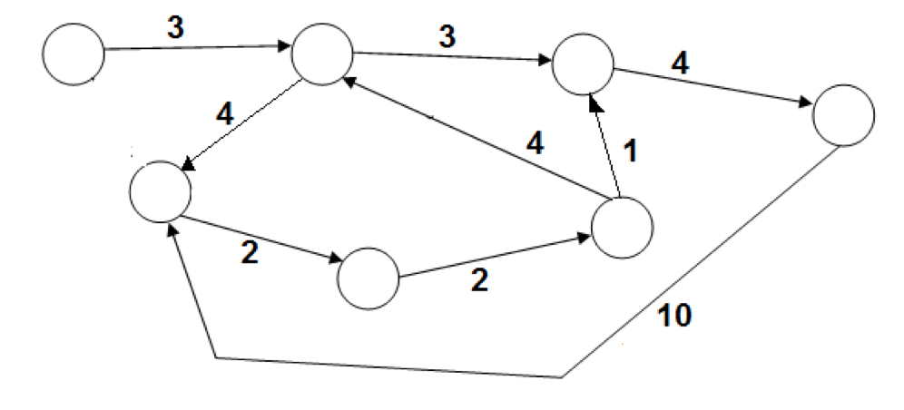

# דף פעילות 3 – הסוכן הנוסע עם מספר מסלולים #

עבור כל גרף: ציינו מהו המסלול החמדן אותו יבחר הנוסע ומה אורכו.
עבור כל גרף מצאו גם את המסלול האופטימאלי (הקצר ביותר).
האם קיים גרף בו המסלול החמדן הוא גם המסלול הקצר ביותר?

---

### גרף מספר 1

  

 אורך המסלול החמדני: `_______________`

אורך המסלול האופטימאלי (קצר ביותר): `_______________`

האם מדובר באותו מסלול? `_______________`

---

### גרף מספר 2

  

 אורך המסלול החמדני: `_______________`

אורך המסלול האופטימאלי (קצר ביותר): `_______________`

האם מדובר באותו מסלול? `_______________`
