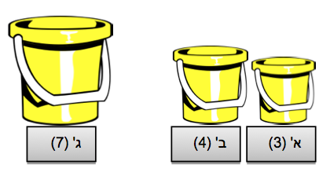
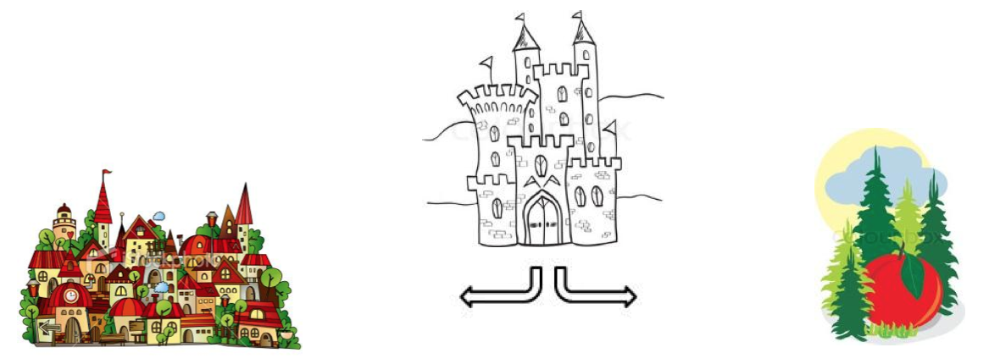

# נספח פתרונות

### דף פעילות מס' 1

<u>
#### חידת דליים:
</u>

1. שפוך 4 ליטרים מדלי ג' לדלי ב'.
2. שפוך 3 ליטרים מדלי ב' לדלי א'.
3. בדלי ב' יישארו 1 ליטרים.
4. שפוך 3 ליטרים מדלי א' לדלי ג'.
5. שפוך 1 ליטרים מדלי ב' לדלי א'.
6. שפוך 4 ליטרים מדלי ג' לדלי ב'.
7. שפוך 2 ליטרים מדלי ב' לדלי א'.

סה"כ: 3 ליטרים בדלי א', 2 ליטרים בדלי ב'. 2 ליטרים בדלי ג'.

  

### דף פעילות מס' 2

<u>
#### חידת השרשרת:
</u>

הפתרון הברור לעין הוא לפתוח את החוליה האחרונה בכל שרשרת ולסגור אותה בחזרה כך שתתחבר לחוליה הראשונה של השרשרת הבאה. על תהליך זה יש לחזור ארבע פעמים וזה יעלה לגיבור שלנו 6 שקלים.
במבט ראשון נראה שאין פתרון יעיל יותר: אנחנו צריכים לחבר ארבע שרשראות במעגל, וזה אומר שיש לנו ארבע נקודות חיבור. כל נקודת חיבור מצריכה חוליה שתיפתח, ואחר כך תיסגר.

המפתח למציאת דרך יעילה יותר הוא לזהות את הקיבעון בדרך שהוצאה. השרשראות הן בסך הכל חוליות מחוברות -  וחוליות אפשר לפתוח..

אם נפתח את כל החוליות של אחת השרשראות, יישארו בידנו שלוש חוליות פתוחות ועוד שלוש שרשראות בלבד. אחת השרשראות למעשה נעלמה. עם שלוש שרשראות אנו זקוקים רק לשלוש פעולות חיבור - ושלוש חוליות פתוחות כבר יש לנו. נשתמש בכל חוליה פתוחה כדי לחבר שני קצוות של אחת משלוש השרשראות הנותרות ונקבל שרשרת עגולה.

סה"כ: שלוש פתיחות ועוד שלוש סגירות יעלו: 4 וחצי שקלים בלבד.

  

<u>
#### חידת המטבעות:
</u>

נחלק את המטבעות ל- 3 קבוצות של 3 מטבעות. נשקול שתי קבוצות של מטבעות. אם הן שוות
משקל - המטבע המזויף נמצא בקבוצה הנותרת של 3 מטבעות. אם צד אחד יותר קל, המטבע המזויף נמצא בקבוצה זו.   לשקילה השנייה נצטרך להתמודד עם רק 3 מטבעות, באותה שיטה בדיוק – רק במקרה זה נשקול מטבע מול מטבע.

  

### דף פעילות מס' 3

<u>
#### כיצד מגיעים לעיירה:
</u>

הטריק מאוד פשוט: דובר אמת תמיד יאמר אמת. הדובר שקר – תמיד ישקר. לכן, עלינו לשאול שאלה
שתשובה עליה <u>תהיה זהה אצל שניהם</u>. השאלה תהיה לאחד המשרתים: "מה יאמר חברך אם אשאל אותו: היכן העיירה"? נניח שהעיירה בצד מערב.
דובר האמת יודע שחברו דובר שקר ושהוא ישלח אותנו מזרחה, ומאחר שהוא עצמו דובר אמת, הוא יגיד לך בדיוק את זה: "חברי יאמר לך שהעיירה נמצאת בצד מזרח". דובר השקר, לעומת זאת, יאמר אותו דבר: "חברי יאמר לך שהעיירה נמצאת בצד מזרח".
שני המשרתים יחזירו את אותה התשובה! ולגיבור סיפורנו נשאר רק ללכת לכיוון השני.

  

<u>
#### כיצד מגיעים לגשרים:
</u>

 אנו לא יודעים מי מהמשרתים דובר אמת ומי דובר השקר, אבל כמו שראינו בחידה הקודמת - האם זה באמת משנה?
 נניח שדובר האמת הוא זה שפנה אל גיבור סיפורנו. כלומר המשרת השני, דובר השקר, הוא זה שיוביל את יניב לגשרים. לכן צריך ללכת אחרי המשרת השני.
 אם דובר השקר פונה אליו, אז מכיוון שהוא משקר, הוא לא יכול להוביל אותו אל הגשרים, ולכן שוב - יניב צריך ללכת אחרי המשרת השני.
בשורה התחתונה, בשני המצבים צריך ללכת בעקבות המשרת השני (כלומר המשרת שלא דיבר איתנו).
