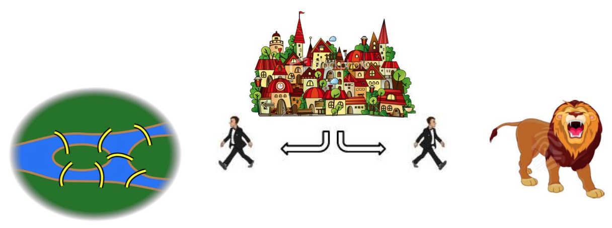

#דף הפעלה מס' 3

### חלק א': כיצד מגיעים לעיירה?

יניב, בצאתו מהארמון, מבקש משני המשרתים שלו שילוו אותו לעיירה.  
 הוא יודע כי העיירה ממוקמת בקצהו של השביל שחוצה את הארמון, אבל לא יודע באיזה קצה (האם לפנות שמאלה או ימינה?).  
  שני המשרתים יכולים לסייע לו: יניב יודע כי אחד מהם תמיד משקר, והשני תמיד דובר אמת (אבל הוא לא יודע מי משקר ומי דובר אמת).   
  יניב חייב לגלות איפה נמצאת העיירה, וזאת ע"י שאלה <u>אחת</u> בלבד ל<u>אחד</u> המשרתים.   
  מהתשובה שיקבל, יסיק יניב בצורה חד משמעית איפה נמצאת העיירה.

מה תהיה השאלה?


  

### חלק ב': כיצד מגיעים לגשרים?

יניב הגיע לעיירה, ביקר בדוכני המזכרות והצטלם מול בתיה הציוריים.  
 ברגע שעבר על פני פוסטר המזמין מבקרים לבקר במסלול ההליכה על גשרי העיירה, פונה אליו אחד המשרתים ואומר:     
 "אדון נכבד, אנו ממליצים לך מאוד לבקר בגשרי העיירה. אם אתה מעוניין, המשרת דובר השקר יוביל אותך אל הגשרים".     
 באותו הרגע, פונה אחד מהם ימינה, והשני פונה שמאלה.       
 ליניב אין מושג לאן לפנות, אבל חייב למהר אחרי אחד המשרתים לפני שייעלמו לו.

לאן עליו לפנות כדי להגיע אל הגשרים?  

  

