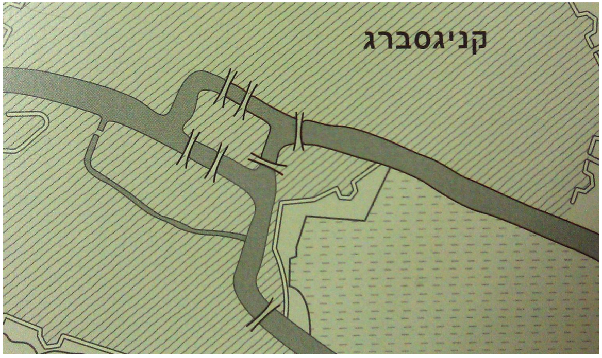

#דף הפעלה מס' 4

###הגשרים של קניגסברג

באותם ימים, קניגסברג הייתה עיר חשובה. המלך, שרצה לאתגר את תושבי העיירה, הורה על פרסום חידה ברחבי העיר:   
האדם הראשון שיצליח ללכת דרך כל הגשרים, מכל נקודת התחלה שירצה, ולסיים באותה הנקודה (מבלי לעבור על אותו הגשר פעמיים) - יזכה בפרסום ועושר אינסופי.   
יניב כמובן לא יכול היה שלא להיענות לאתגר.

האם יניב יצליח למצוא נתיב כזה על פני המפה (לא משנה מאיפה יתחיל)?


  

