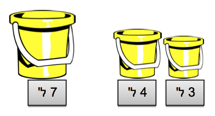

#רקע#

כסטודנטים ל-'מדעי המחשב' המעבירים שיעורים בתחום, רבות נשאלנו ע"י התלמידים והמורים במהלך השיעורים "כיצד זה קשור למדעי המחשב ?", "מה זה בעצם מדעי המחשב ?" - ותמיד הרגשנו קצת לא בנוח לענות על השאלה השנייה. אחרי הכל, גם אנחנו לא באמת ידענו איך להסביר את התחום בצורה ברורה. ניסינו להסביר זאת באמצעות הבאת דוגמאות מחיי היומיום, בהן אנחנו משתמשים באותם כלים ועקרונות 'מדעיים' בהם משתמש 'מחשב'.
מכאן התעורר הצורך בשיעור מבוא שלא יתמקד בנושא מסוים אלא יהווה רקע לכל שאר המפגשים, שבו נדבר באופן כללי על התחומים בהם עוסקים במדעי המחשב. נושאים כגון: מבני נתונים, אלגוריתמים, סיבוכיות, וכדומה. זאת נעשה דרך חידות פשוטות, וכך נוכל לתת לתלמידים מושג ״מוחשי״ יותר לגבי עולם 'מדעי המחשב'.
מערך השיעור הנ"ל יתמקד בניסיון זה.
###מטרת השיעור###

1. מבוא ל'מדעי המחשב' - הצגת  התחומים המרכזיים שעליהם מבוסס תחום 'מדעי המחשב' דרך חידות
פשוטות.
2. הקניית עקרונות חשיבה מדעית -  לימוד "הכל מהכל וכלום מכלום": חידות אשר ילמדו עקרונות חשיבה,
מושגים בסיסיים במדעי המחשב, "טריקים" שלאחר מכן התלמידים ילמדו לעומק בשאר השיעורים ועוד.

#נתחיל..#

השיעור עוסק בהצגה בסיסית של תחום 'מדעי המחשב' דרך חידות הלקוחות מתחום מדעי המחשב והמתמטיקה. חידות אלו לקוחות מבעיות יומיומית שלנו ולכן קל להבין אותן, ומצד שני, השימוש בעקרונות העומדים מאחורי פתרון חידות אלו משמש אותנו, אנשי 'מדעי המחשב', בכל פרט בעשייה בתחום. בעזרת חידות אלו, ננסה להכיר ולהבין קצת מה זה 'מדעי המחשב', ולפתח חשיבה מדעית שתעזור לנו בשיעורים הבאים.

**שאלה**: כתוב 'מדעי המחשב' במרכז הלוח במעין שמש, ושאל את התלמידים: "במה אתם חושבים שעוסק תחום מדעי המחשב"?

את תשובות התלמידים רשום מסביב לשמש. רוב התשובות שיתקבלו יהיו בסגנון: פייסבוק, גוגל, יו-טיוב, נושאים הקשורים בתכנות, משחקי מחשב, תוכנות שעוזרות לנו בחיי היום-יום וכו'. ברור כי האינטואיציה הראשונית שלנו קשורה בנושאים שיש לנו נגיעה בהם ביום-יום שלנו, בין אם לראות וידאו באינטרנט, לדבר עם חברים ולשתף תמונות, לחפש מידע שימושי, לשחק במחשב וכו'. אבל לפני כל אלו, מאחורי הקלעים מתרחשים תהליכים רבים, הרבה מאוד 'טריקים' ועקרונות שמשותפים לכל תוכנה, משחק מחשב או כל אפליקציה, בלי קשר לצורה שבה נראית, מה היא מבצעת ואיפה היא מותקנת.

אז מה זה 'מדעי המחשב'? יותר קל להתחיל ממה זה לא: זה לא מדע, וזה לא קשור למחשבים.

אז מה כן? מדעי המחשב זהו תחום שעוסק בפתרון בעיות. אילו בעיות? בסיפור הבא:

סיפור על בחור בשם יניב (אפשר לקרוא לו בכל שם, שם של מתמטיקאי וכו', העיקר לעורר הזדהות ועניין בקרב התלמידים). בוקר אחד, כאשר יניב נח בביתו, הוא שמע דפיקות בדלת. כאשר פתח את הדלת, ראה מולו שני אנשים הלבושים בקפידה שהציגו בפניו מסמך, ובו כתוב בקצרה: "עליך להתייצב מידית בפני מלך קניגסברג!" בלי לחשוב פעמיים, יניב מיד החל להתארגן. בכל זאת, לא כל יום מופיעים בפני המלך. אחד הדברים הראשונים שיניב שעושה זה
למלא בקבוקי מים לדרך, מתוך דלי מלא במים.

חלק את
[דף הפעלה מס' 1](appendix-a.html "")
 - חלק א', חידת דליים. פעילות של כ- 10 דקות.

  

יניב כבר נדרש בעבר להכין את הדליים, ולכן יש לו כבר רשימה של הפעולות שהכין בעבר שצריך לבצע כדי לחלק את המים בין הדליים כנדרש.
עבור עם התלמידים על פתרון החידה (פתרון מצורף ב[נספח הפתרונות](appendix-b.html "")).

<u>
אנלוגיה למדעי המחשב</u>: לאותה סדרת הפעולות המוגדרות לביצוע משימה מסוימת זו, בעלת מספר סופי של צעדים קוראים בשם **אלגוריתם**
(רשום את המילה בטוש בצבע אחר, מסביב לשמש על הלוח).

אלגוריתם במדעי המחשב היא דרך שיטתית לביצוע משימה מסוימת, שיש לה נתונים מראש (כמו במקרה שלנו: גודל דליים וכמות מים) במספר סופי של צעדים. אם היה לנו 'רובוט' שהיינו נותנים לו את סדר הפעולות כהוראות לביצוע, תמיד הרובוט היה עומד במשימתו. ניתן להרחיב על תחום האלגוריתמים וחשיבותם במדעי המחשב.

בשלב זה, ניתן לבחור ילד שיגיע ללוח וישמש כ'רובוט', וילד אחר יקריא לו ההוראות. עפ״י ציורי הדליים על הלוח, ה'רובוט' יבצע ההוראות, ואכן בסיום הדליים יהיו עפ״י כמות המים הנדרשת.

נמשיך בסיפור: לאחר שהכין את הדליים, מלא לעצמו בקבוקי מים, הכניס לתיקו בגדים, כובע וקצת ממתקים, נזכר  יניב באוסף הדיסקים המגניב ברשותו, וכמובן שהוא לא יכול לצאת לדרך ארוכה זו ללא הדיסקים. מיד דחף גם אותם לתיקו ויצא לדרך.

עם הגעתו לארמון נלקח יניב לחדרו, כדי להתרענן ולהתארגן לקראת המפגש עם המלך. הוא נכנס לחדר והתחיל להוציא את כל תכולת תיקו כדי למצוא את הבגדים היפים ביותר שזכר להביא. בתיק, בין כל הדברים שהביא, נח כמובן אוסף הדיסקים. הוא שם את ערמת הדיסקים על השולחן והמשיך בהכנות למפגש. לאחר שהתארגן, ממש לפני שיצא מהחדר למפגש עם המלך, רצה לשמוע שיר רגוע, שיעזור לו להירגע...

[דף הפעלה מס' 1](appendix-a.html "")
 - חלק ב', פעילות הדיסקים.

ניתן לצייר על הלוח 5 'דיסקים' (או בכלל להביא 5 קופסאות מהבית, ממש מעולה!) בהתאם לסעיפים בדף
ההפעלה, ולשנות את הציור בהתאם להסברים מטה.
עבור עם התלמידים על השלבים החשיבתיים המפורטים מטה ודונו ביתרונות ובחסרונות של כל שלב:
1. הכי קל והכי מהר זה לא לסדר בכלל. להשאיר אותם מבולגנים. כל דיסק שנוסיף, פשוט נזרוק אותו על הערימה. ברור שבצורה כזאת ממש לא נוח לחפש אף דיסק. אם ליניב 100 דיסקים, ייקח לו המון זמן למצוא דיסק כלשהו אחד. מה עוד, שזה תופס מקום ויוצר בלאגן בחדר.
2. אז אולי נמליץ לו לסדר אותם בערימה יפה, כזאת שכל כותרת בצד הדיסק תהיה באותו כיוון, ואז הוא יוכל לעבור על כל הכותרות מלמעלה למטה ולחפש את הדיסק הרצוי? אם הדיסק הרצוי יהיה ראשון מלמעלה - אז בכלל מעולה, ייקח לו 1 שנייה למצוא אותו!
 * מה אם הדיסק בתחתית הערמה? כמה זמן <u>במקרה הגרוע ביותר</u> ייקח למצוא אותו?
 * ומה אם הדיסק נמצא איפושהו באמצע? כיצד נוציא אותו? (נצטרך להרים את כל
הדיסקים עד לאותו הדיסק, ורק אז להוציא).
 * ומה אם יש ליניב שני דיסקים זהים? האם לשמור את שניהם בערמת הדיסקים?
3. אוקי, ננסה רעיון יותר טוב: כדי לא להרים את כל הדיסקים עד לדיסק הרצוי, נסדר אותם כמו בציור
ג'. ככה אמנם לא נשפר את זמן החיפוש של הדיסק, אבל ברגע שנמצא אותו, לא נצטרך להרים
שום דבר מעליו, אלא רק לשלוף אותו מהמקום שלו. ואם יש שני דיסקים זהים, נשמור רק אחד מהם. אחלה.. אבל אולי אפשר לנצל גם את שם הדיסק?
4. רעיון אפילו יותר טוב: לסדר אותם בארון מיוחד, אבל שיהיו תאים מיוחדים המוסדרים לפי
אותיות. כל הדיסקים באות א', יסודרו במקום אחד. כל הדיסקים המתחילים באות ב', במקום אחר וכך הלאה. וכך, נניח אם יש ליניב רק 10 דיסקים שמתחילים באות א', במקרה הכי גרוע, יצטרך רק 10 שניות כדי למצוא את הדיסק המבוקש (הרי יניב יודע מה הוא מחפש). אבל מה אם כל הדיסקים מתחילים באות א'? אולי לבצע תת-סידור לפי סדר האות השנייה? נראה דרך בשיעור ['ציד צוללות'](search-algorithms.html "") כיצד לחפש כל דיסק רק ב- 7 בדיקות בלבד!

<u>
אנלוגיה למדעי המחשב</u>: בעולם המחשבים, במיוחד בשנים האחרונות כאשר יש המון
המון מידע השמור במחשב, מתפתח אתגר מאוד גדול והוא: כיצד לשמור אותו. גם למחשב לוקח זמן לחפש כל פרט שאנחנו מבקשים, וכמובן גם נדרש מקום בשבילו. אנחנו כאנשי 'מדעי המחשב' נדרשים לחשוב איך לשמור את המידע בצורה הכי יעילה, כך שגם לא יתפוס מקום מיותר, וגם כשנרצה 'לשלוף' את המידע הזה, זה ייקח לנו מעט זמן ככל האפשר. תחום זה, העוסק ב-איך לשמור את המידע, נקרא: ״מבני נתונים״ (כתוב מסביב לשמש).
לפני שמחליטים איזה מבנה נתונים יהיה לנו (איזה 'מתקן אחסון') כדי שנשמור בו את כל המידע הרצוי - ממש כמו בדוגמת הארונות והמדפים לדיסקים - אנחנו צריכים להבין כמה זמן ייקח לנו במקרה הגרוע ביותר / בממוצע כדי למצוא דיסק (פריט מידע) מסוים. למה? כי כאמור, נרצה זמן מינימלי ככל האפשר. לעיתים, כמו בדוגמת הדיסקים, עם קצת מחשבה תהליכים מסוימים אפשר לשפר כדי שיגזלו פחות זמן, וזה לעיתים אתגר לא פשוט.
יניב התלבש והתארגן ולפני שיצא, לא שכח להוציא מתיקו את שרשרת המזל שקיבל מאשתו. אך לרוע מזלו, היא התפרקה לו בידו!
 "אוףףף", אמר לעצמו, "אני לא יכול להופיע בפני המלך בלי השרשרת!". לכן, החליט לתקן אותה במהירות אצל הנפח המקומי.
חלק את
[דף הפעלה מס' 2](appendix-c.html "") - חלק א', חידת השרשרת. פתור את החידה ביחד
עם התלמידים (פתרון מצורף ב[נספח הפתרונות](appendix-b.html "")).

  

 בחידת השרשרת לא נרצה לשלם יותר כסף מסכום מינימלי כלשהו שאפשר על תיקון השרשרת. כך גם במדעי המחשב – אתגר לא פשוט הוא לשפר תהליכים, מקום בזיכרון וזמן ריצה של תוכניות, כדי שיצרכו כמה שפחות משאבים. התחום במדעי המחשב שמתעסק בנושא חישוב המשאבים הדרושים לנו נקרא: **סיבוכיות** (רשום את השם מסביב לשמש).

 סיבוכיות היא איזשהו מדד מתמטי של המשאבים הנחוצים לפתרון בעיה נתונה באמצעות מחשב, כאשר שני המשאבים העיקריים הם: הזמן והמקום. הסבר על הסיבוכיות - בפעילות הדיסקים.
 ניתן להזכיר למשל את גוגל (בטח רשומה על הלוח מסביב לשמש..), כיצד לשמור את האתרים, ולחפש במהירות את המילים שחיפשנו. האם נמתין שעה עד לחיפוש של אתר מסוים?

 נמשיך בסיפור: יניב התלבש והתארגן, ומיד יצא בליווי שני המשרתים לפגוש המלך. הוא הגיע למלך וקד קידה. המלך, שממש שמח לראותו, מיד פנה אל יניב וסיפר לו את הסיפור הבא: "במועצת העם האחרונה, שאלתי את שר האוצר על כמות מטבעות הזהב שנאספו מהעם בעיירה כמיסים למלך. שר האוצר, בפנים עצובות, סיפר כי ישנה שמועה על כך שתושבים מסוימים החלו לזייף את מטבעות הזהב, ובמבט חיצוני לא ניתן להבחין בשום הבדל בין מטבע מזויף לאמיתי".

[דף הפעלה מס' 2](appendix-c.html "") - חלק ב', חידת המטבעות.

  

פתור את החידה ביחד עם התלמידים (פתרון מצורף ב[נספח הפתרונות](appendix-b.html "")).
הסבר לתלמידים כי כאשר נדרשים לפתור בעיה 'גדולה', נעדיף לפרק אותה קודם לבעיות קטנות יותר. כך אולי יהיה לנו ולמחשב יותר קל 'לעכל' את הבעיה. בהתאם לעניין בכיתה ולרמת הקשב וההבנה, ניתן לפתור את החידה ע"י ציור המלווה בהסבר של פתרון החידה, כלומר ציור של מצבים ומעברים בין כל מצב (אוטומט) על הלוח תוך הסבר של סדר הפעולות.

<u>
אנלוגיה למדעי המחשב</u>: הסבר קצת על **חישוביות** (רשום המילה על הלוח מסביב לשמש). כיצד ניגשים לפתרון בעיה כלשהי? כיצד ניעזר ב"טריק" של פתרון בעיות גדולות בעזרת בעיות קטנות יותר? תורת החישוביות מהווה בסיס למדעי המחשב "מהצד המתמטי". היא עוסקת בשאלה הבסיסיות, מה ניתן לחשב ומה לא? האם כל בעיה מחשב יכול לחשב?

המלך, שהתלהב מהדרך של יניב לפתרון בעיית המטבעות המזויפים, הציע לו לבקר בעיירה קניגסברג עצמה. יניב כמובן נענה בחיוב. הוא יצא מהארמון וראה לפניו שני מסלולים - ימינה ושמאלה.
 יניב לא ידע לאן לפנות, ולכן  החליט לשאול את שני המשרתים שהיו לצידו: "איזו דרך מובילה לעיירה"?

חלק את
[דף הפעלה מס' 3](appendix-d.html "")
 - חלק א', כיצד מגיעים לעיירה?

  

 פתור את החידה ביחד עם התלמידים (פתרון מצורף ב[נספח הפתרונות](appendix-b.html "")).

כאשר הגיע יניב לעיירה, הוא החליט לבקר בגשרים המפורסמים של העיירה. מדובר ב- 7 גשרים, אשר מחברים בין חלקי העיירה, כאשר נהר עובר באמצע ומחלק אותה לכמה חלקים. אך כאמור, יניב לא יודע לאן ללכת, ואת המשרתים שלו הוא כבר לא רוצה לשאול (לא רוצה לשבור את הראש בשאלות מתחכמות!).

[דף הפעלה מס' 3](appendix-d.html "")
 - חלק ב', כיצד מגיעים לגשרים?

  

 פתור את החידה ביחד עם התלמידים (פתרון מצורף ב[נספח הפתרונות](appendix-b.html "")).

רשום **מתמטיקה** (על הלוח מסביב לשמש). הסבר על חשיבותה של המתמטיקה למדעי המחשב, ובין היתר **לוגיקה**, כמו החידות האחרונות.

יניב הגיע אל הגשרים המפורסמים, ואז נתקל בתופעה מוזרה: המוני אנשים הולכים על הגשרים ללא הפסקה, עוברים מגשר לגשר - ומהרהרים. "מוזר", חשב לעצמו. יניב עצר את אחד מתושבי המקום אשר הלכו על הגשרים ושאל: "אמור לי בבקשה, מדוע כולם הולכים מגשר לגשר בלי הפסקה?". עובר האורח צחקק והשיב: "זה בכדי לזכות בפרס הגדול" - והפנה את אצבעו לכיוון פוסטר ענק שהיה תלוי לצד הדרך.

חלק את
[דף הפעלה מס' 4](appendix-e.html "")
 - הגשרים של קניגסברג.

רשום **גרף** (על הלוח מסביב לשמש). הסבר בקצרה על חשיבות הגרפים בתחום מדעי המחשב כפרומו לשיעור הייעודי בנושא –['צביעת מפות'](graph-theory.html "").

שאל את התלמידים: דיברנו על מבני נתונים, אלגוריתמים, סיבוכיות, קצת מתמטיקה ולוגיקה, גרף וחשיבותו למדעי המחשב - אבל בכלל לא דיברנו על תכנות, בניית תוכנות, אתרים, וכולי. מדוע?

מדעי המחשב כמקצוע, עוסקים בפתרון בעיות וביישום של פתרונות תיאורטיים בתחומים שונים.
 במבט ראשון, לכל החידות שפתרנו אין שום קשר למחשבים, אבל תוך כדי הסבר הבנו את חשיבות העקרונות וה"טריקים" שעומדים מאחורי אותן חידות והקשר לתחום מדעי המחשב. העיסוק במחשבים עצמם הינו משני.
להבדיל, **הנדסת תוכנה** הוא תחום המתמודד עם האתגרים של פיתוח תוכנה גדולה ומורכבת, כמו למשל אתגרי ניהול ותיאום, אתגרים טכנולוגיים, ממשקי משתמש, נוחות ועיצוב וכולי.

בהתאם לרמת העניין וההבנה של התלמידים, מצורף [נספח חידות נוספות](appendix-f.html "").
