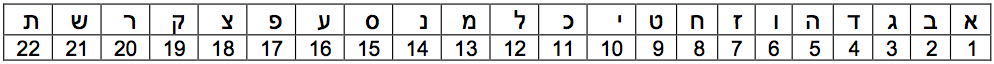

# דף פעילות - העברת מסרי קול בינאריים #

שמך:

`_____________________________`

בחר מילה ורשום אותה כאן:

`__________________________________________________________________`

כעת, המר את המילה לרצף מספרים בהתאם לטבלה הבאה:

המילה במספרים:

`__________________________________________________________________`

כעת הפוך כל מספר למספר בינארי כפי שלמדת:

`__________________________________________________________________`

אם שמעת צליל רשום אותו כאן כאפסים ואחדות ("מופ" – 1, "מיפ" – 0):

`__________________________________________________________________`

תרגם את המספר הבינארי למספר עשרוני:

`__________________________________________________________________`

תרגם את המספר העשרוני למילה:

`__________________________________________________________________`

