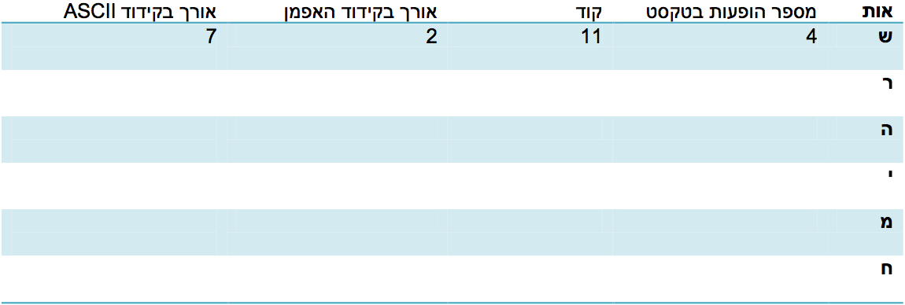

#דף פעילות 4 - קידוד בשיטת האפמן#

####עכשיו תורכם! קדדו את המשפט הבא כפי שנעשה בכיתה:

###שרה שרה שיר שמח


  

 

  

 
כעת חשבו כמה ביטים אנו צריכים לייצג את המשפט "שרה שרה שיר שמח" בכל אחת משיטות הקידוד:
 

* קידוד ASCII: `__________________________________________`

  

* קידוד האפמן: `__________________________________________` 