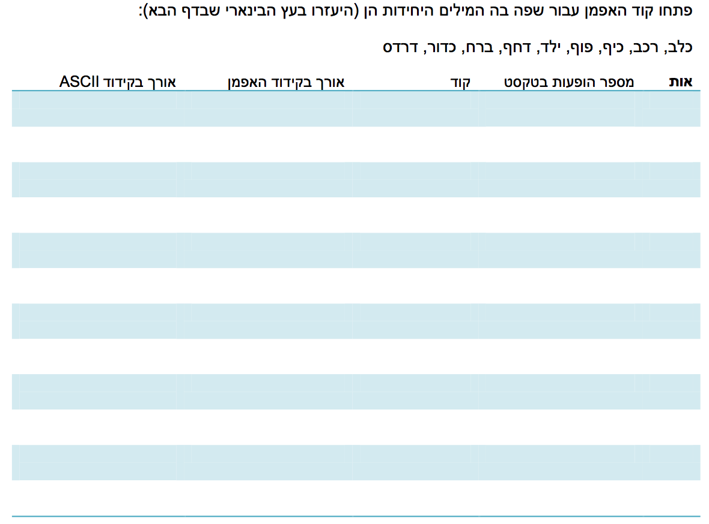
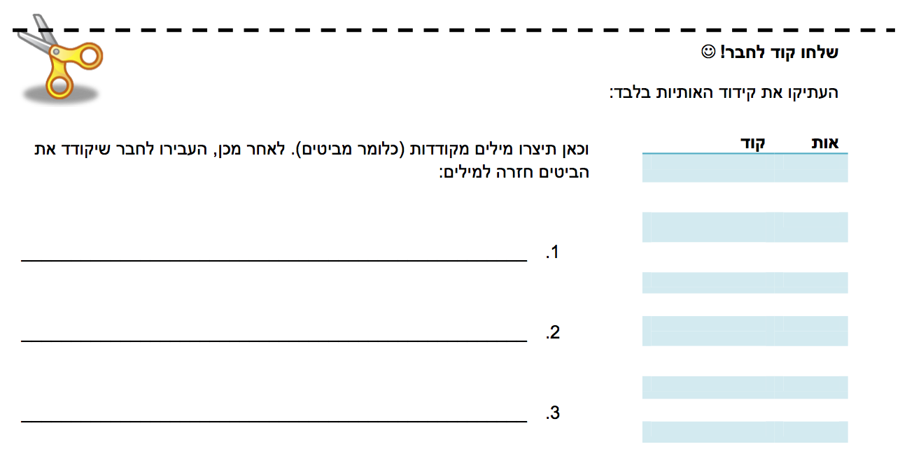
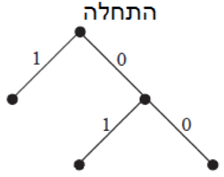

#דף פעילות 5 - פיתוח קוד האפמן#

  

  

מלאו את עמודת ה"קוד" בטבלה בעזרת העץ הבינארי.   
איך יראה העץ הבינארי שלכם? מאוזן יחסית? מדורג? שימו לב שאתם מתייחסים למספר הופעות האותיות במילים.

  

  

  

  

