### מטרת המערך
* כיצד האינטרנט עובד בהיבט הדפדפן
* הבנת תפקידו של הדפדפן
* הכרת השפות השונות אותם הדפדפן מדבר
* הכרת מבנה דף האינטרנט
* כתיבת האתר הראשון שלי

### ציוד דרוש
* מקרן שמחובר למחשב
* מחשב לכל תלמיד
* קבצי ה-HTML שמשתמשים בהם במהלך השיעור
* [מצגת](presentation.pptx "")

# חלק א - כיצד האינטרנט עובד בהיבט הדפדפן והבנת תפקידו

בחלק זה נרצה להראות לתלמידים כי האינטרנט אותו אנחנו מכירים אינו אלא קבצי מחשב שמוצגים בעזרת הדפדפן.
קבצי המחשב הם בדיוק כמו קבצי המחשב במחשבים שלנו בבית. כלומר, כאשר אנחנו ניגשים לאתר מסויים, מה שבפועל קורה הוא שהדפדפן שלנו מציג את התוכן שרשום בקובץ היושב במחשב נידח במקום כלשהו בעולם.

### הכנה
* מקרן המציג את מסך המחשב שלכם
* שימוש במצגת / לוח מחיק + טושים
* [אתר מספר 1](אתר_מספר_1.html "")

## פעילות מספר 1 - דף האינטרנט הוא קובץ במחשב

<u>שאלה לתלמידים</u>: מה לדעתכם קורה כשאנחנו מקישים בדפדפן שלנו
[www.facebook.com](http://www.facebook.com "")
?
<u>תשובה</u>: יש להניח שהתשובות של התלמידים יהיו מגוונות מאוד וכל תשובה תתקבל בברכה.
במקום לענות להם על התשובה באופן ישיר, תבצעו את הדבר הבא:

* אמרו להם: "לפני שאני עונה, אני רוצה להראות לכם משהו"
* פתחו את התיקייה בה נמצא הקובץ [אתר מספר 1](אתר_מספר_1.html ""). עמדו על הקובץ
* שאלו אותם: "האם כולם מסכימים שכרגע סימנתי קובץ שיושב אצלי במחשב?" (מישהו/י יענה כן)
* כעת לחצו על הלחצן הימני בעכבר כשסמן העבר נמצא על הקובץ
* ברו לאפשרות של 'פתח באמצעות' ועמדו על אחד הדפדפנים (אל תלחצו עדיין)
* לפני שאתם לוחצים תפנו את תשומת ליבם לפעולה שאתם עושים "אנא שימו לב שאנחנו מבקשים
מהדפדפן שלנו לפתוח קובץ במחשב"

  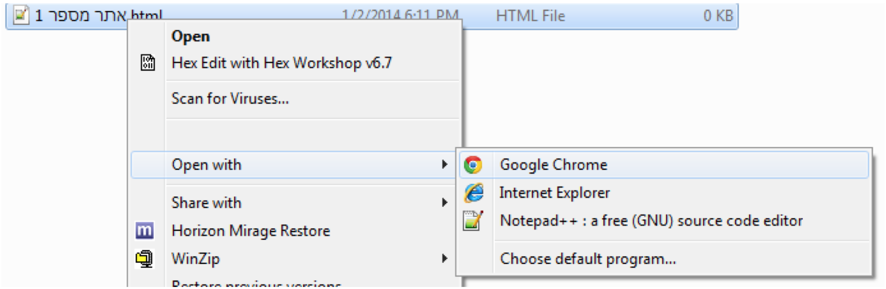

* כעת לחצו
* אמרו לתלמידים "אמנם זה לא דף האינטרנט הכי יפה שראיתם אבל זה דף אינטרנט כמו כל דף אחר"
* כעת חזרו ושאלו שוב את התלמידים את השאלה ששאלתם בתחילת השיעור: מה לדעתכם קורה כשאנחנו מקישים בדפדפן שלנו
[www.facebook.com](http://www.facebook.com "")
?
* כעת התשובות של התלמידים אמורות להשתפר ואמורות להכיל תשובות כמו "פותחים קבצים של
פייסבוק במחשב שלנו" (בתקווה:-)). הדגש שלכם צריך להיות שאתר באינטרנט הוא בעצם קובץ (או הרבה קבצים) שנמצאים במחשב כלשהו בעולם

כעת אנחנו נענה בצורה רחבה יותר אך עדיין מופשטת מה קורה כשאנחנו מקישים על האתר של פייסבוק (לא נכנסים כאן לרזולוציית הסבר של מהו DNS וכרגע גם לא נכנסים להסבר של כתובת IP וכו'):

* כאשר אנחנו מקישים
[www.facebook.com](http://www.facebook.com "")
המחשב שלנו יודע לתרגם כתובת האינטרנט לכתובת אמיתית בה יושב מחשב בעולם.
כן, ממש כתובת פיזית כמו הכתובת שלכם בבית.
* תסבירו לתלמידים שהמטרה שלנו היא להגיע לקבצים שנמצאים במחשב ששייך לכתובת של
[www.facebook.com](http://www.facebook.com "")
כאשר נמצא את הקבצים נרצה לשלוח את התוכן של הקבצים הללו מהמחשב של
פייסבוק אל המחשב שלנו ולעשות בדיוק את מה שעשינו מקודם, נרצה לומר לדפדפן שלנו "דפדפן יקר,
אנא פתח את הקובץ (ובמקרה שלנו כרגע, תקרא את הנתונים שלקחנו מתוך הקובץ שהיה במחשב של פייסבוק ופתח אותם / קרא אותם)".
* כעת הציגו במצגת או ציירו את הציור הבא:

  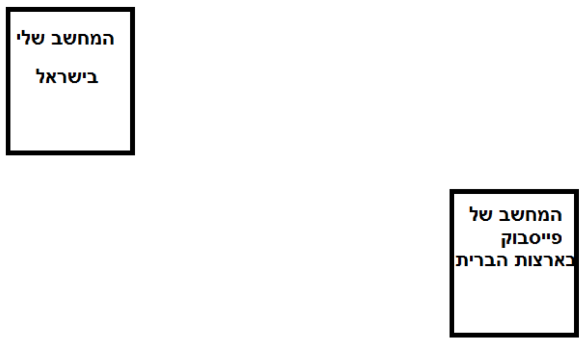

* תשאלו אל התלמידים: "רגע, אבל איך המחשב שלנו בכלל יגיע למחשב של פייסבוק שנמצא בארצות
הברית? איך המחשב של פייסבוק ישלח לנו את התוכן של הקובץ המיוחל?"
* התשובה כמובן צריכה להיות "על גבי רשת האינטרנט"
* השלימו את הציור בצורה הבאה ודברו איתם מעט על המושג רשת. תפנו את תשומת ליבם שהמילה
באנגלית לרשת היא web וש- www שמופיע בכתובת האינטרנט זה world wide
**web**

  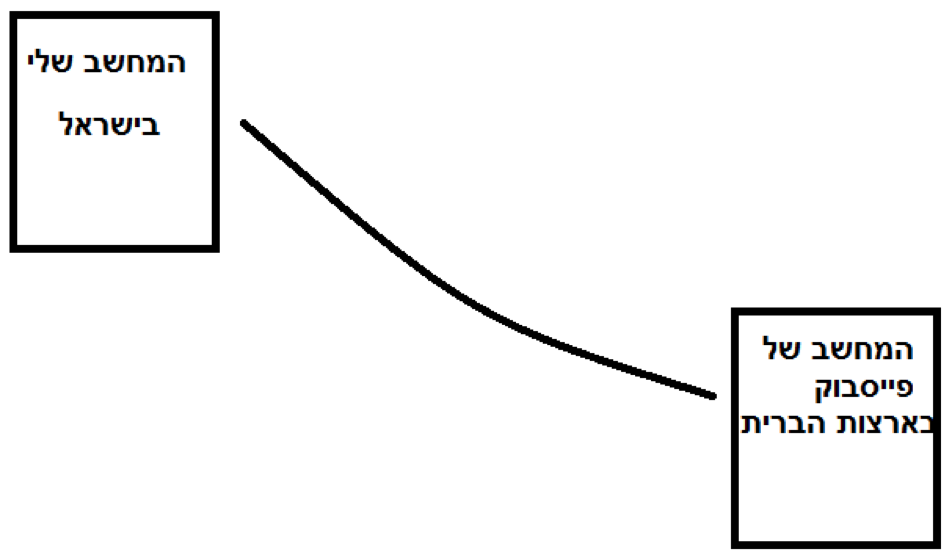

* עברו שקף במצגת או הוסיפו לציור שלכם עוד ועוד מחשבים שכולם מחוברים לכולם והסבירו להם
שהאינטרנט מאפשר לכל מחשב לתקשר עם כל מחשב

**הערה**: הסבר זה על מבנה רשת האינטרנט הוא כמובן מאוד מאוד מופשט ומטרתו העיקרית היא להמחיש את העובדה שהדפים שאנו רואים באינטרנט הם בסופו של דבר תוכן הנמצא בתוך קבצי מחשב ושהמחשב שלנו נגיש למחשבים אלו באמצעות רשת האינטרנט

## פעילות מספר 2 - סרטון יוטיוב בנושא

נא הראו לתלמידים את הסרטונים הבאים (רצוי להפעיל כתוביות בעברית גם אם הן אינן מושלמות).
אפשר לבחור רק אחד או להראות את שניהם. מומלץ להראות את שני הסרטונים.
כל ילד יתחבר לסרטון אחר ובנוסף הם אומרים דברים דומים דבר שיעזור לתלמידים להבין יותר את הנושא.

  [סרטון מספר 1](http://www.youtube.com/watch?v=P7o9Qg8EP-g "")
[סרטון מספר 2](http://www.youtube.com/watch?v=azBl7ShTX_I "")

# חלק ב - השפות השונות שהדפדפן מדבר

בחלק זה נציג לתלמידים את שפות המחשב השונות אותם הדפדפן קורא / מציג / מדבר.
נרצה להראות לתלמידים שכמו שאמרנו מספר רב של פעמים, המחשב שלנו הוא יצור טיפש ולכן נרצה להיות מאוד זהירים ומאוד מדוייקים במה אנחנו אומרים למחשב, מתי ואיך.

### הכנה
* מקרן המציג את מסך המחשב שלכם
* שימוש במצגת / לוח מחיק + טושים

## פעילות מספר 3 - מה הדפדפן מציג?

<u>שאלה לתלמידים</u>: אילו דברים אתם רואים בדף האינטרנט שאתם פותחים אותו? מה נמצא בדף האינטרנט?

* ניתן לפתוח את אתר הכניסה של פייסבוק כדוגמא

<u>תשובה</u>:
 יש כמובן תשובות רבות לשאלה זו (ראו בהמשך את האפשרויות שככל הנראה יתקבלו. הוסיפו אפשרויות שלא היו רשומות)

* רשמו את התשובות של התלמידים על הלוח
* אחרי שרשמתם והוספתם מה שהם לא אמרו, ספרו להם שהדפדפן שלנו ממש כמו בן אדם דובר כמה
שפות
* ספרו להם כי הדפדפן מדבר בעיקר שלוש שפות: "שפת התצוגה (ייצוג)", "שפת העיצוב", ו-"שפת
האינטרקציה בין המשתמש לאתר"
* ספרו להם (בעל פה) כי
	* HTML – שפת התצוגה (כל המילים, תמונות, מה שאנחנו רואים בעיניים)
	* CSS - שפת העיצוב (מילים בצבעים, רקעים, הדגשות של מילים, גודל תמונות)
	* Java Script - שפת אינטרקציה משתמש – אתר (log in ועוד)

הציגו טבלה זו לתלמידים (הטבלה נמצאת כמובן במצגת):

  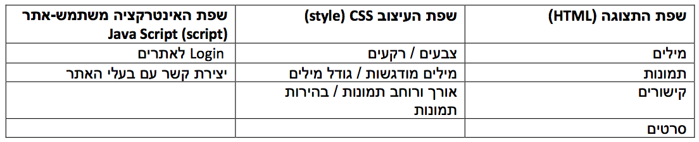

## פעילות מספר 4 - מה הדפדפן מציג?

בפעילות קצרה זו נרצה לתת לתלמידים "להרגיש בידיים" ולראות כי גם האתר המועדף שלהם גם הוא כתוב בשלוש השפות שציינו.
 ב*פעילות מספר 3* נלמד כיצד הדפדפן קורא את השפות הללו ונכתוב דף כזה בעצמנו.

* בקשו מהתלמידים לשבת ליד המחשב ולפתוח בדפדפן את האתר המועדף עליהם
* בקשו מהם להקיש לחצן ימני בעכבר על האתר בו הם נמצאים
* וכעת ללחוץ ”View page source“ (אנא שימו לב שבכל מערכת הפעלה יכול להיות קצת שונה)
* לא להיבהל! אמרו לתלמידים לא לדאוג ועוד ממש קצת הם יבינו טוב יותר מה המשמעות של כל מה
שכתוב לפניהם
* בקשו מהם לחפש פתיח וסגירה של כיתוב HTML
	* <html
	* </html
	* יש לנו כאן הוכחה לשימוש בשפה
* בקשו מהם לחפש פתיח וסגירה של כיתוב script
	* <script
	* </script
	* האם הם מוצאים בין הפתיחה לסגירה את הכיתוב "js" שמעיד על שימוש בשפת Javascript?
* בקשו מהם לחפש פתיח וסגירה של כיתוב style
	* <style
	* </style
	* האם הם מוצאים בין הפתיחה לסגירה את הכיתוב "CSS" שמעיד על שימוש בשפה זו?

עכשיו שהתלמידים מאמינים לנו כי גם האתר המעודף שלהם כתוב בשלושת השפות שציינו נוכל לעבור לחלק הבא והוא  "אז מה בכלל כתוב שם?" ובשפה דידקטית יותר "הכרת מבנה דף האינטרנט".

# חלק ג - הכרת מבנה דף האינטרנט

בחלק זה נרצה לאט לאט להכיר עם התלמידים את קובץ ה-HTML בצורה של שאלות וניחושים.
ננתח איתם ביחד את התוכן שלו וננסה לנחש ביחד איתם מה יוצג לנו על המסך כאשר נפתח את הקובץ בדפדפן.

### הכנה
* דאגו כי קבצי ה- HTML הבאים נמצאים על המחשב שמחובר למקרן:
	* [ניחוש ראשון](First_Guess.html "")
	* [ניחוש שני](Second_Guess.html "")
	* [ניחוש שלישי](Third_Guess.html "")
	* [ניחוש רביעי](Forth_Guess.html "")
* מקרן המציג את מסך המחשב שלכם
* מצגת / לוח מחיק + טושים

## פעילות מספר 5 - עקרון פתיחה וסגירה <>

* הסבירו לתלמידים כי הדפדפן שלנו כמו המחשב, הוא מעט טיפש ואנחנו לא יכולים כמו בן אדם לדבר
איתו בכמה שפות באותו משפט, אנחנו חייבים בכל פעם להגיד לו מתי אנחנו מתחילים לדבר בשפה  מסויימת או אפילו בנושא מסויים ומתי אנחנו מסיימים לדבר איתו.
* לדוגמא, בן אדם שמדבר עברית ואנגלית יבין כאשר אגיד לו:
**?ארוחת הצהריים How was your**
* אם דפדפן היה מדבר עברית ואנגלית היינו צריכים להגיד לו את זה בצורה הבאה:
**<'Start language: English'> How was your <'End language: English'>**
**<'Start language: Hebrew'> ?ארוחת הצהריים <'End language:Hebrew'>**
* ספרו להם שהדפדפן אכן מדבר וקורא ככה, רק שהוא משתמש בקיצר שהוא הסימן ”/“ שמסמן לו סוף
* אם ניקח את המשפט הקודם לדוגמא, הדפדפן ירצה שנכתוב לו
**<'English'> How was your <'/English'>**
**<'Hebrew'> ?ארוחת הצהריים <'/Hebrew'>**
* כולי תקווה כי לפחות ילד אחד כבר שאל אתכם: אבל רגע, מה קשור עברית ואנגלית? הדפדפן שלי לא מדבר עם בני אדם, הוא רק מציג לי דברים או מבקש ממני לעשות דברים וכל זאת בלי לדבר

כעת במידה והטבלה שרשמנו מקודם לא נמצאת על הלוח, כדאי לעזור להם לזכור ולרשום על הלוח (במצגת יש שקף תזכורת):

	* HTML – שפת התצוגה (כל המילים, תמונות, מה שאנחנו רואים בעיניים)
	* CSS - שפת העיצוב (מילים בצבעים, רקעים, הדגשות של מילים, גודל תמונות)
	* Java Script - שפת אינטרקציה משתמש – אתר (log in ועוד)

## פעילות מספר 6 - שלב הניחושים

בשלב זה הציגו לתלמידים כל קטע "תוכן קובץ" ובקשו להם לנחש מה יקרה כאשר תפתחו את אותו קובץ שמכיל את
קטע "קוד" בעזרת הדפדפן

* [ניחוש ראשון](First_Guess.html "")
 – מה לדעתכם נראה כאשר נפתח את הקובץ עם התוכן הבא (כתבו על הלוח / מצגת)?

  

* **תשובה**:
	* הסבירו לתלמידים שמה שכתבנו בקובץ הוא שפשוט אמרנו לדפדפן שלנו "דפדפן יקר, שים לב
כי כעת נרצה להציג בדפדפן משהו ולכן אנחנו משתמשים בשפת היצוג, הלא היא HTML".
	* ניחוש זה אכן מאוד מבלבל וזה כמובן מצויין. השתמשו בדוגמא זו כדי להסביר לתלמידים שכאן
מסתתר בדיוק העקרון שדיברנו עליו מקודם (עם האנגלית-עברית).
	* זה כמו לכתוב: (שים לב, כאן יכתב משהו באנגלית):
**<'English'>   <'/English'>**
	* כעת הפנו את תשומת ליבם לעבודה כי כמו בדוגמא של האנגלית יש כאן סימן ל HTML פתיחה
ו HTML סגירה בו אנחנו אומרים לדפדפן מתי נרצה שהוא יתחיל להציג ומתי נרצה שהוא יפסיק  להציג
	* הראו להם כמובן על גבי הדפדפן שלא נכתב כלום
		כעת אמרו לתלמידים כי כל מה שחסר לנו זה להכניס תוכן, מילים, תמונות ועוד כדי להציג אותם.

* [ניחוש שני](Second_Guess.html "")
 – מה לדעתכם נראה כאשר נפתח את הקובץ עם התוכן הבא ?

  

* **תשובה**:
כאן ה body יכול מעט לבלבל את התלמידים. הסבירו להם שזו פשוט הדרך שלנו להגיד
לדפדפן שכאן זה בעצם גוף העמוד. זה קצת כמו לכתוב מכתב לחבר שמכיל כותרת, גוף ועוד.
	* התשובה הנכונה היא שירשם על המסך "מדעי המחשב זה מגניב!"
	* הראו להם זאת על גבי הדפדפן

* [ניחוש שלישי](Third_Guess.html "") - כעת תשאלו אותם איזה שפה הוספנו כעת לתוכן של הקובץ ומה לדעתכם ישתנה?

  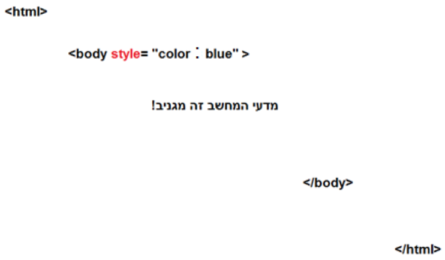

* **תשובה**:
 כעת הוספנו את שפת העיצוב שלנו, שפת ה- CSS.
  איך אנחנו יודעים? כי יש את המילה style.
  * כעת הכיתוב "מדעי המחשב זה מגניב" יופיע בצבע אדום

  * [ניחוש רביעי](Forth_Guess.html "") - כאן קודם הראו לתלמידים את האתר, כלומר תפתחו את קובץ ה- HTML בדפדפן ורק אחרי זה תציצו בקוד.
תשאלו אותם מה לדעתם יופיע בתוכן הקובץ? מהי השפה שלדעתם תופיע בתוכן הקובץ?

  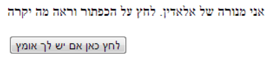

**אחרי לחיצה** על הכפתור נקבל

  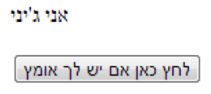

* **תשובה**:
 כאן יש לנו אינטרקציה בין המשתמש לאתר. ולכן נראה בתוכן הקובץ את שפת האינטרקציה,
 הלא היא Java Script

  

# חלק ד – כתיבת האתר הראשון שלי

בחלק זה התלמידים יכתבו את האתר הראשון שלהם בו הם יספרו מעט על עצמם ועל התחביבים שלהם.
בנוסף האתר של התלמידים יכיל תמונה שהם אוהבים.

### הכנה (ביחד עם התלמידים):

* כל ילד יושב על יד מחשב
* בקשו מהם לפתוח תיקיה חדשה בשם "האתר הראשון של `שם הילד`" (בררו איפה ניתן לפתוח תיקיה
במחשב אשר תכניה לא ימחקו למקרה שתזדקקו לסיים את הפעילות בשבוע הבא)
* כעת בקשו מהתלמידים לחפש תמונה באינטרנט שהם אוהבים.
זה יכול להיות של קבוצת הכדורגל המעודפת עליהם, כוכב ילדים מועדף, ג'סטין ביבר, וכמובן גם תמונה שלהם או של המשפחה שלהם
	* בקשו מהתלמידים לשמור את התמונה בתיקיה שהם יצרו. עדיף בשם image.jpg בשביל
האחידות (לא חובה)
* בקשו מהלדים ליצור קובץ טקסט חדש בשם "txt.האתר הראשון שלי"

  

**הערה טכנית** (ניתן לבצע עם התלמידים או לפני השיעור): וודאו כי בתיקיה שיצרו התלמידים ניתן לראות סיומות של קבצים.
זאת כדי שנוכל לשנות את הסיומת של קובץ ה txt לסיום של html ובחזרה.

  

 

  

## פעילות מספר 7 - בניית האתר ביחד עם התלמידים שלב אחר שלב

* פתחו את קובץ הtxt שלכם ורשמו בו:

  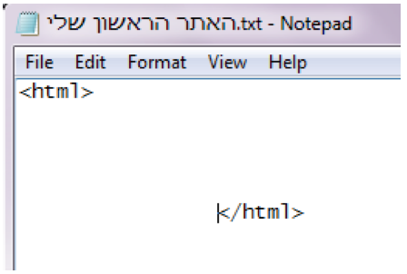

* כעת שאלו את התלמידים אם הם זוכרים מה יקרה אם אנחנו נפתח את הקובץ הזה בדפדפן (אל תפתחו
אותו בדפדפן)?
	* התשובה האמת צריכה להיות "שום דבר מכיוון שזהו לא קובץ HTML", אבל המניע של השאלה
הוא להזכיר לתלמידים כי מה שכתבנו בקובץ כרגע זה רק מאיפה עד איפה יהיה מה שאנחנו  מבקשים מהדפדפן להציג
* כעת כתבו: (כל אחד רושם את השם שלו)

  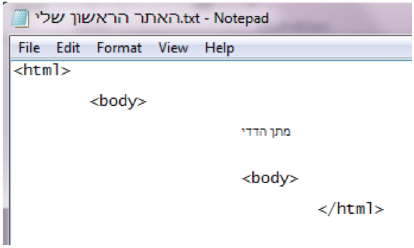

*  בקשו מהם לשמור את הקובץ. ודאו כי הם שומרים את הקובץ בפורמט של 8-UTF

  

* כעת חזרו לתיקיה שיצרתם ושנו את סיום שם הקובץ ל HTML, כלומר:
**html.האתר הראשון שלי**

* כעת פתחו את הקובץ באמצעות הדפדפן

  

נקבל:

  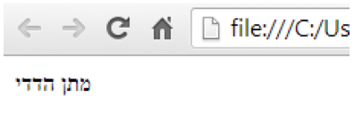

* אמרו לתלמידים כי נרצה שהשם שלנו יהיה גדול, ממש כמו כותרת ולכן בקשו מהם לשנות שוב את השם
של הקובץ, הפעם ל-
**txt.האתר הראשון שלי**

  

* האות h מסמלת את המילה header שזה כותרת
* כעת בקשו מהם לשנות את שם הקובץ ל-
**html.האתר הראשון שלי**
* כעת בקשו מהם שוב לפתוח את הקובץ באמצעות הדפדפן (מכאן ואילך אניח שהתלמידים ואתם הבנתם
את עקרון שינוי שם הקובץ)
נקבל:

  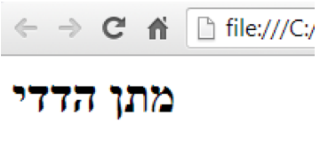

* כעת נצבע את השם שלנו באמצעות CSS , style. כל ילד מוזמן לבחור את הצבע המועדף עליו

  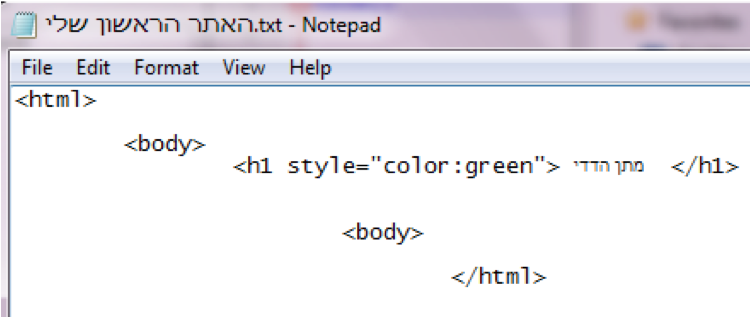

נקבל:

  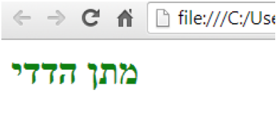

* כעת נוסיף מעט כיתוב על עצמנו
* ספרו להם שאנחנו משתמשים ב `
` כדי להודיע לדפדפן מתי אנחנו כותבים פסקה (paragraph) ובפועל
זה משמש אותנו כדי לכתוב בשורות נפרדות (לרדת שורה)
* אם התלמידים רוצים הם כמובן יכולים לצבוע כל שורה בצבע אחר

  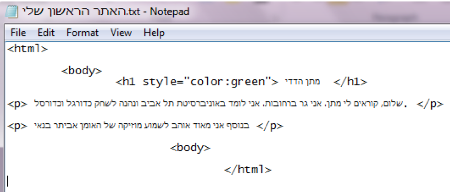

נקבל:

  

* ולבסוף נוסיף את התמונה שכל ילד הוריד לדף לאתר שלו
* ניתן לפני התמונה לערוך דיון קצר ולשאול את התלמידים איזו מאפיינים לדעתם נצטרך לציין כאשר נרצה
לבקש מהדפדפן להציג את התמונה (מקור, גובה, רוחב, מסגרת ועוד)

**הערה טכנית**: שימו לב כי חשוב שהתמונה תשב באותה תיקיה בה יושב קובץ ה- HTML וכי השם הנכון נכתב ב- src

  

נקבל:

  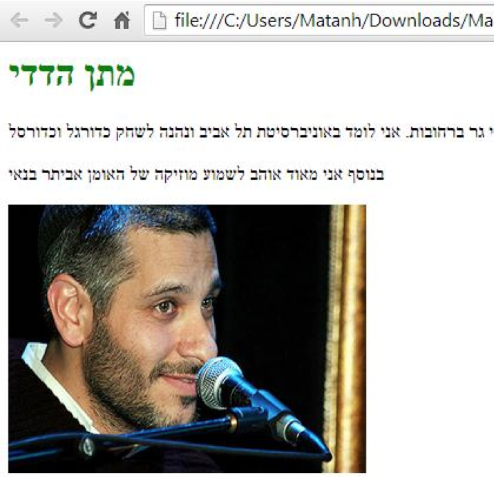

* אמרו לתלמידים כי ניתן לשחק עם אורך ורוחב התמונה לפי רצונם
* הפנו את תשומת ליבם של התלמידים לעובדה שעבור התמונה לא השתמשנו בעקרון הפותח והסוגר
` </img>`

#### סוף שיעור (משהו מצחיק לסיים איתו)

  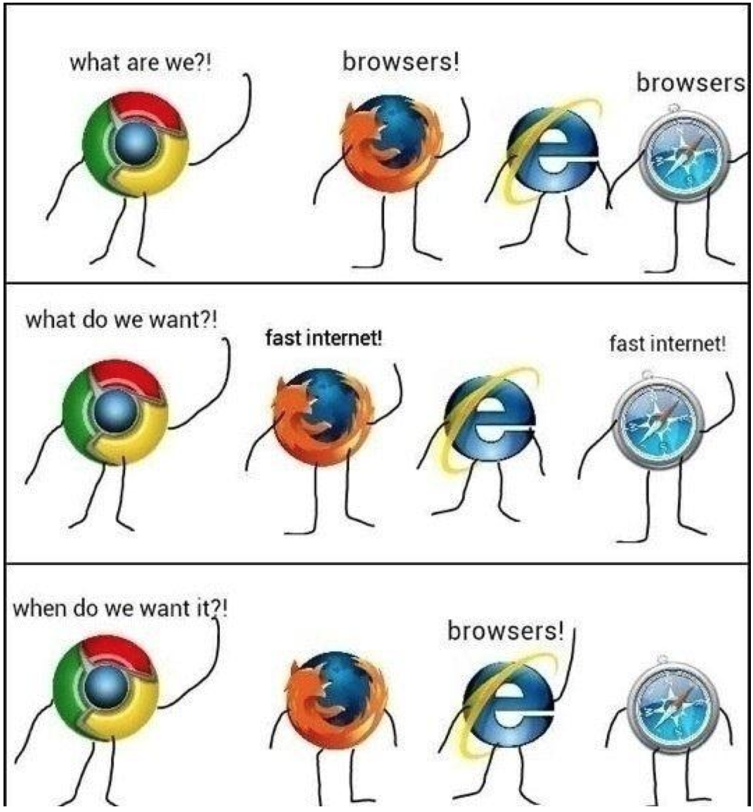

