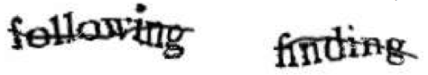

> ״אף פעם אל תסמוך על מחשב שאינך יכול לזרוק מהחלון״ (סטיב ווזניאק)

###קהל יעד

 שיעור זה מתאים לשני ילדים ומעלה בכיתות ו' ומעלה.
 
###מיקום השיעור ברצף הלימוד

מומלץ כי השיעור יתקיים לאחר השיעורים של
[מספרים בינאריים](binary-numbers.html "")
ו-
[ייצוג ועיבוד תמונות](image-processing.html "").

###משך השיעור

שעה עד שעה וחצי.

###רשימת ציוד

* לוח
* טוש ללוח
* דפי הפעילות לחלוקה
* שני עטים
* חבילת דפים
* שעון-עצר (ניתן להשתמש בשעון שבטלפון הסלולרי)
* מחשבון (לא הכרחי)

#רקע

לאורך ההיסטוריה נהגו בני האדם להשוות את עצמם ואת גופם להמצאות הגדולות של התקופה.
 נהגו להשוות את הלב ל*חשמל* (ביטויים כמו "אני במתח" התווספו לשפתנו), או ל*מכונת הדפוס*, וכו'. 
 בתקופתנו, בה המחשב הוא ההמצאה הגדולה, נדמה כי הדמיון בין הגוף האנושי למחשב גדול מאוד ובפרט - הדמיון בין
המחשב ל*מוח האנושי*. תחום **הבינה המלאכותית** של המחשב הולך ומתפתח, התחרות בין המוח למחשב נמשכת מזה זמן ולא מעטים חושבים כי לא רחוק היום בו המחשב יוכל להחליף את המוח האנושי.

בשיעור זה נדבר על הקשר בין המוח למחשב. נעמוד על ההבדלים בין השניים ונראה כיצד המחשב עוזר לנו בחיינו ויותר מעניין מזה - כיצד אנו עוזרים לו.

#פעילות פתיחה

שאלות שמוליכות לדיון: מה ההבדל בין המוח האנושי למחשב?

ראשית, נשאל את הילדים את השאלות הבאות:

<u>שאלות חישוב:</u>

1. כמה זה 7 + 12 ? (הילדים יענו יחסית מהר)
2. כמה זה 121 * 22 ? (שאלה יותר קשה. הילדים אולי ינסו לחשב, ואולי לא)
3. כמה זה 689547 * 5623 ? (כנראה שאף ילד לא ינסה לפתור את השאלה)   
 * נשתמש במחשבון ונראה לילדים כיצד התוצאה מחושבת במהירות.
4. בכספת של שולה יש ממתקים מיוחדים מאוד.   
הקוד לכספת מורכב מ-6 ספרות, כל ספרה היא בין 0-9.   
כמה זמן יקח לכם למצוא 	את הקוד ? (שנים...)
5. מה יהיה מזג-האוויר בעוד שבועיים ? (אף ילד לא אמור לענות תשובה אמיתית)

נדגיש בפני הילדים שהמחשב עוזר לנו בפעולות חישוביות רבות; בחיזוי מזג אוויר, בפענוח צפנים ובתחומים רבים נוספים.

<u>שאלות זיכרון:</u>

1. נשאל את הילדים מי מהם זוכר את מגילת העצמאות בע"פ? (בתקווה, אף אחד לא יענה)  
כעת נשאל באיזה מהמחשבים אפשר למצוא את כל מגילת העצמאות? (בכולם - פשוט נחפש בגוגל)

2. שאלה נוספת: מה עשיתם בדיוק ב-1/12/2011 בשעה 18:43 בערב?  
אף אחד לא יזכור אבל המחשב יזכור - זה רשום לו בזיכרון, בקובץ שנקרא "לוג".

נדגיש כי למחשב יש יכולות זיכרון עצומות, וקיימים מחשבים שנקראים *שרתים* שכל תפקידם הוא לאחסן מידע.

<u>שאלות ראיה:</u>

1. נצייר על הלוח ציור של כלב ונשאל את הילדים מה מצויר בתמונה.   
כעת נשאל את הילדים מה לדעתם היה עונה המחשב על השאלה הזו:  
האם כשנסרוק את התמונה במחשב הוא ידע לזהות אותה? (לא, מבחינתו זה סתם אוסף ביטים)  
האם כשנצלם את התמונה ונעלה אותה כקובץ למחשב, הוא יידע לזהות מה יש בתמונה? (גם לא)  
ומה יקרה אם נשמור את התמונה בשם "ארנב" (ולא כלב) ואז נחפש תמונות של ארנבים, האם הוא יציג לנו
את התמונה? האם זה יתאים לחיפוש שלנו? (הוא יציג את התמונה אך היא לא תתאים כי התמונה היא, כאמור, תמונה של כלב)   
ומה אם נחפש את המילה "כלב"? (המחשב לא יביא לנו את התמונה כי היא מופיעה תחת השם "ארנב" ולא תחת השם "כלב" - יש בעיה!)
2. שאלת אתגר - מי מהילדים נאלץ בעבר לקרוא רצף של מילים מוזרות ולכתוב אותן בעצמו כדי שיוכל להמשיך בתהליך הרשמה כלשהו? (למשל פתיחת חשבון פייסבוק)  
ניתן לצייר דוגמה על הלוח:

  

נסביר שלציור הזה קוראים CAPTCHA, וזהו למעשה מבחן שמטרתו לוודא שהתשובה אינה ניתנת באמצעות מחשב - כלומר להבטיח שמי שיושב מול המחשב הוא אנושי (ניתן להזכיר שזהו "מבחן טיורינג" ולהרחיב בנושא).

<u>שאלות בנושא הדיון:</u>


שאלה:

באילו תחומים אתם חושבים שהמחשב "חזק יותר" מהמוח שלנו?

תשובה:

 זיכרון, חישובים, מהירות, התמצאות במרחב (GPS), יכולת מיון, יכולת חיפוש וכו'


שאלה:

באילו תחומים אתם חושבים שהמוח שלנו "חזק יותר" מהמחשב?

תשובה:

ראיה, שמיעה, תרגום משפטים הדורשים הבנת הקשר מסוים, צריכה פחותה של אנרגיה - נסביר לילדים
שצריכת אנרגיה מופחתת נבחנה מדעית וחוקרים הצליחו לכמת את צריכת החשמל של המוח האנושי. החוקרים הוכיחו  שהמחשב צורך הרבה יותר אנרגיה מהמוח האנושי.


שאלה:

 כיצד אתם רואים את המחשב בעוד 10 שנים מהיום?  
(תנו לילדים להשתעשע בדמיונם ועודדו אותם להפליג ברעיונות שמי יודע, אולי יתגשמו בעתיד)


שאלה:

 האם לדעתכם המחשב יוכל להחליף את המוח? מתי?  
 (אין תשובה אמיתית לשאלה, אך ניתן לציין שמומחים רבים מאמינים שהמחשב "יעבור" את יכולות המוח האנושי בסופו של דבר)

#פעילות מספר 1 - משחק ה- ESP
##או: איך גוגל שיפרה את מנגנון חיפוש התמונות שלה?

###מטרת הפעילות
להראות לילדים כיצד אנחנו יכולים לעזור למחשב לתייג תמונות בעזרת משחק פשוט.  
נזכיר לילדים שקודם ראינו שיש למחשב בעיה לזהות תמונות: אין לו יכולת לראות ולכן הוא לא יידע למצוא את התמונה של הכלב מכיוון שקראנו לקובץ "ארנב".   
כעת נשחק במשחק אמיתי בו גוגל השתמשה בשביל לפתור את הבעיה הזו.

###הכנות למשחק וחלוקת תפקידים
נבחר שלושה ילדים - מנהל המשחק, ושני שחקנים (אתם יכולים להיות המנהל אם יש צורך בכך).  
נתלה תמונה על הלוח (ממאגר התמונות המצורף ב
[דף פעילות מספר 1](artificial-intelligence/appendix-a.html "")
).  
שני השחקנים – כל אחד מהם יקבל דף ועט, ומטרתם לרשום כמה שיותר מילים שיתארו את התמונה שעל הלוח.  
מנהל המשחק - יקבל טוש ללוח ושעון-עצר (סטופר), ימדוד על השעון 30 שניות, וירשום על הלוח את התוצאות.  
בכיתות קטנות – ניתן לחלק את הילדים לשתי קבוצות (במקום שני שחקנים בלבד) וכך כל הילדים יוכלו להשתתף.

###מהלך המשחק
מנהל המשחק רושם על הלוח (בפינה הימנית העליונה של הלוח, יש לדאוג להשאיר מקום על הלוח לשאר התמונות) "תמונה מספר 1" ומפעיל את הסטופר. כל אחד מהשחקנים ירשום על הדף כמה שיותר מילים שיתארו את התמונה
שתלויה על הלוח. 
יש להפריד בין השחקנים כך ששחקן 1 לא יראה את המילים שרושם שחקן 2 ולהיפך.  
אחרי 30 שניות המנהל יעצור את השחקנים ויבקש שכל אחד מהם יקריא לו את המילים שהוא רשם.  
המנהל ירשום על הלוח את כל המילים שרשם השחקן הראשון. לאחר מכן ישאל את השחקן השני איזה מילים רשם.  
על כל מילה שכבר רשומה על הלוח (כלומר ששני השחקנים רשמו) - ייתן המנהל נקודה לשני השחקנים.  
כל מילה אחרת לא תזכה בנקודה אף אחד מהשחקנים, אך תירשם על הלוח.  
הקפידו שהמנהל לא ימחק את המילים ששויכו לתמונה מהלוח.  
המשיכו באופן דומה לתמונות נוספות.  

במידה ויש הרבה ילדים בכיתה, אחרי 3-4 תמונות ניתן להחליף זוג ולשחק שוב את המשחק. ניתן לשחק עם אותן תמונות שוב ושוב. (ולהוסיף מילות טאבו כפי שמתואר בהמשך תחת "הרחבות")

בסופו של תהליך, יירשמו הרבה מאוד מילים על הלוח שמתארות את התמונות שהצגנו.     
המילים שהשתמשו בהן לתיאור התמונה שוב ושוב ע"י ילדים שונים ייחשבו לתיאורים "חזקים" שכן הם קיבלו חיזוק מהרבה מקומות שונים.   
נסביר לילדים שהם בעצם עזרו לנו <u>לתייג ולאפיין</u> את התמונות.   
מילים שהופיעו מספר רב של פעמים עבור תמונה מסוימת כנראה מייצגות אותה טוב יותר מאשר מילים אחרות שתדירותן פחותה.

###הרחבות
ניתן להוסיף למשחק את פונקצית "מילות הטאבו" – מילים שקשורות לתמונה אך לשחקנים אסור להשתמש בהן.    
מטרת מילות הטאבו היא להוסיף עוד מילים שיכולות לאפיין את התמונה ובנוסף לעורר עניין במשחק.  
 ב[דף פעילות מספר 1](artificial-intelligence/appendix-a.html "")
, תוכלו לראות שמילות הטאבו מופיעות מתחת לכל תמונה ואם תרצו תוכלו להגיד לילדים לא להשתמש במילים האלו.    בנוסף, תוכלו להוסיף מילות טאבו משלכם. למשל, אם תראו שכולם משתמשים באותה מילה, תוכלו להוסיף אותה והילדים ייאלצו למצוא תיאור חדש.

###הסבר
נספר לילדים שהמשחק שנקרא ״משחק ה-ESP״ הוא משחק שפותח בחברת גוגל. אתה נכנס לאתר האינטרנט של
המשחק ומשחק מול שחקן אחר זר לחלוטין. הדבר היחיד שמשותף לכם הוא התמונה שמוצגת לשניכם. האסטרטגיה
הכי טובה היא לכתוב כמה שיותר מילים, עד שהשחקנים אומרים את אותה מילה - ואז הם מקבלים נקודות והם  שמחים :-)   
גוגל עשתה שימוש במשחק הזה בשביל לתייג תמונות.   
לפני שהומצא המשחק, חיפוש תמונות התבצע ע”י שם הקובץ, או איזשהו טקסט שהיה באזור התמונה הזו. לאחר המצאת המשחק, התמונות קיבלו תגיות והן עולות במהירות בחיפוש פשוט באינטרנט. כלומר השתמשנו ביתרון הראיה של האדם כדי לתת למחשב את היכולת "לראות".

על מנת לוודא שאין זיופים, פותחו שתי שיטות:

1. הוכנסו כמה תמונות מבחן שכבר תויגו מראש, ולפי המילים שנתנו השחקנים לתמונה - ניתן להבין האם
השחקנים מרמים או לא. 

2. פותח מנגנון שבו הוחלט לשמור תיוג לתמונה רק אחרי מספר מסויים של הסכמות.

במציאות - 75,000 אנשים שיחקו במשחק, 50 מיליון הסכמות התקבלו, ובסופו של דבר תייגו את כלל התמונות שברשת תוך חודשים ספורים בלבד.

הסבר על המשחק בויקיפדיה וקישור אליו ניתן למצוא כאן: http://en.wikipedia.org/wiki/ESP_game


#פעילות מספר 2 - משחק המלל - Verbosity
##או: איך גוגל מנסה להכניס למחשב מעט "שכל ישר"

###מטרת הפעילות
להראות לילדים כיצד אנחנו יכולים לעזור למחשב להפוך למעט יותר "אינטליגנטי".   
נסביר לילדים שכידוע, בני האדם מודעים לעובדות רבות - כולם יודעים שמים מרווים, למכונית יש ארבעה גלגלים וכדומה.. הקשרים הללו במוחנו, הם מה שמאפשרים לנו להתנהג בטבעיות ולנווט את דרכנו בעולם.  
למשל, בסיטואציה שבה נפנה למישהו ונאמר לו "החתול שלי לא מרגיש טוב", הוא כנראה יציע לנו לפנות לווטרינר בהקדם. לעומת זאת, חיפוש דומה בגוגל עבור אותו משפט לא יספק לנו רשימה של וטרינרים. למחשבים אין את הידע הזה ומטרת המשחק היא להשתמש בבני האדם כדי לספק למחשבים את העובדות הללו ולהפוך את המחשבים למעט יותר "אינטלגנטיים".   
המשחק, בדומה למשחק הקודם, גם הוא משחק אמיתי שגוגל המציאה והשתמשה בו על מנת לשפר את מנגנוני החיפוש שלה.

###הכנות למשחק וחלוקת תפקידים
נבחר שלושה ילדים - מנהל המשחק, ושני שחקנים (אתם יכולים להיות המנהל אם יש צורך בכך).   
שני שחקנים – האחד נקרא "מתאר", השני נקרא "מנחש". המתאר מקבל את 
[דף פעילות מספר 2](artificial-intelligence/appendix-b.html "").  
מנהל המשחק - יקבל טוש ללוח ושעון-עצר (סטופר). המנהל ימדוד על השעון 30 שניות, וירשום על הלוח את התוצאות. בכיתה קטנה ניתן לבחור "מתאר" ושאר הילדים יהיו "מנחשים" על מנת לשתף את כלל הילדים במשחק.

###מהלך המשחק
אנחנו נותנים ל"מתאר" מילה; למשל - “חלב”.   
 הוא צריך לגרום ל"מנחש" לגלות את המילה מבלי להשתמש במילה עצמה וע"י שימוש באחד מהמשפטים שבבנק המשפטים שנמצא ב[דף פעילות מספר 2](artificial-intelligence/appendix-b.html ""), לאחר שהשלים את המשפט בצורה הגיונית כלשהי.   
  למשל, כדי לתאר את המילה חלב, ה"מתאר" יוכל להגיד ל"מנחש" את המשפט: זה בד"כ הולך עם `דגני בוקר`.   
אם ה"מנחש" לא הצליח לנחש את המילה, ה"מתאר" יכול לבחור משפט נוסף ולהשלים גם אותו - למשל: יש בזה `לקטוז` - וכן הלאה.   
ברגע שה"מנחש" גילה את המילה, שני השחקנים זוכים בנקודה.  
ניתן להחליף את הילדים אחרי שלושה סיבובים. אם המשחק נהיה להם קל מדי, אפשר לאתגר אותם ולתת להם לנחש מילים שנלמדו בקורס שלנו, למשל: "מספרים בינארים", "פיקסל", "גרפים", "זיכרון" או כל מילה אחרת שאתם חושבים שהם כבר אמורים להכיר.

###הרחבות
ניתן להוסיף למשחק את פונקצית "מילות הטאבו" – מילים שקשורות למילה אך לשחקנים אסור להשתמש בהן.  
מטרת מילות הטאבו היא לעורר עניין במשחק ולהקשות על ניחוש המילה.

###הסבר
בעזרת המשחק ניתן לתת למחשב מעט הגיון. לאחר שישחקו במשחק המוני אנשים, למחשב יהיה מעט יותר "ידע בסיסי" ויוכל ליצור קשרים בין מילים. משהו שנראה לנו ברור מאליו, למשל שחלב בד"כ הולך עם דגני בוקר, לא ברור למחשב.     
מטרת גוגל ביצירת המשחק היא לנסות להפוך את החיפוש לטוב יותר, חכם ואינטליגנטי יותר. מעכשיו, כשנחפש מידע על חלב, הוא יציג לנו את המידע המבוקש ויציע לנו גם לבדוק האם אנחנו רוצים מידע על דגני בוקר, שכן הוא "יבין" ששני המושגים קשורים זה לזה.

#סיכום
בשיעור זה עמדנו על ההבדלים שבין מחשב למוח האנושי וראינו שיטות שפותחו בגוגל על-מנת לגשר על הפערים.  
 ראינו שיש הרבה מאוד פעולות בהן אנחנו נזקקים למחשב – לחשב לנו חישובים, לזכור כמויות עצומות של מידע, לעזור לנו לחפש ביעילות ועוד. מן הצד השני, ראינו כי גם לאדם יש יכולות שאין למחשב - אנחנו רואים, שומעים, משתמשים בשכל ישר, אנחנו צורכים הרבה פחות אנרגיה וראינו שאנחנו יכולים ל"הועיל" למחשב ולהפוך אותו לטוב ויעיל יותר.

**אנקדוטה** - נשאל את הילדים אם הם מכירים את הסרט "מטריקס" – סרט מדע בדיוני שיצא ב-1999. אם תחשבו על הסרט, המחשבים הופכים להרבה יותר חכמים מהאנשים, ובמקום להרוג אותנו - הם משאירים אותנו בשביל לייצר אנרגיה מאיתנו. כלומר, הם חייבים אותנו כי אנחנו פותרים בעיות שהם עוד לא פתרו. אז ה"מטריקס" היא דוגמא מעט קיצונית ובדיונית אבל היא מראה לנו שאנחנו לא יכולים בלי המחשב, והמחשב לא יכול בלעדינו.