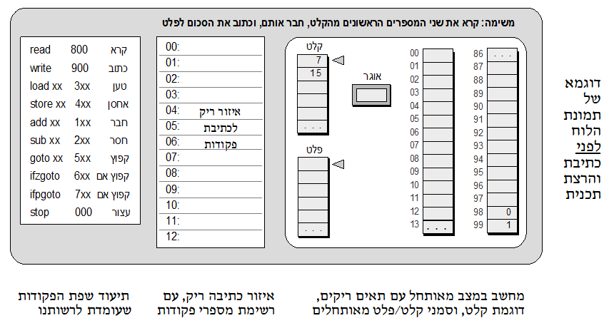

```
parent_lesson: basic-hardware-software
order: 2
layout: appendix
```

#נספח ב': כתיבת והרצת תכניות מחשב#

כתיבת תכניות מחשב לפני קהל צופים יכולה להיות הנאה צרופה או עונש מזוקק -- הכול תלוי באופן שבו מנהלים את הפעילות. אנו ממליצים בכל לב לפעול לפי הנוהל הבא.

##איך כותבים תכנית בכתה##

- ודא שלכל ילד יש עותק של הדף "שפת הפקודות של רובי".
- כתוב על הלוח, בעברית ובדיוק נמרץ, את המשימה שהתכנית אמורה לבצע.
- הצג לילדים תמונת מצב של מחשב מאותחל עם דוגמת קלט מתאימה לתכנית.
- כתוב על הלוח רצף של מספרי פקודות, מ 00 עד 12. 

שימו לב לנקודה האחרונה: לפני שכותבים תכנית כלשהי בשפת רובי על הלוח או במחברת, צריך תמיד לרשום רצף של מספרי פקודות עם שורה ריקה ליד כל מספר. תריסר שורות בדרך כלל יספיקו, אך כדאי להשאיר מקום לכמה שורות נוספות שאולי נצטרך בתכניות יותר מורכבות.

נניח שאנו עוסקים בכתיבת תכנית לחיבור שני מספרים. אם עשית את כל ההכנות שמתוארות למעלה, תמונת הלוח צריכה להראות כך:


<div id="container" align="center">
  
</div>
<br>

כעת אפשר להתחיל לכתוב את הפקודות בדף התכנית הריק (במרכז הלוח), ולעשות זאת בשיתוף פעולה מירבי עם הילדים. יש למישהו רעיון מה צריכה להיות הפקודה הראשונה? וכן הלאה. אנו ממליצים לכתוב את התכנית בפקודות מילוליות. למשל, אם ילד מציע "800", כותבים על הלוח read. לאחר שסיימתם לכתוב את כל התכנית בפקודות מילוליות, עוברים לשלב הבא. 

##איך מריצים תכנית בכתה##

1. תרגמו את כל הפקודות המילוליות לפקודות מספריות.
    (למשל, תרגמו את read ל- 800, את store 90 ל- 490, וכן הלאה).
2. העתיקו את רצף הפקודות המספריות (תוצאת התרגום) אל זיכרון המחשב:
    כיתבו את פקודה מספר 00 בתא זיכרון 00, פקודה מספר 01 בתא זיכרון 01, וכן הלאה.
    ציירו את סמן הזיכרון (חץ קטן) ליד תא 00.
3. שימו עצמכם בנעליו של רובי הרובוט, ובצעו את התכנית על הלוח, פקודה אחר פקודה. 
    עשו זאת לאט ובזהירות, והקפידו למלא כל פקודה כלשונה. לאחר ביצוע כל פקודה, הזיזו את
    סמן הזיכרון לפקודה הבאה (ציירו מחדש את החץ הקטן).
4. אם התכנית לא פועלת כהלכה, נסו לאתר את הפקודה או הפקודות שגרמו לבעייה,
    תקנו את הטעון תיקון בתכנית (מרכז הלוח), וחיזרו לשלב (1) למעלה.
אנו משתמשים בלשון רבים משתי סיבות. ראשית, אם כותבים ומריצים תכניות לפני הכתה, מומלץ להזמין ילדים ללוח ולבקשם לבצע את כל השלבים המצוינים לעיל בעצמם. שנית, אם הילדים כותבים את התכנית על נייר, אלה בדיוק ההוראות שצריך לתת להם.

בשלב זה הלוח יראה בערך כך:

<div id="container" align="center">
  
</div>
<br>

####דוגמא להרצה על נייר (סימולציה) של תכנית לחיבור שני מספרים (מימין לשמאל, מלמעלה למטה)####
<div id="container" align="center">
  
</div>
<br>

כללי עבודה: כשקוראים מספר מהפלט, מוחקים אותו עם קו אלכסוני. לפני שכותבים מספר חדש לתוך תא כלשהו, מוחקים את המספר הישן עם קו אלכסוני. בסיום ביצוע כל פקודה מעדכנים את מונה הפקודות.

 
####שפת הפקודות של רובי#####

<div id="container" align="center">
  
</div>
<br>

<div id="container" align="center">
  
</div>
<br>