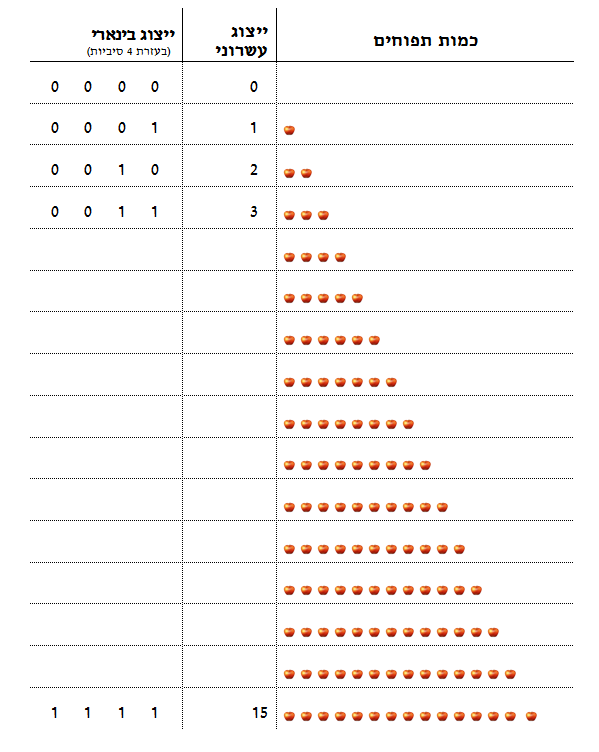

```
parent_lesson: binary-numbers
order: 2
layout: appendix
```

#דף פעילות 1#

##השלימו את התאים הריקים בטבלה:##

<br>
<br>

<div id="container" align="center">
  
</div>
<br>
<br>

<br>
<br>
<br>
<br>
