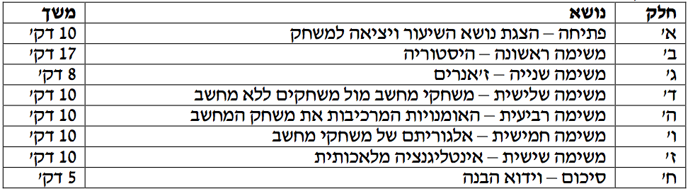

###מטרות

התלמידים יסבירו מה הם המאפיינים של משחקי המחשב.

###משך השיעור

 שעה ועשרים דקות ללא הפסקה. ניתן לקיים הפסקה בת עשר דקות בין המשימה השלישית לרביעית וכך להאריך את
 השיעור לשעה וחצי.

###מהלך השיעור

  

###דגשים
- במידה והתלמידים לא למדו עדיין מה זה אלגוריתם אז אל תבצע את חלק זה בשיעור.
- במידה ואינך עומד בזמני השיעור, ניתן לוותר על חלק ה' – האומנויות המרכיבות את משחק המחשב או על כל חלק אחר לפי היכרותך את הקבוצה ולפי חשיבות הנושאים בעיניך. שים לב שהזמנים מציינים את החשיבות שיש להקדיש לכל פרק.
- ניתן לבצע את השיעור כשיעור פתיחה לשיעורי מדעי המחשב ללא מחשב אשר מציג את הרעיון של העתקת יישומי היומיום למחשב. משחק המחשב הוא דוגמא לביצוע המעבר לעולם המחשבים. באותה מידה ניתן לבצע את השיעור כשיעור מסכם לנושא מדעי המחשב ללא מחשב, בתור סיום חווייתי ומהנה אשר מבצע סיכום עקרוני של החומר הנלמד. אם הוא מבוצע כשיעור מסכם, חשוב להקפיד לקשר לאורך השיעור את הנושאים השונים לנושאים שנלמדו כבר בתוכנית מדעי המחשב ללא מחשב.
- השיעור עוסק במשחקים, לכן מועבר כולו כמשחק. השיעור צריך להיות כיף, אם הוא לא כיף אז השיעור לא ישיג את מטרתו.
- בהגדרה בתחילת השיעור נשתמש בביטויים "משחקי מחשב" לעומת "משחקים רגילים" (דהיינו משחקים שלא משוחקים באמצעים אלקטרוניים). השתמש בביטויים אלו לאורך השיעור.
- השיעור מבוסס על האינטראקציה שלך עם התלמידים לשם למידה אקטיבית. על מנת שהתלמידים יבינו ויזכרו את החומר הנלמד חייבת להתבצע חשיבה של התלמידים בכל שלבי השיעור. חשיבה זו מבוצעת בעזרת שאלות ותשובות לאורך השיעור (בעיקר בתום
כל משימה). כדי שהתלמידים יענו את התשובות המצופות יש להוביל אותם לתשובה באמצעות גילוי מודרך.

###רשימת ציוד

- כרטיסיות משימות:
 * כרטיסיות **היסטורית משחקי המחשב**.
 * כרטיסיות **ז'אנרים**.
 * כרטיסיות **משחקי המחשב ומשחקים ללא מחשב**.
 * כרטיסיות **אומנויות**.
  * כרטיסיית **אלגוריתם**.
  * כרטיסיות **אינטליגנציה מלאכותית** + כרטיסיות **ריקות**.
- (מומלץ!) קופסאות שניתן לשים בהן את הכרטיסיות השונות ולהטמינן באדמה.
- מטמון (סוכריות או משהו דומה).
- עטים.

###קיצורים

**ש** - **ש**אל
**ק** - **ק**בל
**א** - **א**מור
**ה** - **ה**פעלה

#חלק א': פתיחה – הצגת נושא השיעור ויציאה למשחק

###הצגת הנושא

**ש**: מה משותף ל: קלאס, פוקר, הקדרים באים, שוטרים וגנבים, איקס עיגול, מונופול?
 **ק**: הם כולם משחקים שונים.
  **ש**: מה משותף ל: וורלד אוף וורקרפט, פיפא, פק-מן, אנגרי בירדס, פרוט נינג'ה, פרו, סטרקרפט, קאונטר סטרייק, מדל אוף אונר?
   **ק**: הם כולם משחקי מחשב.
   **א**: בשיעור היום נעסוק במשחקים ומשחקי מחשב.
    **ש**: מה זה משחק ומה זה משחק מחשב?
     **ק**: במילון מגדירים משחק כך - שעשוע, השתעשעות, התבדרות, התעסקות בדבר מהנה; צעצוע, כלי להשתעשע עמו, מכשיר שמשתעשעים אתו; הצגה, דרמה, אמנות ההצגה; צחוק, שחוק, עליצות, עליזות.
     לעומת זאת משחק מחשב לא מוגדר במילון של אבן שושן אלא רק בויקיפדיה -
משחק מחשב הוא תוכנה המהווה משחק, ומקיימת אינטראקציה מתמדת עם השחקן. משחק מחשב הינו סוג של משחק וידאו, המופעל על גבי מחשב אישי, ונשלט באמצעות ממשקים מתאימים כגון מקלדת, עכבר ועוד.
זאת אומרת שמשחק מחשב, כשמו כן הוא, וריאציה של משחק. הוא כולל בתוכו את כל האלמנטים של משחק אך הוא מתרחש במחשב. חשוב לשים לב לכך שבמשחק מחשב מתקיימת אינטראקציה של המחשב עם השחקן.

###מוטיבציה
**ש**: מדוע אנו לומדים על משחקי מחשב?
 **ק**: אנחנו משחקים כל הזמן במשחקי מחשב, אבל נראה שאף פעם אנחנו לא עוצרים וחושבים כיצד הם נוצרו ומה מאפיין אותם.
  **ש**: למה זה קשור למדעי המחשב ללא מחשב?
  **ק**: בעזרת למידה על משחקי מחשב אפשר להבין על עקרונות חשובים על עולם המחשבים. בעיקר נלמד בשיעור כיצד מבוצעת המרה של עולם התרבות לפני תקופת המחשב אל תוך עולם המחשב.
  **א**: בשיעור לא נלמד מרכיבים מתמטים במדעי המחשב ולא נלמד לתכנת, אבל כן נלמד על העקרונות שיוצרים את משחקי המחשב. אם נעלה לרמה עקרונית נוכל להבין את מה שעומד מאחורי כל תכנות בסיסי של אפליקציות שונות: משחקים, עזרי משרד, תוכניות ניהול. בעצם כל תוכנות המחשב (אפליקציות) מהוות מעבר מעקרונות מחוץ לעולם המחשב אל עולם המחשב.
###הצגת מהלך השיעור
**א**: בשיעור זה נלמד על:
1. היסטורית משחקי המחשב
 2. ז'אנרים של משחקי מחשב
  3. משחקי מחשב מול משחקים ללא מחשב
   4. האומנויות המרכיבות את משחק המחשב
    5. אלגוריתם למשחקי מחשב
     6. אינטליגנציה מלאכותית
      7. נסכם את השיעור

**א**: אז כדאי ללמוד על משחקים, בואו נצא למשחק!
 **ה**: כולם מכירים את המרוץ למיליון?! אז אנחנו נשחק המרוץ למיליון רק שבסוף במקום מיליון שקלים יהיה מטמון צנוע יותר, ובמקום להתחלק לזוגות נרוץ כולם יחדיו. בקיצור, נשחק חפש את המטמון. בבית הספר (מתנ"ס או כל מקום אחר) מתחבאות משימות, נרוץ לכל משימה, נמצא אותה, נבצע אותה ונרוץ למשימה הבאה עד שנגיע למטמון.

#חלק ב': היסטוריית משחקי המחשב

**ה**: התלמידים צריכים למצוא את
 [כרטיסיות **היסטורית משחקי המחשב**](appendix-a.html "").
 לאחר שמצאו, בקש מהתלמידים לסדר את האירועים על פי סדר התרחשותם מהישן לחדש (אין צורך לדייק לחלוטין אלא לסדרם לפי העשורים: אירועים משנות ה- 50, משנות ה- 60, וכן הלאה). הזמן המוקצב למשימה הוא 10 דקות. בתום המשימה תעבור יחד עם התלמידים על האירועים ובדוק האם התלמידים סידרו את האירועים על פי הסדר. במידה וטעו, תקן וסדר על פי הסדר הנכון. חשוף את השנים שבהן קרא כל אירוע.
 **ש**: כיצד משפיעה ההתפתחות הטכנולוגית על התפתחות המשחקים?
**ק**: מורכבות המשחקים מכל הבחינות (גרפיקה, סאונד, סיפור, כמות משתתפים, אינטליגנציה מלאכותית) התפתחה כתלות בהתפתחות הטכנולוגיה.
 **ש**: כיצד למשל התפתחו המשחקים כתוצאה מהתפתחות הגרפיקה?
  **ק**: מראה המשחק עבר מתצוגות פשוטות לתצוגות מורכבות המשלבות קטעי וידאו רבים. המשחק נעשה יותר ריאליסטי, או יותר פנטסטי.
   **ש**: מהן ההתפתחויות החדשות של השנים האחרונות שחשובות לכם במיוחד?
    **ק** (תלוי בתלמידים): משחקים על בסיס הרשת מאפשרים משחק חברתי יותר. קונסולות
משחקים כמו Wii וקינקט מאפשרות משחקים קלים יותר שלא מיועדים אך ורק לגיימרים. סאונד מאפשר משחקים מלהיבים יותר, או משחקים הקשורים למוזיקה (כמו גיטרה הירו) וכו'.

#חלק ג': ז'אנרים של משחקי מחשב

**ה**: התלמידים צריכים למצוא את
 [כרטיסיות **ז'אנרים**](appendix-b.html "").
 בעזרת כרטיסיית הז'אנרים, התלמידים צריכים להתאים שני משחקי מחשב (שהם מכירים) לכל ז'אנר. למשימה מוקצבות 3 דקות. לפני המשימה, וודא שהתלמידים מבינים את המושג "ז'אנר" ברמה הבסיסית. בתום המשימה תעבור יחד עם התלמידים על התאמות המשחקים לז'אנרים ושאל לגבי כל ז'אנר את השאלות הבאות:
**ש**: מה הם המאפיינים של ז'אנר X? (התשובה על הכרטיסיות אך וודא כי באמת הבינו)
**ש**: כיצד מאפיינים אלו באים לידי ביטוי במשחק שהותאם לז'אנר זה?
**ש**: מי מהתלמידים מעדיף את הז'אנר X על פני הז'אנרים האחרים?

#חלק ד': משחקי מחשב מול משחקים ללא מחשב

**ה**: התלמידים צריכים למצוא את
 [כרטיסיות **משחקי המחשב ומשחקים ללא מחשב**](appendix-c.html "").
בעזרת כרטיסיות המשחקים, התלמידים צריכים להתאים משחק מחשב לכל משחק רגיל. למשימה מוקצבות 4 דקות. וודא שהתלמידים מכירים כל משחק. במידה והתלמידים נתקעו ולא מצאו "שידוך" מתאים למשחק, הצע שידוך כזה בעצמך.
**א**: הרודוטוס היסטוריון יווני מספר שהמשחקים הומצאו בממלכת לידיה בעת שהיה בממלכה בצורת ורעב. המשחקים עזרו לתושבים להעביר את הזמן ולשכוח מהרעב. מאוחר יותר הם השתמשו במשחקים כדי לקבל החלטות באשר לגורל הממלכה.
**ש**: מה ניתן להסיק מהתאמות אלו שביצעתם כעת?
**ק**: המשחקים באשר הם מאפשרים לבני האדם ליהנות. כאשר פותח המחשב, נפתחו אפשרויות חדשות של משחק. במשימה הראשונה, למדנו שהמשחקי מחשב הראשונים היו המרות אחד לאחד של משחקי מציאות למשחקי מחשב, ושככל שהתפתחה הטכנולוגיה התפתחו המשחקים לכיוונים שונים אך הם תמיד שומרים על קורלציה למציאות (למשל משחקי "גיטר הירו" או משחקי טניס ב- Wii).
**ש**: האם במשחקי המחשב קיימת חברתיות או אינדיבידואליות?
**ק**: כבר ממשחקי המחשב הראשונים ניתן היה לשחק בזוג. לרוב משחקי המחשב משוחקים נגד המחשב, דבר המאפשר זמן רב יותר של משחק כיוון שאין צורך בתיאום עם חברים. מאז המצאת הרשת, משחקי מחשב נעשו מרובי משתתפים. סגנון משחק זה הוא בעל פופולאריות אדירה ומקיף כבר כמות אדירה של אנשים ברחבי העולם. "וורלד אוף וורקרפט" למשל משוחק על ידי יותר מ- 500 מיליון אנשים ברחבי העולם.
**ש**: אליו משחקים אתם מעדיפים, רגילים או משחקי מחשב? למה?

#חלק ה': האומנויות המרכיבות את משחק המחשב

**ה**: התלמידים צריכים למצוא את
 [כרטיסיות **אומנויות**](appendix-d.html "").
 בעזרת כרטיסיות אלו, התלמידים צריכים להסביר כיצד כל ענף אומנות בא לידי ביטוי במשחקי מחשב. למשימה מוקצבות 4 דקות. בקש דוגמאות מהתלמידים למשחקי מחשב בהם ענף האומנות בא לידי ביטוי.
 **ש**: האם במשחק הראשון (איקס עיגול) היה צורך באמנות מסוג כלשהו?
  **ק**: לא, זה היה משחק פשוט כפי שמציירים על דף.
**ש**: מדוע נכנסה האמנות לעולם זה?
**ק**: ככל שהתפתחו היכולות הטכנולוגיות, נפתחו אפשרויות רבות לעיצוב המשחקים. מטרתם המרכזית של המשחקים היא ליצור הנאה אצל המשתמש. שילוב האומנות (מוזיקה, צילום, ציור) מאפשר זאת.
 **ש**: כיצד התפתחה האמנות בעולם זה?
  **ק**: שימוש נכון באומנות מוביל למורכבות רבה של המשחקים. למשל, במשחקי פנטזיה, סיפור טוב (כמו בסיפורי פנטזיה של שר הטבעות למשל) מוביל למעורבות ועניין רב יותר של המשתמש במשחק. המשחק נעשה מורכב ומסקרן יותר עבורו וכך גם הנאתו מהמשחק.
  **ש**: מה תרומת האומנות למשחק?
    **ק**: מורכבות רבה ויכולת הנאה ברמות שאינן מסתכמות במשחק עצמו.
   **ש**: איזו אומנות הכי משמעותית עבורכם, עבור הנאתכם מהמשחק?

#חלק ו': אלגוריתם של משחקי מחשב

**ה**: התלמידים צריכים למצוא את
 [כרטיסיית **אלגוריתם**](appendix-e.html "").
בכרטיסייה זו מתואר אלגוריתם המשחק "איקס עיגול" (לשני שחקנים – לא נגד המחשב) באמצעות תרשים זרימה חסר. על התלמידים להשלים את התרשים. לפני תחילת המשימה הסבר לתלמידים מהו אלגוריתם וודא כי כולם יודעים את חוקי המשחק איקס עיגול. למשימה מוקצבות 3 דקות. במידה והתלמידים אינם יודעים כלל מה זה אלגוריתם, בצע הסבר כללי והמשך למשימה הבאה.
**ש**: כדי לבצע מעבר של משחק מציאותי למשחק מחשב, מה עלינו לדעת?
 **ק**: אנו צריכים להכיר את חוקי המשחק ואת מהלכו. כאשר מבינים את נתונים אלו ניתן לתכנת אותם וליצור את המשחק שלב אחר שלב באלגוריתם. לאחר שתוכנת אלגוריתם בסיסי שמתאר את חוקי המשחק ואת מהלכו, ניתן להוסיף את האומנויות עליהן למדנו במשימה הקודמת (גרפיקה, סאונד וכו'), בנוסף, נכין בסיס נתונים בו ינוהל המידע שמצטבר במהלך המשחק.
 **ש**: מה יקבע את רמת המורכבות של המשחק פרט לאומנויות?
 **ק**:

 1. ז'אנר אליו משתייך המשחק.
 2. האם הוא מתאר אחד לאחד משחק מציאותי או שיש לבצע התאמות.
 3. הרמה הטכנולוגית בה ייושם המשחק.

**ש**: האם משחק מורכב טכנולוגית בהכרח אומר משחק יותר מהנה?
 **ק** (תלוי בתלמידים): לאו דווקא. משחקים פשוטים כמו שמפותחים היום לסמארט פון צוברים פופולאריות רבה. קיימים הרבה משחקים ישנים כמו משחקי קלפים, משחקי ארקייד ועוד, שעדיין שומרים על פופולאריות.
**ש**: אילו משחקים פשוטים אתם אוהבים?

#חלק ז': אינטליגנציה מלאכותית

**ה**: התלמידים צריכים למצוא את
 [כרטיסיות **אינטליגנציה מלאכותית**](appendix-f.html "")
ומספר **דפים/כרטיסיות ריקות**.
על התלמידים לשחק "איקס עיגול" כאשר בכל זוג שחקן אחד ישחק על פי הכללים שקיבל בכרטיסיית אינטליגנציה מלאכותית. למשימה מוקצבות 5 דקות.
 **ש**: אם השחקן שנעזר בחוקים ביצע מהלכים על דעת עצמו?
  **ק**: באופן כללי, לא.
**ש**: האם ניתן היה להחליפו במחשב?
 **ק**: כן. אופן הפעולה שלו כה היה תבניתי עד שהיה ניתן לתכנת מחשב לבצע פעולות תגובה זהות.
  **ש**: במשחקי מחשב אנו משחקים לרוב נגד המחשב. אילו דוגמאות למשל יש למשחקים כאלו?
  **ק**: במשחקי ספורט המחשב יהיה הקבוצה היריבה. במשחקי יריות, המחשב יהיה האויב כך גם במשחקי אסטרטגיה.
  **א**: אנו נרצה שהמחשב יבצע תפקיד במקום שאדם יבצע את התפקיד כדי שנוכל לאפשר מצב בו שחקן יחיד נהנה ממשחק מאתגר. יכולת של המחשב לבצע סדרת מהלכים כאילו היה בנאדם נקראת אינטליגנציה מלאכותית. המטרה היא לגרום למחשב להתנהג בדרך שהייתה נחשבת אינטליגנטית לו אדם היה מתנהג כך. כבר בשנת 1950 תהה אבי תורת האינפורמציה קלוד שנון אם ניתן לתכנת מחשב לשחק שח-מט, ואם יעיד הדבר על יכולתו של המחשב לחשוב. שאלתו של שנון דרבנה דורות של מחקרים בבינה מלאכותית בנושא משחק השח-מט, והללו שיפרו את יכולות המשחק ממחקר למחקר. בתחום השח-מט, כיום, המחשב מוטב על האדם.
  **ש**: אילו משחקים אתם מעדיפים לשחק מול המחשב ואילו מול חבר?

#חלק ח': סיכום

**ש**: מה למדנו בשיעור?
 **ק**: למדנו על היסטורית משחקי המחשב וכיצד הפיתוחים הטכנולוגיים השפיעו על התפתחות התחום. למדנו על הז'אנרים של משחקי המחשב וכיצד ניתן למצוא משחק במציאות המקביל לכל ז'אנר כזה. כמו כן, למדנו על האומנויות המרכיבות את משחק המחשב, כיצד מתוכנת משחק מחשב ומהי אינטליגנציה מלאכותית. חוץ מזה, נהנו ממטמון משמח!
 **א**: אם נעלה לרמה עקרונית, נוכל להבין שמטרתן של תוכנות המחשב הוא להחליף את הקיים בעולם שהיה ללא מחשב. כך למשל תוכנות האופיס (יומן, חוברות כתיבה וכו') תוכנות ניהול שונות ואפילו האינטרנט שמחליף את אמצעי התקשורת שהיו לפניו. כך גם המשחקים במחשב החליפו את המשחקים הרגילים.
 **ש**: יש שאלות?
  **א**: אני אשאל שלוש שאלות לוודא שהבנתם את החומר (בחר שלוש שאלות מהשאלות הבאות).
  **ש**: מה היה משחק המחשב הראשון?
   **ש**: מהי אינטליגנציה מלאכותית?
    **ש**: אילו ז'אנרים קיימים?
     **ש**: אילו אומנויות באות לידי ביטוי במשחקי המחשב?
      **ש**: מדוע המשחקים הראשונים שפותחו היו משחקי שבאו מעולם המציאות?
       **א**: תודה רבה! (הוסף מילות סיכום אישיות במידת הצורך).
       המלץ לתלמידים על הלינק הבא (או כל לינק אחר) לאתר של משחקים של פעם:
http://www.old-games.org/online
