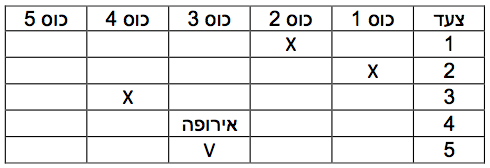

> "פיתחנו אמצעי תקשורת המאפשרים לאדם על כדור הארץ לשוחח עם אדם על הירח, ואף על פי כן לעיתים קרובות אם אינה מסוגלת לשוחח עם ביתה, אב עם בנו, שחור עם לבן" (האדלי ריד)

כיצד היו נראים חיינו אילולא מחשבים ידעו לדבר בינהם? תקשורת בין מחשבים מתבטאת בכל חלק מחיי היום יום: בבית, בתעשייה וברחוב. מרבית הבתים בישראל ובעולם מחוברים לאינטרנט, ותקשורת המחשבים מאפשרת ליואב שנמצא בישראל לשוחח בקלות עם חואן שנמצא בארגנטינה. באמצעות התקשורת העולם כולו נהפך לכפר גלובלי בו ניתן לגשר על פערי תרבות ושפה.

  

  
  בשיעור זה נדון במונח "תקשורת". בחלקו הראשון של השיעור נבין את האופן בו המחשבים מתקשרים בינהם וכיצד עובר המידע, על ידי הבנת מודל 5 השכבות.   בחלקו השני של השיעור נלמד כיצד בנויה רשת האינטרנט, ובאיזה אופן מחוברים המחשבים המרכיבים אותה.

###פעילות פתיחה - תקשורת מהי?

1. בחר 2 מתנדבים, ובקש מאחד מהם לשאול את השני שאלה כגון "מה השעה" או "איזה יום היום". כעת בקש מהמתנדב השני לענות על השאלה.
2. בחר שני ילדים היושבים בקצוות מרוחקים בכיתה. בקש מהאחד לשאול את השני שאלה, אך הבהר כי כעת לא ניתן לדבר, להשתמש בפנטומימה או לקום מהמקום, אלא יש להעביר את המידע בדרך אחרת. דרך אפשרית הינה העברת פתק באמצעות ילדי הכיתה (ובמידה ולא יחשבו על כך, הצע להם פתרון זה).
3. בקש מאותם המתנדבים להניח כי המרחק בינהם רב, וכי הם אינם רואים אחד את השני, ובקש מאחד לשאול את השני שאלה. הסבר כי הפעם לא ניתן לדבר, וכמו כן לא ניתן להשתמש בפתקים, בשל המרחק הרב. שאל אילו דרכים קיימות על מנת לתקשר במצב זה (התשובות האפשריות הן כמובן טלפון/ אינטרנט / דואר).  
הסבר לכיתה כי כל אילו הן דרכי תקשורת.


###הצגת נושא השיעור

לאחר שנאמרת האפשרות "אינטרנט", הסבר כי נושא השיעור הינו תקשורת בין מחשבים ברשת האינטרנט.
תקשורת הינה העברת מידע בין שני מקומות שונים, ותקשורת באינטרנט הינה העברת מידע בין שני מקומות על ידי אמצעים אלקטרונים.


שאלה:

מהן המטרות העיקריות של תקשורת בין מחשבים?  
 
תשובה:
שיחה בין משתמשים רחוקים, שיתוף משאבים כגון מדפסת וסורק, העברת נתונים וקבצים.  

הסבר כי מטרת השיעור הינה להבין כיצד המידע עובר ברשת, כלומר כיצד הרשת מאפשרת למשתמשים מרוחקים לתקשר, מנקודה אחת לאחרת.     
הצג לדוגמא העברת קבצים בין שני משתמשים במחשבים שונים, או את צ'אט הפייסבוק, בו משתמש שולח הודעה, ההודעה מתקבלת, וניתן להשיב לו מיידית.


#מודל 5 השכבות

על מנת לקיים תקשורת בין שני מחשבים, על המחשבים לדבר ביניהם. הבעיה נוצרת בכך שקיימים יצרנים שונים לכל רכיב קטן במחשב וברשת, וכל יצרן משתמש בתקנים שונים, שלא תמיד מכירים אחד את השני.


שאלה:

כיצד המערכות השונות יוכלו להתחבר ביחד ולפעול?  
 
תשובה:
על כולם לדבר באותה "שפה". (הקבל זאת לפעילות הפתיחה, בה התלמידים הבינו אחד את השני כיוון
שדיברו באותה שפה – עברית, בין אם היה מדובר בדיבור, או בכתיבה. ניתן גם להקביל זאת לתקשורת בין בעלי חיים,  כגון כלבים).

בשל התקנים הרבים והיצרנים השונים, נקבע מודל אחיד שבו יש לעבוד ברשת האינטרנט. תוכנן תקן מסויים אשר על כל יצרני המחשבים וציוד התקשורת לעמוד בו. באופן זה, כל הרכיבים תמיד ידעו לדבר ביניהם ולפעול באופן תקין.

המודל מתאר את התקשורת ברשת כסדרת שכבות. כל שכבה יכולה לתקשר רק עם השכבה מעליה או מתחתיה. העברת נתונים בין מחשב למחשב חייבת לעבור לפי הסדר בכל אחת מהשכבות הללו.


#שכבה 1 - השכבה הפיזית

###פעילות מספר 2

חלק לכל ילד את 
[דף פעילות מספר 1](computer-networks/appendix-a.html ""),
ובקש מהילדים לפתור את שני המבוכים (תחילה את הראשון).    

למבוך הראשון יש פתרון, כלומר קופיקו יכול להגיע אל הבננות.  
למבוך השני אין פתרון. המתן עד שאחד הילדים "יעלה" על כך.

הצג לילדים את הניסיון לפתרון, והסבר מדוע אין כל אפשרות להגיע מהחץ הראשון אל החץ השני:

  

 


שאלה:

איך המידע שעובר בין המחשבים (כלומר ביטים של 0 ו-1) יכול לעבור ממקום למקום?  
 
תשובה:
יש צורך בתווך כלשהו, לדוגמא כבל, עבור הביטים האלו. אין אפשרות להעביר ביטים בין שני מקומות אשר
לא קיים עבורם תווך פיזי, בדיוק כפי שלא ניתן להגיע מצד אחד של המבוך אל צידו השני, אם אין תווך פיזי מוגדר. 

###פעילות מספר 3 

סימולצית העברת מידע בינארי בכבל: בחר מתנדב, הבא לו פנס, ופתק עם מספר בעל משמעות (לדוגמא השנה 2012, או השנה בה התלמידים נולדו במידה והם באותו גיל), כך שכל אחת מספרות המספר מיוצג בשיטה הבינארית, באמצעות 4 ספרות.

דוגמא לפתק עם המספר 2012:

  


 
הסבר כי הספרה 1 מיוצגת ע"י "פנס דלוק" והספרה 0 מיוצגת ע"י "פנס כבוי", וכי על התלמיד לייצג את המספר לכיתה בעזרת הפנס.   
בקש ממתנדב נוסף למחוא כפיים בקצב איטי, והסבר לכיתה כי כל מחיאת כף הינה הקצב בו עובר כל ביט (לדוגמא, פנס דלוק לאורך 2 מחיאות כף, משמעותו הספרות 1 1). כמו כן יש להסכים כי אורך כל מספר 4 ביטים.   
מנה מתנדב נוסף אשר יכתוב על הלוח את המספרים המתקבלים בזמן אמת. לבסוף בקש מהכיתה כולה "לתרגם" את המספרים המתקבלים לספרות עשרונית, ולגלות מה המספר.

דוגמא להעברת הרצף 21, כלומר 0001|0010:

  

####<u>הסבר קצר על השכבה</u>:

* בשכבה זו הנתונים מתורגמים לביטים, "0" ו "1", ועוברים דרך תווך פיזי שהוגדר בשכבה זו כמשמש לחיבור בין המחשבים, על ידי אותות חשמליים.
* שכבה זו מגדירה מה התווך הדרוש (כבל, סוג הכבל, המתח חשמלי הדרוש וכל דבר אחר המשמש להעברת האות ברשת).

#שכבה 2 - שכבת קישור הנתונים

###הדגמה

השתמש במספרים הבינארים הכתובים על הלוח מהפעילות הקודמת, ובקש ממתנדב להחליף את אחד הביטים מ—0 ל-1, או מ-1 ל-0.   
בקש מהתלמידים לחשב איזה מספר התקבל כעת.  


שאלה:

מה יקרה במידה ושני ביטים יחליפו בטעות מקום בעת השליחה בכבל?  
 
 תשובה:
המשמעות של הנתונים הנשלחים תשתנה לחלוטין.

####<u>הסבר קצר על השכבה</u>:

* שכבה זו אורזת אוספי ביטים לחבילות ומבצעת מעקב וביקורת עליהם.
* שכבה זו יכולה להוסיף סיומת לחבילות שנשלחות כדי שהמחשב המקבל יוכל לוודא שהנתונים (הביטים עצמם)
התקבלו בשלמות. 
* במידה ולא התקבלו בשלמות, מחשב היעד לא ישלח אישור קבלה והמחשב השולח ייאלץ לשלוח שוב את המידע.

דוגמא למכשיר ברמה זו: מודם – מאפשר שידור וקליטה של המידע, כלומר של אוספי הביטים.

#שכבה 3 - שכבת הרשת

###פעילות מספר 4 

סדר 5 כוסות אשר ממוספרות מ- 1 עד 5 בשורה. כתוב על 5 פתקים שונים את שמות 5 היבשות, והכנס פתק תחת כל כוס באופן אקראי. כעת בחר מתנדב, אמור לו כי עליו להעביר מסר לג'ון שגר באירופה, אך תחילה עליו למצוא מהי הדרך הנכונה להגיע לאירופה, כלומר למצוא את הכוס המתאימה. התלמיד יתחיל לנחש, ובכל פעם שהתלמיד שוגה, סמן בטבלה להלן כי הכוס ה-i אינה מייצגת את אירופה ע"י סימון X במקום המתאים, וערבב את הכוסות. בקש מהתלמיד להשתמש בטבלה על מנת לזכור אילו מספרים לא כדאי לו לנחש בשנית. כאשר יצליח למצוא את המיקום הנכון, כתוב בטבלה כי הכוס מייצגת את אירופה. כעת הראה לכיתה כי ה"ניחוש" הבא הינו וודאי, כיוון שהניתוב כבר נמצא בטבלה.

  


שאלה:

מה יקרה אם יישלח מידע ברשת, אך לא יוגדר לו איפה נמצא היעד. האם הוא יחפש את היעד בכל מקום
אפשרי ברשת?  
  
 תשובה:
לא, במקרה זה המידע יאבד ולבסוף "יזרק", ולא יגיע ליעדו.

הסבר לתלמידים כי קיימות ברשת טבלאות ניתוב רבות, ובכל רגע נתון כל הזמן רכיבי הרשת לומדים את מיקומם של יתר המחשבים והתחנות בדרך.

####<u>הסבר קצר על השכבה</u>:

השכבה קובעת את הדרך שבה הנתונים יעברו ברשת עד שיגיעו ליעד, ע"י הכנת טבלאות הניתוב.   
דוגמא למכשיר בשכבה זו: ראוטר ביתי - מנתב מהבית הפרטי אל רשת האינטרנט העולמית, ובוחר את האופן ואת המסלולים בהם הנתונים הנשלחים מהבית יעברו.

#שכבה 4 - שכבת התעבורה

###פעילות מספר 5

בחר 2 משתתפים, וחלק להם את
[דף פעילות מספר 2](computer-networks/appendix-b.html "").  
הסבר כי על כל תלמיד לקרוא את השורה שלו, לקבל תגובה מהתלמיד השני, ולקרוא את השורה הבאה, וכן הלאה.    התלמידים באופן זה ינהלו שיחה בה השאלות והתשובות לא קשורות אחת לשניה:

  

בתום הפעילות, שאל את הכיתה מה הבעיה בשיחה הזו.


שאלה:

מה יקרה במצב בו לאותו מחשב הגיעו באותו זמן הודעה בצ'אט של הפייסבוק ודואר אלקטרוני ב-GMAIL, וכן
המשתמש ביקש להעלות את אתר ערוץ הילדים. כיצד המידע "יודע" לא להתערבב כשהוא מגיע למחשב הזה?   
  
 תשובה:
יש צורך להפריד ולחלק את הנתונים. זוהי בדיוק מטרת שכבה 4.   

####<u>הסבר קצר על השכבה</u>:

* שכבה זו אחראית לחלוקה מחדש של הנתונים שנשלחו בסדר הנכון, כלומר לפי האפליקציה המתאימה במחשב
היעד, ועל פי הנושא הספציפי אליו נשלחת החבילה. 
* לעיתים ישנה בקרה על הגעת הנתונים באופן שלם ונכון, תלוי במתכנן האפליקציה. לדוגמא, בשליחת קובץ, חשוב שהוא יגיע בשלמותו - גם אם הדבר כרוך במספר שליחות מחדש אשר מאטות את הקצב. אם לא נעשה זאת, לא נוכל לפתוח אותו - זהו פרוטוקול TCP.
* לעומת זאת, ישנם מקרים בהם לא נבקש בדיקת אמינות ושליחות מחדש של מידע שלא הגיע. לדוגמא, בשיחת וידאו ברשת, אם חלק מהמידע לא יגיע, תהיה קפיצה של התמונה או של הקול, אך אין טעם לשלוח מחדש משפט שכבר נאמר לפני מספר שניות. במקרה זה יש דרישה למהירות ופחות לאמינות - זהו פרוטוקול UDP.


#שכבה 5 - שכבת היישום (האפליקציה)

אפליקציות הן תוכנות שהמשתמש מפעיל ישירות כדי לתקשר באמצעות האינטרנט.  

 * כדי שאפליקציות יוכלו לתקשר ביניהן, עליהן להחליט על הצגה אחידה של נתונים.
 * דוגמא לאפליקציה: דפדפן האינטרנט (אקספלורר, פיירפוקס), פייסבוק.
 
#הדגמת מודל השכבות 

אופן שליחת וקבלת מידע - הצג את האיור הבא על הלוח והסבר:

  

**בצד השולח**, שכבת האפליקציה יוצרת נתונים, אשר מועברים למטה דרך שאר השכבות, עד שהם מגיעים לשכבה הפיזית ומשודרים דרך הרשת. כל שכבה מוסיפה לנתונים מידע, שמיועד לאפשר את הגעתם ליעדם בצורה רצויה (למשל - כתובת יעד). החבילה שנשלחת לבסוף באופן פיזי ברשת, למשל ע"י כבל תקשורת, כוללת את ההודעה המקורית, עטופה בכמה שכבות של עטיפות, שנוצרו בכל שכבה.

**בצד המקבל**, הנתונים עוברים מהשכבה התחתונה ביותר, דרך שאר השכבות ועד לשכבת האפליקציה, באופן שבו כל שכבה "מקלפת" את העטיפה שלה לפני שהיא מעבירה את הנתונים לשכבה שמעליה. הדבר מאפשר לכל שכבה במחשב השולח לתקשר ישרות עם השכבה המקבילה לה במחשב המקבל.

###פעילות מספר 6

הדגמת המודל – משחק תחנות: הכן מספר סטים של 10 פתקים המכילים את ההודעות והמסרים הבאים, חלקם עם שגיאות כתיב קלות, וכן בכל פתק כתוב מספר בין 1 ל- 3 עבור תלמיד היעד.
דוגמא לפתקים:  

  


יש לחלק את הכיתה לקבוצות של 5 תלמידים, כך שכל אחד מחברי הקבוצה אחראי על שכבה. במידה ואין מספיק תלמידים בכיתה, כל תלמיד יכול לדוגמא לתפקד כאחראי על שתי שכבות. כמו כן, יש למנות 3 תלמידים נוספים שאינם חלק מהקבוצות, שתפקידם הוא קבלת ההודעות, ולמספרם מ-1 עד 3. יש להכין עבורם טבלה מהצורה:

  

טבלה זו יש להעביר לאחראים על שכבה 3 מכל קבוצה.   
יש לדאוג כי כל האחראים על שכבה מסויימת מכל קבוצה, יישבו באותו אזור בכיתה.

####<u>אופן המשחק</u>:

* **אחראי שכבה 1**: "השליח". לוקח את הפתקים, ותפקידו להעביר את ההודעה בין השכבות, לאורך כל המשחק. תחילה יעביר את הפתקים לאחראי שכבה 2.
* **אחראי שכבה 2**: בודק ומתקן שגיאות כתיב בפתקים. מעביר לשליח, על מנת שיעבור לשכבה 3.
* **אחראי שכבה 3**: בודק את המספר הסידורי אליו מיועדת כל הודעה, משווה לערך המתאים בטבלה, וכותב על
הפתק את שמו של התלמיד המתאים, ואת מיקומו בכיתה. לאחר מכן מעביר לשליח, על מנת שיעביר לשכבה 4.  
* **אחראי שכבה 4**: בודק אם יש מספר הודעות לאותו אדם, ואם כן מסדר אותן לפי הסדר. הדבר נעשה על ידי נסיון למצוא את הרצפים שבפתקים (שלום כיתה א', סליחה מה השעה, בוקר טוב, יורד גשם). לאחר מכן מעביר לשליח, שמעביר לאחראי שכבה 5.
* **אחראי שכבה 5**: האפליקציה – תפקידו להציג למשתמש (כלומר לכל אחד משלושת תלמידי היעד) את הפתקים, בסדר הנכון, ועבור המשתמש הנכון.

הקבוצה המנצחת הינה הקבוצה אשר מסיימת להעביר את כל המסרים ראשונה.

###פעילות מספר 7

הדגמת המודל ע"י יום עבודה של דוור - חלק לכל ילד את
[דף פעילות מספר 3](computer-networks/appendix-c.html "").  
הדף מתאר יום עבודה של דוור, ואת הפעולות שעושה הדוור. על התלמידים להקביל כל פעולה של הדוור לאחת השכבות ברשת. 

<u>
פתרון דף הפעילות  
</u>
1 - שכבה 3 , שכבת הרשת  
2 - שכבה 4 , שכבת התעבורה    
3 - שכבה 1 , השכבה הפיזית  
4 - שכבה 5 , שכבת היישום (האפליקציה)    
5 - שכבה 2 , שכבת קישור הנתונים   

#טופולוגית רשת

* זהו חלק אופציונלי במערך השיעור.

###פעילות מספר 8

####<u>הדגמת טופולוגיות רשת שונות</u>:

1. **טלפון שבור**: בחר 5 מתנדבים - העמד את הילדים בשורה, ובקש מהילד הראשון ללחוש מילה מסובכת כלשהי לילד שמימינו, וכן הלאה. יש לקוות שהמילה תגיע ליעדה בצורה מעוותת. 
2. **מעגל**: בחר 6 מתנדבים - אחד שיעמוד באמצע, והיתר מסביבו. העבר פתק למתנדב שבאמצע, וכעת בקש ממנו ללחוש לכל אחד מחמשת המתנדבים את המילה. שאל את הילדים מה יקרה אם לפתע התלמיד שבאמצע יהיה חס וחלילה חולה, ולא יהיה לו קול, ושאל מה יקרה אם אחד מחמשת האחרים יאבד את שמיעתו לפתע.
3. **"הזרם"**: בחר 6 מתנדבים - על הילדים להחזיק ידיים, ועל הילד שמתחיל ללחוץ את אחת הידיים שהוא מחזיק. כל ילד שלחצו לו את היד יכול ללחוץ את יד התלמיד האחר, או להחזיר לחיצה. באמצע המשחק לחש לאחד התלמידים לצאת, ואפשר להם להמשיך לשחק. לאחר מספר שניות, לחש לתלמיד שאינו סמוך לצאת מהמשחק (הדבר יגרום למצב של שני משחקים נפרדים).

בקש מהילדים לדמיין כי כל ילד במשחקים האחרונים היה מחשב, ושאל את הילדים איזו דרך העברת מידע נראית להם עדיפה.   
הסבר כי טופולוגיית רשת מתארת את הסידור של הרכיבים השונים ברשת מחשבים, על מנת שיוכלו לתקשר בינהם באופן שלמדנו עד כה.

---

###**סוגי טופולוגיית רשת**

במקביל להסבר על כל טופולוגיה, יש לציירה על הלוח, ולכתוב את שמה בסמוך לציור.

###כוכב

  

כל הקצוות מחוברים למרכז אחד (בדרך כלל רכיב תקשורת) שמנהל את התעבורה ביניהם. שני קצוות יכולים "לדבר" באותו זמן, ורכיב התקשורת יסדר זאת כך שלא תהיה התנגשות. בנוסף, כל קצה יראה רק את ההודעות אשר מיועדות אליו.
###אפיק (קווית)

  

כל הקצוות מחוברים לשדרה מרכזית אחת. רק קצה אחד יכול לשדר בכל זמן נתון, כיוון שהתווך משותף. בטופולוגיה זו, כל קצה ברשת "רואה" את כל מה שעובר בה. זה יכול להוות יתרון אם רוב המידע צריך לעבור לרוב הקצוות, אך גם חסרון, כיוון שיוצר בעיות אבטחה.
###טבעת

  

כל קצה מחובר לשני הקצוות הסמוכים אליו, לכן כל קצה תלוי בקצוות האחרים להעברת הנתונים לשאר חלקי הרשת. במידה ושני קצוות לא סמוכים מפסיקים לתפקד, הם בעצם מחלקים את הרשת לשני חלקים נפרדים שאין אפשרות להעביר ביניהם מידע.
###טבעת כפולה

  

טופולוגיית טבעת כפולה היא טופולוגיית טבעת בה כל חיבור בין שני קצוות הוכפל. שיטה זו אך מאפשרת שרידות גבוהה יותר של הרשת (למשל במקרה שנהרס אחד הכבלים), ומאפשרת גם להכפיל את כמות הנתונים שמועברת ברשת.
###אריג

  

לכל מחשב יש חיבור למספר מחשבים. טופולוגיה זו עמידה מאוד בפני תקלות כך שאם יש כשל בכבל אחד, המידע יעבור על פני כבל אחר. כך בנויה רשת האינטרנט הגדולה, כאשר כל נקודה היא לדוגמא ראוטר. מקרה פרטי של רשת אריג היא רשת בחיבור מלא.
###חיבור מלא

  

כל קצה ברשת מחובר ישירות לכל קצה אחר. קצה שמפסיק לתפקד ברשת כזו לא ישפיע על הקצוות האחרים, וכל חיבור שמפסיק לתפקד ניתן לעקוף במספר דרכים.

שאלה:

איפה יש צורך להשתמש בחיבור מלא?  
 
תשובה:
 במקומות בהן שרידות ונגישות הרשת הכרחיות, לדוגמא בכורים גרעיניים. 

---

###פעילות מספר 9

חלק לילדים את 
[דף פעילות מספר 4](computer-networks/appendix-d.html "").  

הדף מתאר מצבים מסויימים מן היום יום, ועל הילדים לבחור את טופולוגית הרשת המתאימה בה יש להשתמש בכל אחד מהמקרים.
 
<u>
פתרון דף הפעילות  
</u>
מצב ראשון - אפיק (המציל הוא אחד הקצוות) או כוכב (המציל באמצע)  
מצב שני - חיבור מלא  
מצב שלישי - כוכב או אפיק (תלוי אם מותר להכניס מספר מרכיבים יחד)  
מצב רביעי - טבעת  
מצב חמישי - טבעת כפולה

 