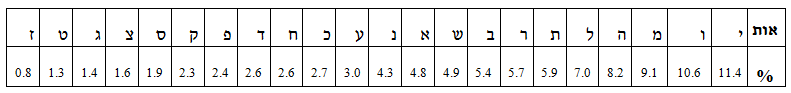

```
parent_lesson: cryptography
order: 3
layout: appendix
```

#דף פעילות 4#
##טבלת שכיחות  האותיות בשפה העברית: ##

<br>
<br>

<div id="container" align="center">
  
</div>
<br>
<br>
<br>

-------------
<br>
#דף פעילות 5#
##מיקום האוצר (קטע מוצפן קצר)##
<br>
<br>
משפט המתאר את מיקומו של אוצר יקר ערך. המשפט מוצפן באמצעות מפתח הצבה לא ידוע (ושונה מן הקודמים):

> בא פעברמ כששס טעקל מסמ נזא טאגזחתק


האם יש לנו מספיק אינפורמציה כדי לפענח את המשפט?
