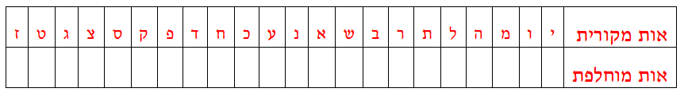

```
parent_lesson: cryptography
order: 8
layout: appendix
```

#דף פעילות 9#

פענחו באופן מלא את תחילת הטקסט המוצפן (שבע שורות) [מדף פעילות 6א](appendix-d.html ""). מומלץ להיעזר בניחושים אינטליגנטיים וכן ברמזים שקבלתם מהמורה. עם השלמת המשימה, מצאו את מפתח ההצבה ובעזרתו את מיקום האוצר (לא לרוץ, יש מספיק אוצרות לכווווולם).


<br>
<br>
##פיענוח שבע השורות:##
<br>
<br>
<br>
<br>
<br>
<br>
<br>
<br>
<br>
<br>
<br>
<br>
##מפתח ההצבה הסודי##
<br>
<br>
<br>
<div id="container" align="center">
  
</div>
<br>
מיקום האוצר (מוצפן):
> בא פעברמ כששס טעקל מסמ נזא טאגזחתק

<br>
מיקום האוצר (טקסט מקורי):
<br>
<br>
<br>
<br>
