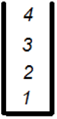

#דף עבודה מספר 2 בנושא מחסנית#

אנחנו משתמשים במחסנית מסוימת על מנת לשמור מספרים.   
יש לנו 3 פעולות:

* **הכנס מספר למחסנית** – הכנסת מספר לראש המחסנית.
* **הוצא מספר מהמחסנית** – הוצאת מספר מראש המחסנית.
* **הצץ למחסנית** – בדיקה מהו המספר שנמצא בראש המחסנית.

הכנס למחסנית [17] – תכניס את המספר 17 לראש המחסנית.

הוצא מהמחסנית – מוציאה החוצה את האיבר שבראש המחסנית.

הצץ למחסנית – אומרת לנו איזה מספר יש בראש המחסנית כרגע, אבל לא מוציאה אותו.

###דוגמא

אם התחלנו עם מחסנית ריקה ואז ביצענו את הפעולות:  
הכנס למחסנית [1],הכנס למחסנית [2], הכנס למחסנית [3], הכנס למחסנית [4], הכנס למחסנית [5], הוצא מהמחסנית.   
בסוף הפעולות המחסנית תראה ככה:

כי הכנסנו קודם את 1, אח"כ את 2, 3, 4, 5, ואז הוצאנו את האיבר האחרון (שהיה 5).

אנחנו מתחילים עם מחסנית ריקה ואז מבצעים את הפעולות:

הכנס למחסנית [2], הכנס למחסנית [4], הכנס למחסנית [6], הוצא מהמחסנית , הוצא מהמחסנית , הכנס למחסנית [12], הכנס למחסנית [55], הכנס למחסנית [2], הוצא מהמחסנית, הצץ למחסנית, הוצא מהמחסנית, הכנס למחסנית [100].

צייר את המחסנית שנקבל בסוף כל הפעולות הללו:

