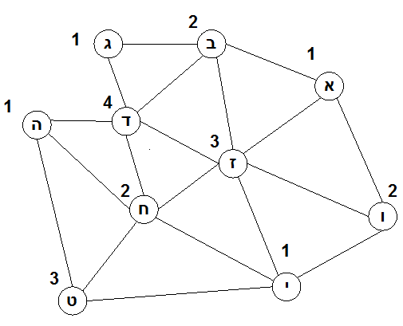

```
parent_lesson: graph-theory
order: 10
layout: appendix
```

#פתרונות אפשריים לבעיות צביעת הגרפים שהוצגו בפרק#

התבוננו בחמשת הגרפים שמופיעים בהמשך. עבור כל גרף, מצאו צביעה במספר צבעים קטן ככל האפשר.

<div id="container" align="center">
  
<br>
<h3>דף פעילות 5</h3>
</div>
<br>
<br>
<br>
<div id="container" align="center">
  
<br>
<h3>דף פעילות 6</h3>
</div>
<br>
<br>
<br>
<div id="container" align="center">
  
<br>
<h3>דף פעילות 7</h3>
</div>
<br>
<br>
<br>

#גרף הקצאת תדרים המתאים למפת תחומי האנטנות מדף פעילות 8#
יש למצוא צביעה של הגרף הזה במספר צבעים קטן ככל האפשר
<div id="container" align="center">
  
</div>
<br>
<br>
<br>

#פתרונות צביעה של שני הגרפים האחרונים מדף פעילות 9#
### (שלושה צבעים לגרף העליון, שבעה צבעים לגרף התחתון)
<div id="container" align="center">
  
</div>
<br>
<br>
<br>
<div id="container" align="center">
  
</div>
<br>
<br>
<br>