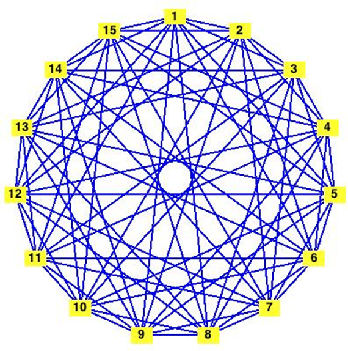

```
parent_lesson: graph-theory
order: 11
layout: appendix
```

#דף פעילות 9: צביעת גרפים (למתקדמים)#

התבוננו בחמשת הגרפים שמופיעים בהמשך. עבור כל גרף, מצאו צביעה במספר צבעים קטן ככל האפשר.

<div id="container" align="center">
  
</div>
<br>
<br>
<br>
<div id="container" align="center">
  
</div>
<br>
<br>
<br>
<div id="container" align="center">
  
</div>
<br>
<br>
<br>
<div id="container" align="center">
  
</div>
<br>
<br>
<br>
<div id="container" align="center">
  
</div>
<br>
<br>
<br>
