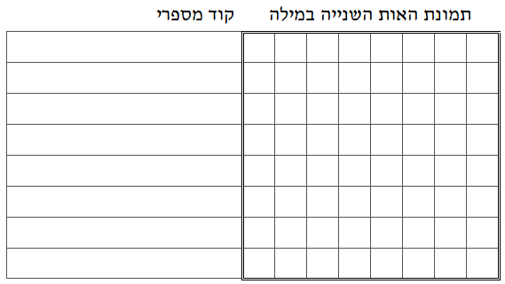

```
parent_lesson: image-processing
order: 5
layout: appendix
```

#דף פעילות 3-א
## בחר מילה של שלוש אותיות (אל תגלה אותה לאף אחד!) וכתוב אותה בדף, מלמעלה למטה.

<br/>
<br/>

<div id="container" align="center">
  
</div>

<br/>

<div id="container" align="center">
  
</div>

<br/>

<div id="container" align="center">
  
</div>

