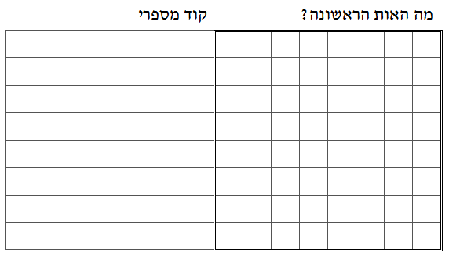
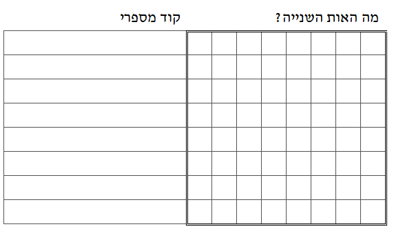

```
parent_lesson: image-processing
order: 6
layout: appendix
```

#דף פעילות 3-ב
##העתק את שלושת הקודים המספריים של שלושת האותיות מדף 3-א לדף הזה (אל תעתיק את התמונות! מקבל ההודעה צריך לצייר את התמונות בדף הזה לפי הקודים שתכתוב כאן.)

<br/>
<br/>

<div id="container" align="center">
  
</div>

<br/>

<div id="container" align="center">
  
</div>

<br/>

<div id="container" align="center">
  
</div>


#שם השולח : ______________________
#שם המקבל : ______________________
