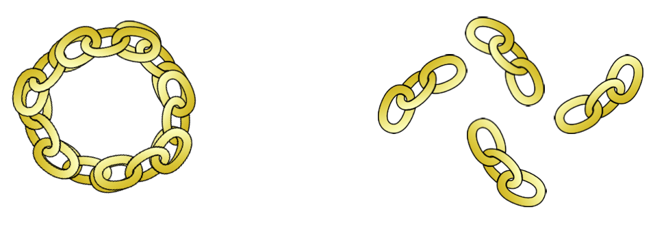

#דף הפעלה מס' 2

### חלק א': חידת השרשרת

יניב הגיע אל הנפח עם 4 חלקי שרשראות, כאשר כל אחת עשויה משלוש חוליות (כמו בציור).  
 הוא ניגש אל הנפח וביקש ממנו לחבר אותן לשרשרת סגורה אחת – כדי שיוכל לענוד סביב צווארו.  
לנפח תעריף קבוע: פתיחה של חוליה אחת בשרשרת עולה חצי שקל. סגירה מחדש של חוליה עולה שקל אחד.   
יניב, שידוע בכל האזור בקמצנותו, לא רוצה לשלם יותר ממה שצריך.   
מה הסכום המינימלי שעל יניב לשלם כדי לתקן את השרשרת?

  

### חלק ב': חידת המטבעות

 המלך מציג בפני יניב 9 מטבעות, ש- 1 מהם מזויף.   
 כמובן לא ניתן לדעת מי המזויף במבט חיצוני. ידוע רק כי מטבע מזויף שוקל <u>פחות</u> ממטבע זהב אמיתי.   
 בנוסף, המלך מניח בפני יניב מאזני כפות, ומבקש ממנו לגלות מיהו המטבע המזויף - וכל זאת רק <u>בשתי</u> 
  שקילות בלבד.
 
כיצד נעזור ליניב לפתור את הבעיה?
 

  

