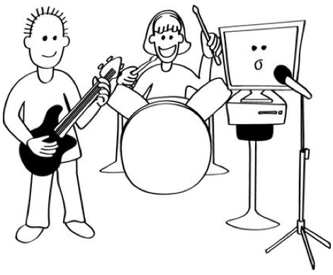
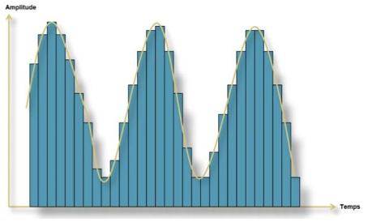
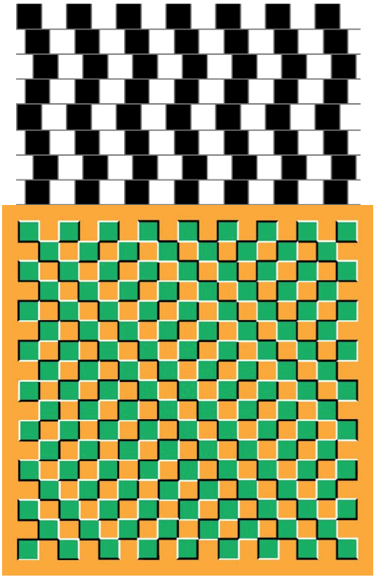

###הקדמה###

מטרת השיעור היא להקנות לתלמידים ידע באשר לאופן בו מחשבים מייצגים גלי קול. 

בנוסף השיעור עוסק בשימוש המחשב בצלילים מעבר לשימוש הברור של השמעת מוזיקה.

השיעור מניח כי התלמידים יודעים מהו מספר בינארי והם התנסו בחישוב של כמה מספרים בינאריים.

###קבצי שמע###

**<u>צלילי דגימה שונים</u>**:

[Smurfs8Khz.mp3](sound-representation/Smurfs8Khz.mp3 "")

[Smurfs44Khz.mp3](sound-representation/Smurfs44Khz.mp3 "")

**<u>צליל מודם</u>**:

[DialupModem.mp3](sound-representation/DialupModem.mp3 "")

**<u> אשליית צליל (Shepard tone)</u>**:

[RISE_100.mp3](sound-representation/RISE_100.mp3 "")

#מהו קול?#

רשום מוזיקה בגדול על הלוח. בקש מהתלמידים לתת שמות של זמרים / להקות שהם אוהבים (מי שאומר ג'סטין ביבר זה הזמן להרחיק אותו &#9786;)

**<u>משחק זיהוי שירים</u>**:

הכן מראש כמה קטעים משירים מוכרים ובקש מהתלמידים לזהות כל שיר, אפשר ואף מומלץ להפוך את זה למשחק עם קבוצות.

כעת, שהסתיים המשחק, שאל את התלמידים כיצד לדעתם הם מצליחים לשמוע את השירים שהם כל כך אוהבים?

כנראה שהם לא ידעו... כאן אתה נכנס:

קול הוא בעצם גל באוויר, הסבר זאת לתלמידים באמצעות אנלוגיה לגלים בים או למצב של שלולית לאחר שזורקים עליה אבן.

**שים לב**: לתלמידים צעירים יותר יהיה מאוד קשה להבין מהו גל קול, זהו לא חלק קריטי בשיעור לכן נסה לפשט את העניין כמה שניתן אלא אם אתה מאמין שהתלמידים מסוגלים להבין זאת בלי להסתבך יותר מידי.

#ייצוג קול במחשב#

צייר גל קול על הלוח.   
שאל את התלמידים איך לדעתם מחשב יכול לשמור גל כזה?   
כמובן באמצעות מספרים (בינאריים בסופו של דבר) בלבד.

כוון אותם למצב שבו שומרים את הגל על ידי דגימה, כלומר, רישום כל זמן מסוים של גובה הגל.

כמו כן, ניתן להסביר להם שככל שנדגום יותר נתקרב יותר לגל המקורי כפי שניתן לראות באיור מתחת.   
מומלץ אפילו להכין קבצי מוזיקה מראש בקצבי דגימה שונים בכדי להשמיע להם את ההבדלים (ראה קבצי שמע בראש השיעור).

#תקשורת מחשבים באמצעות קול#

ספר לתלמידים על עולם מרוחק ועתידני בו מחשבים מדברים ביניהם באמצעות קול! שאל אותם האם לדעתם זה יקרה יום אחד?

האמת שזה קיים כבר הרבה מאוד זמן!!!

שאל את התלמידים אם מישהו יודע איך עובד המכשיר המיתולוגי "פקס". הסבר להם שבעצם פקס זה שני מחשבים מדברים ביניהם באמצעות קול. הרי כל גל ניתן לייצוג ע"י מספר לכן גם להפך, ניתן להפוך מספר לגל קול מסוים, כלומר לצליל, ולשלוח אותו למחשב אחר שיפענח אותו למספר חזרה.

מומלץ להשמיע להם צליל של פקס כהוכחה (ברשימת קבצי השמע).

#פעילות: העברת מסרי קול בינאריים#

העבר לתלמידים את
[דף הפעילות](sound-representation/appendix-a.html "")
ותן לכל אחד לרשום בו מילה ולאחר מכן להמיר את המילה למספר בינארי.

כעת, תקבע כי עבור 0 יש להשמיע את הצליל "מופ" ועבור 1 יש להשמיע את הצליל "מיפ".

תן לשני תלמידים להעביר ביניהם את המילה בעזרת צלילים בלבד.

כעת צלם זאת והעלה ל- YouTube &#9786;

#כיווץ קול#

ספר לתלמידים שמשך שיר ממוצע 180 שניות בערך, כיום בדרך כלל שומרים לכל שניה 44 אלף מספרים!! חישוב זריז יניב כ-7,920,000 מספרים.. זה המון מידע!!

האם אפשר לחסוך במספרים? כן!

הצג לתלמידים את התמונה הבאה (ניתן למצוא אינספור דוגמאות נוספות באינטרנט)

אלו הם אשליות אופטיות! בעצם המוח שלנו מורכב מאוד, הוא מפענח את המציאות בצורה לא תמיד מדויקת. למשל בתמונה הראשונה הקווים מקבילים, למרות שלא נראה כך.

הרבה לא יודעים, אבל באותו האופן, גם המוח שלנו מפענח צלילים. כלומר המוח לפעמים טועה, צלילים נבלעים, משתנים וכו'...הוכח להם זאת באמצאות אשליות קול (הקובץ ״אשליית צליל״ בקבצי השמע נשמע כאילו הוא עולה, אבל הוא זהה לחלוטין לכל אורכו).

למה זה מעניין אותנו? מאחר והמוח גם ככה מפענח את הצלילים אחרת אולי ניתן לוותר על המידע שגם ככה המוח לא מפענח טוב? רעיון מעולה!!

ככה עובדות שיטות כיווץ קול שונות, למשל **MP3**.