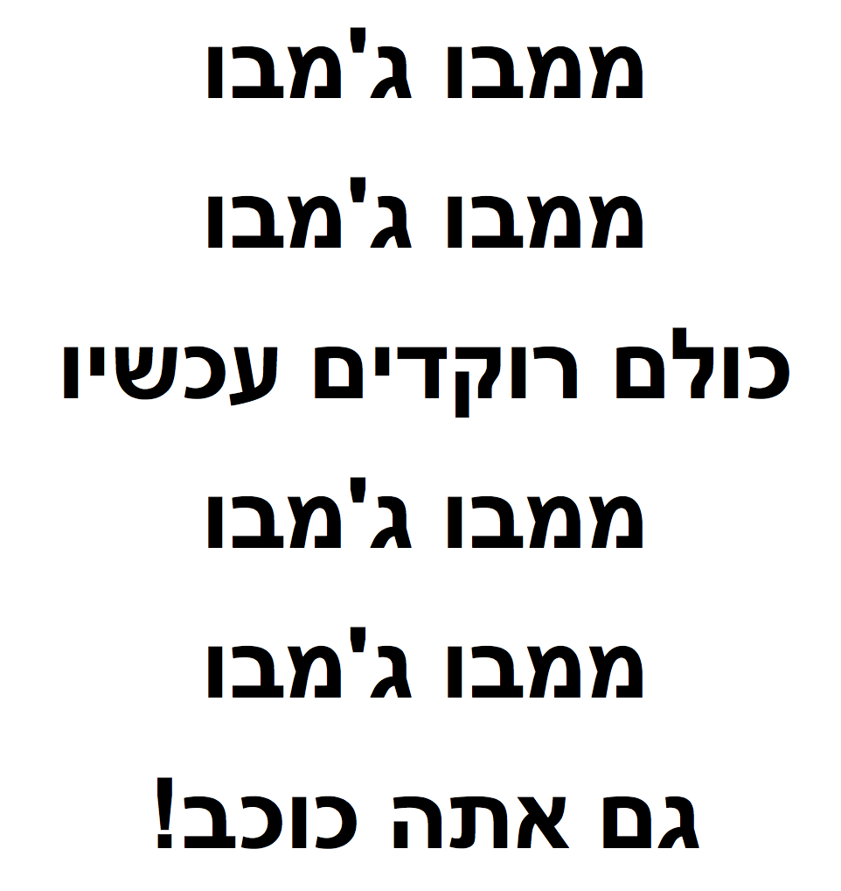
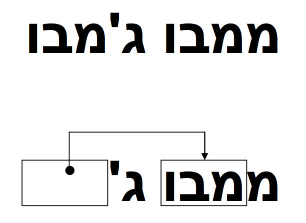
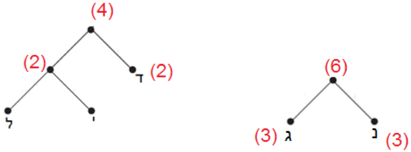

###תקציר###

כיוון שלמחשבים יש כמות מוגבלת של שטח אחסון מידע, הם צריכים לייצג מידע בצורה יעילה ככל האפשר - זה נקרא דחיסה.    
על ידי קידוד נתונים לפני שהם מאוחסן, ופענוחם כאשר הם מוחזרים, המחשב יכול לאחסן יותר נתונים, או לשלוח אותם מהר יותר דרך האינטרנט.

###מונחים טכניים###

דחיסת טקסט, קידוד למפל-זיו, קידוד האפמן.

###חומרים###

<u>כל ילד צריך:</u>  
עותק של דפי הפעילות.

###מבוא###

מחשבים צריכים לאחסן ולהעביר כמות גדולה של נתונים, כדי שהם לא יצטרכו להשתמש בהרבה מדי מקום אחסון, או
 לקחת זמן רב מדי כדי לשלוח מידע באמצעות חיבור מודם, הם דוחסים את הטקסט בצורה דומה לזו.

#הדגמה ודיון

הציגו לכיתה את השיר הבא:

  

דיון - הסתכלו על התבניות של האותיות בשיר, האם אתם מזהים קבוצה של 2 אותיות ומעלה שחוזרות על עצמן, או אפילו מילים או משפטים שלמים?   
החליפו אותם בתיבות כפי שמוצג בתרשים הבא:  

  

###פעילות 1 ###
לאחר ההדגמה יש לחלק את 
[דף פעילות 1](text-compression/appendix-a.html "").  
ניתן להכין טקסטים ושירים מראש ולחלק בין הילדים עבור החלק השני של הפעילות בו הם צריכים להכין פאזל לבד או לתת להם להשתמש בדמיון  &#9786;

[פתרון דף פעילות 1](text-compression/appendix-b.html "")  

###פעילות 2 - קידוד למתקדמים###

ציירו על הלוח או הדפיסו את החידה כפי שמוצגת למטה ושאלו את הילדים: כיצד נפתור את החידה הבאה?  

  

####הסבר:####

לפעמים טקסט חסר מצביע לעצמו. במקרה הזה ניתן לפענח את המילה בצורה נכונה אם נעתיק את האותיות מימין לשמאל, ואז כל אות זמינה להיות מועתקת לפני שהיא נחוצה. האפשרות הזאת שימושית במחשבים אם יש רצף ארוך של אות או תבנית מסוימת.

  

כיוון ששני מספרים משמשים אותנו לקידוד המילים, לרוב נרצה לדחוס רצפים של שתי אותיות ומעלה, אחרת אין לנו חיסכון בשטח.   
למעשה, הגודל של הקובץ יכול לעלות אם שני מספרים נמצאים בשימוש עבור קידוד של אות אחת.

כעת עודדו אותם להמציא ולקודד מילים משלהם ולהעביר לחברים לפענוח &#9786;

מילים לדוגמא: פרפר, כלכלה, שרשרת, גולגולת, מצמצמים, אותות, אפיפית, לקלקל.

[דף פעילות 2](text-compression/appendix-c.html "")

#התמונה הגדולה#

קיבולת האחסון של מחשבים גדלה בשיעור לא יאומן ב-25 השנים האחרונות, כמות האחסון שסופקה במחשב טיפוסי גדלה פי מליון! אבל עדיין אנחנו מוצאים עוד דברים להכניס לזיכרון של המחשב.    
מחשב יכול לאחסן ספרים שלמים ואפילו ספריות וכעת גם מוזיקה וסרטים במידה ויש מספיק מקום.   
קבצים גדולים יוצרים בעיה גם באינטרנט כיוון שלוקח הרבה זמן להוריד אותם, מה גם שאנחנו כל הזמן מנסים להקטין את הגודל של המחשבים – היום אפילו טלפון נייד או שעון יד מאחסנים מידע רב.  

יש פתרון לבעיה זו, עם זאת, במקום לקנות עוד שטח אחסון או מודם מהיר יותר, אנחנו יכולים לדחוס את המידע כך שהוא יתפוס פחות מקום.  
 תהליך זה של דחיסה ושחזור הנתונים נעשה בדרך כלל באופן אוטומטי על ידי המחשב.  
  אנחנו עלולים להבחין בזה שהדיסק מחזיק יותר, או שדפי האינטרנט מציגים מהר יותר אבל המחשב בעצם מעבד יותר (עובד יותר).

הומצאו שיטות רבות לדחיסת נתונים.  
 בפעילות זו השתמשנו בשיטה שמשתמשת בעקרון ההצבעה על מופעים קודמים של רצפים בטקסט, שיטה זו מכונה קידוד "למפל-זיו" או בקיצור "LZ" והיא הומצאה על ידי שני פרופסורים ישראליים בשנות ה-70.  
  ניתן להשתמש בקידוד זה לכל שפה ואף להקטין בחצי את הגודל של הנתונים שאנו "דוחסים".   
  במחשבים האישיים הוא מכונה "ZIP", וכמו כן הוא משמש לתמונות "GIF", כמו גם למודמים במהירות גבוהה.  במקרה של מודמים, הקידוד מפחית את כמות הנתונים שצריכים להיות מועברים בקו הטלפון כך שזה עובר הרבה יותר מהר.

שיטות אחרות מתבססות על הרעיון כי אותיות שנמצאות בשימוש בתדירות גבוהה יותר צריכות קידוד קצר יותר מהאחרות (לדוגמה – קוד מורס השתמש בזה), נדבר על שיטה כזאת היום – קידוד האפמן.


#קוד האפמן#

קוד האפמן הוא שיטה לקידוד סימנים, כגון תווי טקסט, ללא אובדן נתונים.  
 הקוד שייך למשפחה שימושית של קודים המכונה **קודי תחיליות**, ובמשפחה זו הוא הקוד המספק דחיסת נתונים מרבית, כלומר מאחסן את הסימנים במספר מזערי של סיביות.   
 השיטה מתבססת על אורך משתנה לסימנים על פי שכיחותם, כך ש**סימן נפוץ יוצג באמצעות מספר קטן של סיביות**.  
 לרוב ניתן לחסוך באמצעות שיטה זו בין 20% ל-90% משטח האחסון.  
  קוד האפמן הוא גרסה כללית יותר של עקרון קידוד הנקרא "קידוד אנטרופיה".

* קוד האפמן הוא **קוד תחיליות**: כל מחרוזת ביטים שמייצגת אות אינה תחילית של מחרוזת המייצגת אות
אחרת.   
*דוגמא:* קוד עם מילים {9, 59, 55} עומד בקריטריון קוד תחילית, בעוד קוד עם המילים: {5, 9, 59, 55} לא עומד בקריטריון מאחר ו-5 הוא תחילית גם של 59 וגם של 55.

###רקע###

הדרך הנפוצה ביותר לייצוג אותיות ומספרים הוא באמצעות טבלת ASCII.  
 טבלה זו מבוססת על מחרוזות באורך 7 של 'ביטים', לדוגמא:
 

  

בטבלה מיוצגים גם סימנים וסמלים מוכרים נוספים כמו: ?@!.# ועוד.

###דיון במטרה שיגיעו למסקנה שצריך לייעל###

**<u>שאלה</u>**:
כמה סימנים ואותיות שונות ניתן לייצג באמצעות 7 ביטים?   
**<u>תשובה</u>**:
2 ∗ 2 ∗ 2 ∗ 2 ∗ 2 ∗ 2 ∗ 2 = 128  

**<u>שאלה</u>**:
ומה לגבי טקסט שיש בו מספר אותיות שכיחות? האם יש שיטה יעילה יותר מקידוד ASCII?  
**<u>תשובה</u>**:
נותנים להם לנסות לחשוב ולהעלות מספר פתרונות, מפה ישר מתחילים את פעילות ההדגמה.

**<u>דוגמא פשוטה</u>**:
(במטרה לעזור לענות על השאלה)  
נניח שנתונה מחרוזת בת 200 תווים, שמחציתם האות א.
בקוד ASCII שבו לכל תו מוקדשות 8 סיביות, אורכה של מחרוזת זו הוא 1,600 סיביות.   
נקודד כעת את התווים בדרך חדשה: האות א תסומן בסיבית יחידה שערכה 0, וכל תו אחר יסומן בקוד ה-ASCII הרגיל שלו, שבתחילתו תתווסף הסיבית 1 (תוספת זו הכרחית, כדי שנוכל להבדיל בין סיבית 0 שמציינת את האות א, ובין סיבית 0 באמצע תו כלשהו). 
אורך המחרוזת בקוד זה הוא 1,000 סיביות בלבד, שהם 63% מאורך המחרוזת המקורית.

###פעילות 3 - מהו עץ בינארי?###

עץ בינארי הוא עץ שבו לכל קודקוד יש לכל היותר שני בנים, ולכל קודקוד, פרט לקודקוד מיוחס הנקרא שורש, יש אב יחיד. קודקוד של עץ נקרא גם צומת. ציירו את העץ הבא על הלוח (לא חייבים לצייר את החיצים), וציינו כי קודקוד 2 הינו אב של 5 ו-7, ובהתאמה 5 ו-7 הם בניו של 2. 5 הוא בן ימני של 2, 7 הוא בן שמאלי של 2. עלה בעץ הוא קודקוד בלי בנים.

חשוב להדגיש מי הם הבנים ומה הם סוגי הבנים (ימני ושמאלי) להמשך הפעילות, מאחר והילדים יצטרכו לבנות עצים בעצמם.

  

נרצה להראות איך בונים עץ בינארי לקוד האפמן:   
שלב ראשון יהיה: על כל קשת שמאלית שיוצאת מקודקוד (כלומר, בן שמאלי של קודקוד) נכתוב את הספרה 1, ועל כל קשת ימנית שיוצאת מקודקוד נכתוב את הספרה 0.

**<u>קידוד חדש</u>**:

הוסיפו את הספרות על הקשתות, ועשו מספר דוגמאות – דוגמאות אלה באות לקודד מסלול מסוים (כל המסלולים מתחילים בשורש ומסתיימים בעלה כלשהו).   

  

קראו ללוח למתנדבים.   
עבור המסלולים הבאים:

2 &larr; 5 &larr; 9 &larr; 4
הפלט יהיה: 001

2 &larr; 7 &larr; 6 &larr; 5
הפלט יהיה: 101

2 &larr; 7 &larr; 2
הפלט יהיה: 11

ניתן לראות כי לא כל המסלולים באותו האורך.  
נחלק את 
[דף פעילות 3](text-compression/appendix-d.html "")
כדי שהתלמידים יתרגלו את שיטת קידוד זו.

###פעילות 4 - הדגמת השיטה###

למדנו מהו עץ בינארי, נמשיך בלימוד שיטת קידוד האפמן (בהמשך נלמד איך בונים עץ בינארי עבור הקידוד).   
שיטת הקידוד של ASCII, בו כל אות מיוצגת על ידי 7 ביטים, אינה יעילה במיוחד במקרים בהם הזיכרון מוגבל (מחשב), או כשאנו מנסים לדחוס מידע (כמו שרוב התוכנות שמעבירות מידע בין מחשב למחשב עושות – כמו נניח שליחת קובץ במייל).

כאשר שולחים מידע, למשל מייל, הרבה יותר יעיל להשתמש בקוד שייצג **בפחות ביטים אותיות שכיחות** בטקסט, וייצג **ביותר ביטים אותיות נדירות** בטקסט (מספר קטן יותר של ביטים = יותר יעיל).   
זה הבסיס לקוד האפמן, אשר פותח בשנת 1952 באוניברסיטת MIT.  

נדגים את השיטה עם הטקסט הבא: **גנן גידל דגן**

נבנה טבלה ונמלא אותה בעזרת עץ בינארי – אותו נבנה מלמטה למעלה.  

  

 

  

 
**<u>איך בונים את העץ עצמו?</u>**  
לפי מספר ההופעות של כל אות בטקסט:  
בכל שלב בוחרים את שתי האותיות שמספר הופעתן הינו הנמוך ביותר בטקסט, במקרה שלנו י' ו-ל'.   
שמים אותם תחת אותו עץ וזוכרים בשורש את מספר הופעתן:
 

  

 
כעת שוב, בוחרים את שתי האותיות עם מספר הופעות נמוך ביותר (לוקחים בחשבון את י' ו-ל' בתור אות אחת!), ושוב מחברים – כלומר שמים תחת אותו אב את שתי האותיות.   
בשלב השני שלנו נשים את ד' יחד עם ל' ו-י':
 

  

 
ממשיכים בתהליך, כעת נחבר את נ' ו-ג' והיער שלנו יראה כך:
 

  

 
שלב אחרון, נחבר את שני העצים שלנו ונקבל (עם הוספת הספרות על הקשתות):

  

 
אם נחשב את ההבדל בכמות הביטים בשתי השיטות:  

* **ASCII** :
יש לנו 10 אותיות (נתעלם מהרווחים) ומאחר ואנו מקצים 7 ביטים לאות נצטרך 70 = 10 &#215; 7
ביטים. 

* **האפמן**:
 נחשב לפי האורך שהקצנו בטבלה: 22 = 3 &#215; 3 + 1 &#215; 2 + 1 &#215; 2 + 2 &#215; 2 + 3 &#215; 3 ביטים! הבדל משמעותי.


 כעת ניתן לחלק את 
[דף פעילות 4](text-compression/appendix-e.html "")
, שישלימו לבד עבור: **שרה שרה שיר שמח**.

[פתרון דף פעילות 4](text-compression/appendix-f.html "")
(לא פתרון יחיד, יתכן פתרון נכון אך לא זהה אם מסדרים שונה את האותיות בעלי העץ הבינארי)


###פעילות 5 - פענוח חזרה###

כעת, נרצה לפענח קידוד כלשהו חזרה למילה, בעזרת טבלת הקידוד שלנו (שבנינו עכשיו למשפט "שרה שרה שיר שמח").   
על מנת לעשות זאת יחד עם כולם **מומלץ לישר קו** מבחינת טבלת הקידוד, מאחר והן **אינן ייחודיות**, ואם לא יישרו קו אז הם יקבלו מילים אחרות...

* 0110&nbsp;&nbsp;0111&nbsp;&nbsp;10&nbsp;&nbsp; (מחר)

* 00&nbsp;&nbsp;010&nbsp;&nbsp;010&nbsp;&nbsp; (היי)

* 11&nbsp;&nbsp;0111&nbsp;&nbsp;10&nbsp;&nbsp; (שחר)

כתבו על הלוח את המספרים ברצף.   
אמורים לזהות את האותיות בקריאה **משמאל לימין** כי מדובר בקוד **תחיליות** (והוא נקרא משמאל לימין).  
לאחר פענוח האותיות, נקרא את המילה מימין לשמאל. מה לעשות שעברית הפוכה מכל השפות..? &#9786;


###פעילות 6 - הסבר על הבדלים בעצים###

ככל ששכיחות האותיות בטקסט מסויים מאוזנת יותר – כלומר, נניח יש לנו טקסט מסוים עם 4 אותיות וכולן חוזרות על עצמן 3 פעמים בטקסט – כך יהיה העץ שלנו שלם יותר, כלומר מאוזן, רוב האותיות ייצוגו על ידי מספר זהה של ביטים.   
לעומת זאת, בטקסט בו יש נניח מופיעה אות מסוימת 100 פעמים, לעומת 3 אותיות נוספות שמופיעות פעם אחת, העץ שלנו יראה פחות מאוזן.

**<u>שאלה</u>**:
כמה עצים שונים ניתן לצייר עבור קוד עם 8 אותיות?  
**<u>תשובה</u>**:
לא חייבים לצייר את כולם, אבל הנה אחד לדוגמא:

תנו לילדים לחשוב על עצים שונים שייצגו 8 אותיות, ונסו ביחד לחשוב על מה מייצגים סוגי עצים אלה.   
הנה כמה לדוגמא:

עץ שלם, בו רוב האותיות מופיעות אותו מספר פעמים:  

 

[דף פעילות 5](text-compression/appendix-g.html "")
