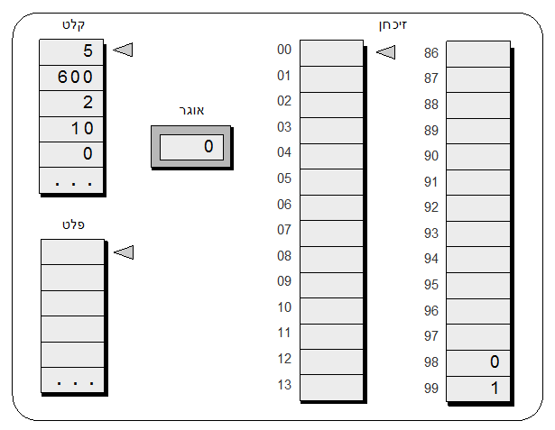
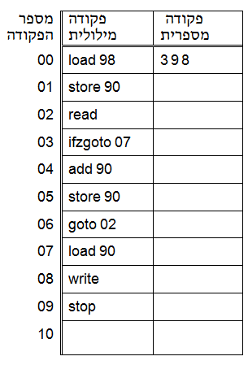

```
parent_lesson: basic-hardware-software
order: 4
layout: appendix
```

#דף פעילות 2: מה התכנית עושה?#

**נניח שהמחשב נמצא במצב הבא:**

<br>
<br>

<div id="container" align="center">
  
</div>
<br>
<br>

**נתונה תכנית המחשב הבאה, שכתובה בפקודות מילוליות:**

<div id="container" align="center">
  
</div>
<br>

**מה לעשות:**

1. תרגם את כל הפקודות המילוליות לפקודות מספריות, וכתוב אותן בטור הימני (הפקודה הראשונה כבר מתורגמת).
2. טען את התכנית אל זיכרון המחשב: העתק את הפקודה המספרית הראשונה לכתובת 00, את הפקודה המספרית הבאה לכתובת 01, וכן הלאה.
3. בצע את כל הפקודות, אחת אחרי השנייה, וכתוב עם עט, על ציור המחשב למעלה, את תוצאות הפקודות.
4. מה כתוב בפלט בסוף הריצה?
5. כעת הרץ את התכנית שוב, על קלט חדש: 0, 4, 5, 7 (המספר הראשון בקלט הוא 7, השני 5, השלישי 4, והאחרון 0). מה כתוב בפלט בסוף הריצה?
6. ראינו שתי דוגמאות של הרצת התכנית על שתי סדרות של מספרים שנגמרות באפס. כתוב למטה, בלא יותר משורה וקצת, איזה משימה התכנית אמורה לבצע על כל סדרת מספרים שנגמרת באפס.


**המשימה הכללית שהתכנית אמורה לבצע על כל סדרת מספרים שנגמרת באפס היא:**