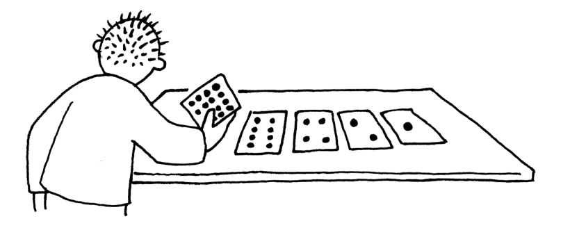
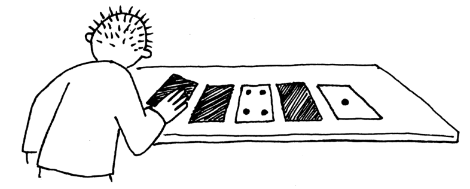
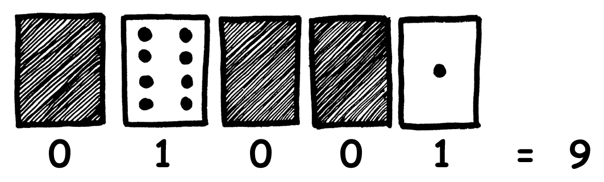
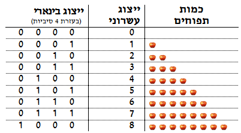

```
title: נקודות למחשבה
description: מספרים בינאריים
author: שמעון שוקן
date: 2009-10-01
layout: lesson
tags: ['מספרים בינאריים','שיטות ייצוג','קידוד']
```

> *"אוכלוסיית העולם מתחלקת לשלוש קבוצות: אלה שיודעים לספור, ואלה שאינם יודעים"*


כשמבקשים ממחשב להציג מידע מספרי כלשהו, כמו למשל מחיר כרטיס לסרט, מה שמופיע על המסך הוא מספר שכתוב **בשיטת הייצוג העשרונית**, כמו למשל 45. בשיטה העשרונית, כל מספר מיוצג ע"י תבנית שמורכבת מהספרות 0, 1, 2, 3, עד 9. באופן דומה, כשצריך להכניס למחשב מספר מסוים, כמו למשל מספר הכרטיסים שמעוניינים לרכוש, גם אז אנו מזינים את המספר המבוקש בשיטה העשרונית.

ומה קורה בתוך המחשב? שם הדברים נראים אחרת. חשוב לדעת שמחשבים מציגים וקולטים מספרים בשיטה העשרונית אך ורק בנקודת המפגש בין המחשב למשתמש. למעשה, מי שאחראי על הצגת וקליטת המידע דרך ממשק המשתמש הוא לא המחשב עצמו, אלא יחידות קלט-פלט כמו המסך, המקלדת, והמדפסת. עמוק בתוך נבכי המחשב – ביחידות הזיכרון, העיבוד, והתקשורת – מספרים מיוצגים באמצעות שני סימנים בלבד: אפס (0) ואחד (1). השיטה הזאת נקראת **שיטת הייצוג הבינארית**.

למה צריך לסבך את העניינים עם שתי שיטות ייצוג שונות? זאת שאלה של נוחות. מצד אחד, בני אדם רגילים לכתוב ולקרוא מספרים שכתובים בעזרת עשר ספרות. מן הסתם זה קשור לכך שלפני אלפי שנים התרגלנו לסמן כמויות שונות בעזרת עשר אצבעותינו. מצד שני, למחשבים אלקטרוניים אין אצבעות, והרבה יותר טבעי ונוח להם לייצג ולעבד מספרים בעזרת מתגים שיש להם שני מצבי יסוד: מתג סגור (מייצג את הסיפרה  1), או מתג פתוח (מייצג את הסיפרה 0).

איך ניתן לייצג מספרים כלשהם – גדולים כרצוננו -- באמצעות שני סימנים בלבד? ומהם היתרונות של השיטה הבינארית בעולם המחשבים? זהו נושא הפעילות הנוכחית.

# הדגמה לפני הקבוצה #
לצורך ההדגמה יש להכין חמישה קלפים קשיחים בגודל דף A4. על קלף אחד יש לצייר נקודה אחת, על השני 2 נקודות, על השלישי 4 נקודות, על הרביעי 8 נקודות, ועל החמישי 16 נקודות, כפי שרואים בציור 1. כל הנקודות בכל הקלפים צריכות להיות באותו גודל. יש לצייר את הנקודות באופן בולט וברור לעין, כדי שניתן יהיה לספור אותן מהשורה האחרונה בכתה. לעומת זאת, צידו האחורי של כל קלף חייב להיות אטום, כך שלא ניתן יהיה לראות דרכו את הנקודות.

<div id="container" align="center">

</div>


העמידי  חמישה מתנדבים בשורה מול הכתה, וחלקי להם את הקלפים באותו סדר שנראה בציור 1: הילד הימני ביותר (מנקודת הראות של הכתה) מקבל את הקלף עם הנקודה הבודדת והילד השמאלי ביותר את הקלף עם 16 הנקודות. כל מתנדב עומד כשפניו אל הכתה כשהוא מציג את הצד האחורי של הקלף שבידו. כלומר, בשלב זה הכתה רואה חמישה ילדים מחזיקים חמישה קלפים חלקים.

בקשי מהמתנדב הימני (ורק ממנו) להפוך את הקלף שבידו ולהציג לכתה את הנקודה הבודדת שמצוירת עליו. בקשי מהילד הבא להפוך את הקלף עם שתי הנקודות. כעת שאלי את הכתה כמה נקודות לדעתם יהיו על הקלף השלישי. רוב הניחושים יהיו מן הסתם "3", אך התשובה שתתגלה היא כמובן "4". המשיכי לחשוף את הקלפים הרביעי והחמישי באופן דומה, והניחושים מן הסתם ישתפרו. שאלי את הכיתה מהי התבנית הכללית של מספר הנקודות על הקלפים. תשובה: בכל קלף מספר הנקודות גדל פי שתיים. כמה נקודות יהיו על קלף שישי, לו היה כזה? תשובה: 16 • 2 = 32.

בשלב זה כל חמשת הקלפים מופנים כלפי הכתה כאשר כל הנקודות גלויות. שאלי את התלמידים כמה נקודות יש בסך הכל על חמשת הקלפים. תשובה: 31=1+2+4+8+16.

מכאן ואילך נשתמש לפעמים במונחים "קלף דלוק" ו- קלף כבוי" לציון קלף שפניו מציגים את הנקודות וקלף שפניו מסתירים את הנקודות, בהתאמה.

ודאי שהמתנדבים ממשיכים להציג את הקלפים לכתה כך שכל חמשת הקלפים דלוקים. זוהי נקודת המוצא לכל אחת מהשאלות הבאות שתפני לכתה. הסבירי שניתן להשתמש בקלפים כאלה כדי לייצג מספרים. השיטה היא כזאת: בהינתן מספר כלשהו, אפשר להדליק חלק מהקלפים ולכבות אחרים כך שסך הנקודות הגלויות בכל חמשת הקלפים יהיה שווה למספר המבוקש. לדוגמא, שאלי את הכתה כיצד לייצג את המספר 6. תשובה: קלפי 2 ו- 4 דלוקים, שאר הקלפים מכובים.

ניתן לקרוא למתנדב נוסף שיורה לחמשת הילדים איזה קלפים צריך להפוך כדי לייצג את המספר המבוקש. חזרי על התרגיל עם מספרים נוספים כגון 15 (קלפי 1, 2, 4, 8 דלוקים), 21 (קלפי 1, 4, 16 דלוקים), וכדומה. כאמור, חשוב להתחיל כל תרגיל כזה במצב בו כל חמשת הקלפים דלוקים.

בסיום ההדגמה בקשי מחמשת המתנדבים לשוב למקומותיהם.

# פעילות קבוצתית #
הצמידי את חמשת הקלפים הגדולים ללוח בעזרת blu tack או חומר דומה (לא פלסטלינה) כך שצידם הגלוי יהיה מופנה אל הכתה. חשוב להצמיד את הקלפים בסדר הנכון: הקלף עם הנקודה הבודדת מימין, משמאלו זה עם שתי הנקודות, וכן הלאה – כמו בציור 1.

חלקי את התלמידים לזוגות. כל זוג צריך לקבל חמישה קלפים, אותם ניתן להכין מצילום וגזירת התבנית [בדף הכנה A](binary-numbers/appendix-a.html "") שנמצא בסוף הפרק. אפשר לעשות את ההכנות הללו לפני השיעור, או, לחליפין, ניתן לחלק לילדים קלפים חלקים ולהדריך אותם לצייר עליהם את הנקודות, כך שתתקבל סדרת הקלפים של ציור 2. חשוב להכין את הקלפים מנייר עבה, כדי שהנקודות לא ייראו מצידו השני של הקלף.

בקשי מהתלמידים להניח את הקלפים בסדר הנכון על משטחי העבודה שלהם, כמו בציור 2. הזכירי להם כי לכל קלף יש שני צדדים ולשניהם יש חלק חשוב במשחק.

<div id="container" align="center">

</div>


**שאלה**: מהו המספר הקטן ביותר של נקודות שניתן להציג בעזרת חמשת הקלפים?

**תשובה**: אפס (כל הקלפים מכובים). חלק מהתלמידים יגידו מן הסתם "אחת", שהיא תשובה סבירה למי ששכח שגם אפס הוא מספר. בקשי מכולם לסדר את הקלפים כך שאפס נקודות תהיינה גלויות.

**שאלה**: מהו המספר הגדול ביותר שניתן להציג?

**תשובה**: 31. בקשי מכולם לסדר את הקלפים כך שכל הנקודות תהיינה גלויות.

כעת בקשי מכולם לייצג כמה מספרים כמו 5 (קלפי 1 ו- 4 דלוקים, השאר כבויים),  13 (קלפי 1, 4, 8 דלוקים), 21 (קלפי 1, 4, 16 דלוקים), ועוד כמה מספרים. אחרי כל תרגיל כזה אפשר לבחור נציג מאחת הקבוצות שייגש אל הלוח ויציג את הפתרון לכתה בעזרת הקלפים הגדולים.

<div id="container" align="center">

</div>

**שאלה**: האם כל מספר בין 0 ל- 31 ניתן לייצוג בעזרת חמשת הקלפים?

**תשובה**: כן. ניתן להדגים זאת ע"י בחירה אקראית של כמה מספרים נוספים וייצוגם בעזרת הקלפים.

**שאלה**: האם יש מספר שניתן לייצגו בעזרת חמשת הקלפים בשתי צורות שונות?

**תשובה**: לא. לכל מספר יש ייצוג יחיד. כדי להדגים זאת אפשר לבחור מספר כלשהו בין 0 ל- 31 ולנסות להציגו בעזרת הקלפים בשתי דרכים שונות.  כאמור, זה בלתי אפשרי.

**שאלה**: איך יודעים שהמספר המיוצג בעזרת הקלפים הוא זוגי?

**תשובה**: הקלף הימני ביותר כבוי (מראה את צידו החלק).

**שאלה**: איך יודעים שהמספר המיוצג בעזרת הקלפים הוא אי-זוגי?

**תשובה**: הקלף הימני ביותר דלוק (מראה נקודה אחת).

# שיטת הייצוג הבינארית #
לאחר שהבנו כיצד ניתן לייצג מספרים בעזרת חמשת הקלפים, אפשר להתקדם להסבר שיטת הייצוג הבינארי. נתחיל בדוגמא קונקרטית: ציירי על הלוח ✈✈✈✈✈✈✈✈✈, ושאלי את הילדים כמה מטוסים מופיעים בציור. בקשי מהילדים להציג את הערך הזה בעזרת הקלפים שלהם. כעת הראי לילדים את ציור 4, ע"י כתיבה על הלוח, מתחת קלפי ההדגמה.


<div id="container" align="center">

</div>

שיטת הייצוג הבינארי מבוססת על המוסכמה הבאה: העמדות בהן הקלפים דלוקים מיוצגות על ידי  הסיפרה 1; העמדות בהן הקלפים מוסתרים מיוצגות על ידי הסיפרה 0 (חשוב להקפיד לקרוא לסימנים האלה "ספרות" ולא "מספרים"). רשמי על הלוח את הייצוג הבינארי של 9, כפי שרואים בציור למעלה. כעת הנחי את הילדים להשתמש בקלפים שלהם כדי לייצג מספר אחר, נניח 20, ושאלי אותם איזה מספר בינארי מתקבל (10100). בצעי את התרגיל על הלוח, וחזרי עליו עם מספר דוגמאות נוספות כגון 0 (00000), 15 (01111), 21 (10101), 31 (11111), וכדומה. מומלץ לסכם כל תרגיל כזה על הלוח (או בעזרת שקף), בסגנון ציור 4.

ייצוג מספרים בעזרת שתי הספרות 0 ו- 1 בלבד נקרא "שיטת הייצוג הבינארי". בשפה הלטינית, "בינארי" משמעותו "מבוסס על שני חלקים". האפסים והאחדים נקראים באנגלית "bits" (binary digits) ובעברית "סיביות" (ספרות בינאריות). שיטת הייצוג שאנו רגילים לה, באמצעות עשר הספרות 0,1,2,3,4,5,6,7,8,9, נקראת "שיטת הייצוג העשרוני" של מספרים, כי היא מבוססת על עשר ספרות. חשוב להדגיש ששתי השיטות נועדו לייצג אותו דבר בדיוק (מספרים) בשתי דרכים שונות. למשל, כמה חודשים יש בשנה? בשיטה העשרונית התשובה היא "12" ובשיטה הבינארית התשובה היא "01100". שתי התשובות מייצגות אותו מספר – כל אחת באופן אחר.

אחרי שלמדנו לייצג מספרים עשרוניים בשיטה הבינארית, נוכל לעשות זאת גם בכוון ההפוך. מהו הערך העשרוני של 10101? (21); 10001? (17); 00111? (7); וכו'.  כדי למצוא את הערך העשרוני של ייצוג בינארי כלשהו, צריך לחשב כמה נקודות נמצאות בסך הכל בכל הקלפים הדלוקים (פעולת חיבור פשוטה).

בקשי מכל ילד לכתוב בייצוג בינארי את היום בחודש שבו הוא נולד. בגלל שבכל חודש יש לכל היותר 31 ימים, חמישה ביטים מספיקים בדיוק לצרכינו.

# פעילויות נוספות #
הערה למורה: לשיטה הבינארית לכשעצמה אין חשיבות פדגוגית משמעותית. יחד עם זאת, העיסוק עם השיטה מחייב את הילדים לחשוב בצורה מופשטת ופעילה. כמו כן, הוא מוביל להבנה שיש הבדל בין מספרים בטבע לבין דרכים שונות לייצג אותם, שהיא אבחנה עמוקה. מכאן ועד סוף הפרק מוצגות שבע פעילויות שלכל אחת מהן ערך חינוכי לא מבוטל. מומלץ לעשות לפחות חלק מהפעילויות, אם לא את כולן. העברת כל הפעילויות תארך כשעתיים ותחייב מן הסתם שני מפגשים.

אם הילדים נתקעים בשאלה מסוימת, אפשר פשוט לתת את התשובה ולהמשיך הלאה.
## פעילות 1: ספירה ##
הבה נעלה בהדרגה, בשיטה הבינארית, מייצוג המספר 0 עד ייצוג המספר 15. כדי לעשות זאת באופן שיטתי, חלקי לכל ילד עותק של [דף פעילות 1](binary-numbers/appendix-b.html ""), והציגי לפני הכתה שקף שלו. ציור 5 מראה את חלקו העליון של דף הפעילות הזה – ייצוג המספרים 0 עד 8, לאחר שהדף מולא כהלכה.


<div id="container" align="center">

</div>


מלאי יחד עם הכתה את שניים-שלושה המספרים הראשונים בדף הפעילות (כתבי על הלוח), והנחי את הילדים למלא את שאר המספרים בדפי הפעילות שלהם. את הייצוג הבינארי של כל המספרים ניתן למצוא בעזרת חמשת הקלפים, כמו שעשינו עד כה  (בעצם, הקלף החמישי מיותר, כי אנו סופרים רק עד 15). מטרת הפעילות הזאת היא להתחיל לזהות את **תבנית** הספירה הבינארית, שהיא נושא הפעילות הבאה. עברי בין הילדים וודאי שדף הפעילות מולא כהלכה.

## פעילות 2: אלגוריתמיקה ##

אנו מעוניינים לבנות רובוט שיבצע את הפעולה "הוסף 1": כאשר מציגים לרובוט מספר בינארי כלשהו, הרובוט מוסיף למספר הזה 1. הבעיה היא ששלושת הפעולות היחידות שהרובוט שלנו מסוגל לעשות הן (א) לזהות אם הקלף מולו הוא עומד דלוק או כבוי, (ב) להפוך קלף, ו (ג) לעבור שמאלה, לקלף הבא. איך אפשר ללמד את הרובוט להוסיף 1 למספר הנוכחי באמצעות שלושת הפעולות האלה? האתגר כאן הוא לנסח תוכנית פשוטה וברורה שאם הרובוט יבצע אותה, הוא יגרום לכך שלמספר הנוכחי יתווסף 1.

הציעי לילדים לשים עצמם בנעלי הרובוט, ולעשות שוב, ולאט, את השלבים הראשונים של הפעילות הקודמת: להתחיל מהייצוג הבינארי של 0  ולעלות בהדרגה (לספור) עד הייצוג הבינארי של 8. הסבירי לילדים שמטרת הפעילות הזאת היא לנסות לגלות את החוק, או התבנית, לפיהם מתבצעת הספירה הזאת. בסיום ההתנסות בקשי מהילדים לנסות לנסח בכתב את החוק שהם גילו. מומלץ לכתוב תשובות טובות על הלוח, אפילו אם הן לא מושלמות.

התוכנית לפיה הרובוט יכול לפעול היא כדלקמן:
0. התחל מהקלף הימני ביותר.

1. הפוך את הקלף.

2. אם פעולת ההיפוך הדליקה את הקלף, עצור.

3. אחרת התקדם שמאלה לקלף הבא.

4. לך לשלב 1.


**כתבי את התכנית על הלוח**. כדי לוודא שהתוכנית מובנת, בקשי מאחד הילדים לשחק את הרובוט ולהשתמש בתוכנית כדי להוסיף 1 לכמה מספרים שרירותיים. מומלץ לעשות זאת ע"י שימוש בקלפים הגדולים, על הלוח.

תרגמי את התכנית לעולם הסיביות (קלף כבוי = 0, היפוך קלף = הפיכת סיבית), וכתבי גם אותה על הלוח: "חיבור 1 למספר נתון: הופכים את הסיבית הימנית ביותר במספר. אם ההיפוך יצר 1, עוצרים; אחרת מתקדמים לסיבית הבאה, וחוזרים על אותה פעולה בדיוק."

הפעילות הזאת היא דוגמא טובה איך מחשב פועל: לרובוט אין מושג מה הוא עושה, אבל בסופו של דבר הוא עושה דבר מועיל: מוסיף 1 למספר נתון. כדאי להדגיש שלרובוט אין שכל אלא פשוט יכולת טובה למלא אחר הוראות. כל ה"חוכמה" נמצאת בתכנית שכתובה על הלוח, ואת התכנית הזאת אנחנו בנינו. אנשים שבונים תכניות שגורמות למחשבים לעשות דברים מועילים נקראים "מתכנתים" ו "מתכנתות".

## פעילות 3: תנאי קצה ##
נניח שכל חמשת הקלפים דלוקים, כך שהמספר המוצג הוא 31. נניח שמבקשים עכשיו מהרובוט להוסיף 1 למספר. מה יקרה?

**תשובה**: יקרה דבר מצחיק. הרובוט חייב לפעול לפי התכנית שהגדרנו לו, כי הוא רובוט. הוא יהפוך את כל הקלפים, מימין לשמאל, עד שהוא יגיע לקלף השמאלי ביותר. הוא יהפוך גם אותו, כי זה מה שהתכנית מכתיבה לו, ואז, לפי התכנית, הוא ינסה להתקדם שמאלה, אל הקלף הבא. אבל אין יותר קלפים! הרובוט ישתגע. אפשר לעשות מזה הצגה מצחיקה בכתה. למה הרובוט השתגע? כי הוא נכנס למצב אותו מתכנתת הרובוט לא חזתה מראש. הבעיה היא לא של הרובוט, אלא של המתכנתת.

התופעה שקרתה כאן נקראת "גלישה" (overflow). אנו מנסים לייצג מספר שהוא גדול מדי עבור שיטת הייצוג שלנו, שמבוססת על חמישה קלפים בלבד (חמש סיביות). איך אפשר לתקן את הבעיה? אפשר כמובן להוסיף לשיטת הייצוג שלנו קלף ששי. אבל גם אז יהיה מספר מירבי שמעליו השיטה תפסיק לעבוד! ככלל, לכל שיטת ייצוג יש תחום מוגבל של מספרים שהיא יכולה לייצג.

למשל, במחשב אישי טיפוסי, כל תא זיכרון בנוי לייצג 32 סיביות, או, במונחי המשחק שלנו, 32 קלפים. יוצא שהמספר הגדול ביותר שמחשב כזה יכול לייצג בתא זיכרון בודד הוא 4,294,967,295 (שמיוצג ע"י 32 אחדים: 11111111111111111111111111111111). מה עושה מתכנת שרוצה לכתוב תוכנית מחשב שמטפלת במספרים יותר גדולים? יש לזה פתרון פשוט: המתכנת מנחה את המחשב להשתמש בכמה תאי זיכרון כדי לייצג כל מספר גדול.

## פעילות 4: הפשטה ##
שיטת הייצוג הבינארית משתמשת בשתי הספרות אפס (0) ואחד (1). יחד עם זאת, כפי שגילה המתמטיקאי הגדול גוטפריד וילהלם לייבניץ כבר במאה ה 16, ניתן לייצג מספרים בעזרת כל שני סימנים שהם, כל עוד הסימנים יהיו שונים אחד מהשני. לכן, לייבניץ נחשב לאבי שיטת הייצוג הבינארית כדי להמחיש את התובנה הזאת – כוח הייצוג המרשים של שני סימנים שונים בלבד – חלקי לילדים את [דף פעילות 2](binary-numbers/appendix-c.html "") ובקשי מהם להשלים אותו, כפי שמראה ציור 6.
<div id="container" align="center">

</div>

## פעילות 5: הכללה ##
אחד ההסברים לכך שאנו רגילים להשתמש בשיטה העשרונית היא שיש לנו עשר אצבעות. אבל, מסתבר שאפשר להשתמש בעשר אצבעות הידיים כדי לספור גם בשיטה הבינארית – זאת רק שאלה של מוסכמה. למשל, בואו נחליט שכל אצבע ביד ימין תייצג את אחד מחמשת הקלפים שלנו (ציור 1): אם הקלף דלוק, נרים את האצבע שמייצגת אותו; אחרת, נוריד אותה. לדוגמא, התחילו עם 0 (כל האצבעות מורדות), הרימו את הבוהן בלבד כדי לייצג את 1, הורידו את הבוהן והרימו את האצבע הבאה כדי לייצג 2, הרימו את שתי האצבעות כדי לייצג 3, וכן הלאה. לאיזה מספר הגעתם כאשר כל האצבעות מורמות? תשובה: 31. חלק מהמספרים, כמו למשל 10, מצריכים אצבעות גמישות למדי ...

כעת בואו נוסיף למשחק את יד שמאל, שגם בה יש לכם (אנו מקווים) 5 אצבעות. את המספר 32 אפשר לייצג ע"י הורדת כל אצבעות יד ימין והרמת האצבע הימנית בלבד של יד שמאל. וכן הלאה. כמה מספרים אפשר לייצג סך הכל בעזרת עשר אצבעות? מסתבר שהתשובה היא תשובה: 1024. ואם היינו יכולים להרים ולהוריד גם את האצבעות של כפות הרגליים, כמה מספרים אפשר היה לייצג בעזרת כל עשרים האצבעות בגוף? תשובה: 1,048,576  (הערה למורה: ניתן לחשוב על כל אצבע כעל סיבית שמייצגת 0 או 1; כללית, מספר הקודים השונים שניתן לבנות עם  סיביות הוא  , מ-   עד  . אם מחליטים שכל קוד כזה ייצג מספר, ניתן לייצג סך הכל   מספרים שונים).

ממבט ראשון, שיטת הייצוג הבינארי נראתה מאד מוגבלת: כמה מספרים אפשר כבר לייצג בעזרת שני סימנים בלבד? ובכן, הפעילות הזאת הדגימה שהשיטה היא חזקה מאד. למשל, אם משתמשים בשיטת ייצוג שמבוססת על 32 סיביות (או "אצבעות"), אפשר לייצג בעזרתה את כל המספרים מאפס ועד 4,294,967,295. לא רע!

## פעילות 6: הרחבה ##
מה קורה כשכותבים את הספרה אפס (0) בצד הימני של מספר כלשהו? אם מדובר במספר שמיוצג בשיטה העשרונית, כתיבת אפס מימין מכפילה את המספר בעשר. למשל, 9 הופך ל 90, 23 הופך ל 230, וכן הלאה.  מה קורה כשכותבים אפס מימינו של מספר שמיוצג בשיטה הבינארית? למשל, הבה נתבונן במספר הבינארי 1001, שמייצג את המספר 9 בשיטה העשרונית. נכתוב אפס מצד ימין, ונקבל 10010. מה מייצג המספר הבינארי 10010? התשובה היא 18.

נסו לכתוב אפס בצידם הימני של עוד כמה מספרים בינאריים. מה מייצגת התוצאה? האם אתם מזהים תבנית כלשהי? תשובה: בשיטה הבינארית, כתיבת אפס מימין גורמת להכפלת המספר בשתיים.

המספר בו המספר מוכפל – 10 בשיטה העשרונית ו 2 בשיטה הבינארית – נקרא "בסיס השיטה".

## פעילות 7: מאותיות למספרים (ובחזרה)  ##
השיטה הבינארית נוחה וטבעית לייצוג מספרים במחשב ולהפעלת פעולות חשבון כגון חיבור, חיסור, כפל, וחילוק. ואמנם, המחשבים הראשונים שימשו בעיקר לסוגים שונים של עיבוד מספרים, בעיקר למטרות צבאיות. למשל, המחשבים הדיגיטלים הראשונים, שפותחו בשנות 1940 במהלך מלחמת העולם השנייה, עסקו בעיקר במשימות מתמטיות כגון חישוב מסלולי תנועה של טילים באטמוספירה, או פיצוח צפנים. אילו היו המחשבים מוגבלים לפעילויות כאלה בלבד, הם היו משמשים רק קומץ מדענים וסוכנויות ביון, ולא היו מגיעים לתפוצה העצומה שיש להם כיום. אחד מסודות הפופולריות של  מחשבים הוא בכך שבעזרת המספרים הבינאריים שהכרנו ניתן לייצג ולעבד מגוון עצום של סוגי מדיה שונים כגון טקסט, מוזיקה, תמונות, אנימציה, וידאו, ועוד. בפעילות זו נדגים כיצד ניתן לייצג אותיות עבריות וסימני פיסוק בעזרת מספרים.

[דף פעילות 3](binary-numbers/appendix-d.html "") מופיעה "טבלת קידוד" של 27 האותיות שבשפה העברית (כולל חמש אותיות סופיות) וחמישה סימני פיסוק (אחד מהם הוא סימן הרווח, שאמנםאיןרואיםאותואךבלעדיוקשהמאודלקרוא). לאוסף העצמים האלה נהוג לקרוא "תווים". שימו לב שכל אחד מהתווים מקודד, או מיוצג ע"י, מספר בין 0 ל 31.

כדי לייצג טקסט כלשהו במחשב, אנו משתמשים בטבלת הקידוד כדי לתרגם כל תו בטקסט למספר המתאים, וכותבים את המספרים המתקבלים **מימין לשמאל** (לו הטקסט היה באנגלית, הכיוון היה כמובן משמאל לימין).

למשל, המשפט **עברי, דבר עברית!** מתורגם לסדרת המספרים

**25  21  9  19  1  15  22  19  1  3  22  9  19  1  15**

שימו לב כי בתרגום למספרים הרווח ( "22") מיוצג באופן מפורש כמו כל תו אחר.

לא סיימנו – כדי לייצג את הטקסט במחשב צריך להמשיך ולתרגם את המספרים לייצוג הבינארי שלהם. זו כבר משימה מוכרת: תרגום סדרת מספרים מייצוג עשרוני לייצוג בינארי. במקרה שלנו

**15     1      19      9      22      3       1       19     22      15      1      19      9       21     25**

מתורגם ל-

**01111 00001 10011 01001 10110 00011 00001 10011 10110 01111 00001 10011 01001 10101 11001**

חלקי לכל תלמיד עותק של טבלת הקידוד,  רשמי את השורה למעלה על הלוח, ובקשי מהם לתרגם אותה חזרה לטקסט (מבינארי לעשרוני, ואז למשפט בעברית). הזכירי להם כי כוון התרגום הוא מימין לשמאל!

כעת בקשי מכל אחד מהתלמידים שירשום את שמו הפרטי (בעברית) על דף, יתרגם אותו בעזרת טבלת הקידוד, ויעביר את המספרים לייצוג בינארי. את הייצוג  הבינארי בקשי שירשמו על דף חלק, ללא סימני זיהוי. אספי את הדפים מכל התלמידים וערבבי אותם (להגברת הרושם, ניתן להשתמש במיכל כלשהו שבו יעורבבו הדפים). חלקי את הדפים לתלמידים. הציפיה היא שרוב התלמידים יקבלו דפים של תלמידים אחרים. למעטים שקבלו דפים שלהם עצמם, החליפי דפים כך שכל תלמיד יקבל דף של תלמיד אחר.

**הערה לסיום**: טבלת הקידוד שמופיעה בציור 1 אינה הטבלה בה מחשבים משתמשים באמת. הקוד איתו עבדנו עד כה הוא קוד בן חמש סיביות. זהו קוד קצר עם קיבולת ייצוג קטנה מדי, שלא ניתן לייצג בעזרתו סימנים שימושיים רבים כגון ספרות, סימני פיסוק רבים, ועוד. יחד עם זאת, טבלאות קידוד אמיתיות נבנות באופן דומה. עד לפני כמה שנים מחשבים ייצגו תווים בעזרת טבלת קוד שנקראה ASCII, המבוססת על 8 סיביות, וכיום משתמשים בטבלת קידוד שנקראת Unicode, שמבוססת על 16 סיביות. קיימות שיטות קידוד נוספות ופחות נפוצות, כגון Hebrew Windows. בתוכנות שונות, כגון דפדפנים ומעבדי תמלילים, יש אופציה לשנות תכונה של הטקסט שנקראת character encoding. כשמשנים את התכונה הזאת, טקסט מעורבל נראה פתאום תקין, או להיפך. התופעה הזאת קורית כי שינוי ה character encoding נותן הוראה לתוכנה להשתמש בטבלת קידוד אחרת כדי לפרש את הסיביות שמייצגות את הטקסט המוצג על המסך. אם טקסט נכתב במחשב אחד בעזרת טבלת קידוד מסוימת, והועבר למחשב אחר בו משתמשים בטבלת קידוד אחרת, יווצר טקסט מעורבל שניתן לפעמים לתקנו בעזרת השימוש ב character encoding.
