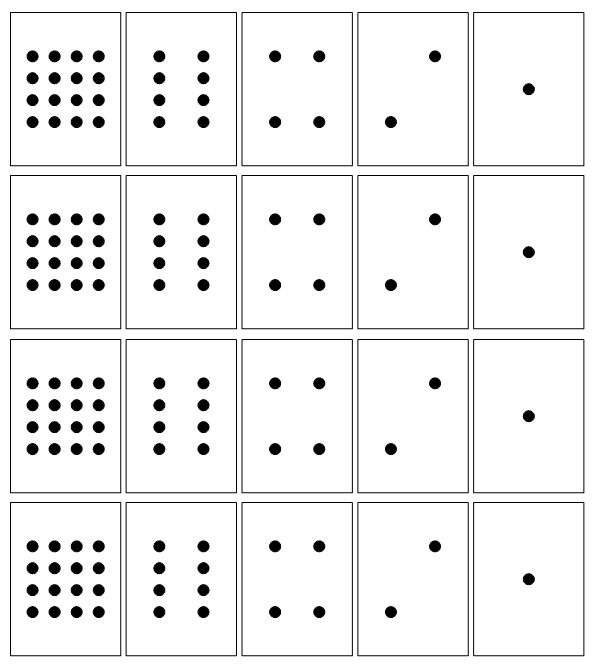

```
parent_lesson: binary-numbers
order: 1
layout: appendix
```

#דף הכנה A#
ארבעה סטים זהים של חמשת הקלפים.

הדבק על נייר קרטון וגזור לקלפים (התוצאה תהייה 4 סטים ל- 4 קבוצות),
או הכן קלפים ריקים ובקש מהילדים לצייר עליהם את הנקודות.

<br>
<br>

<div id="container" align="center">
  
</div>
<br>
<br>
