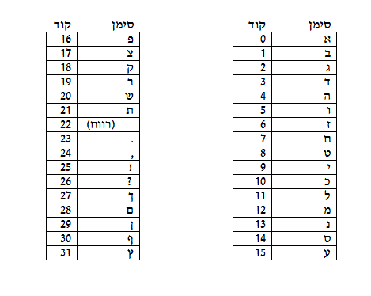

```
parent_lesson: binary-numbers
order: 3
layout: appendix
```

#דף פעילות 3א
##טבלת קידוד:##

<br>
<br>

<div id="container" align="center">
  
</div>
<br>
<br>
<br>
<br>
1. מצאו מהו המשפט בעברית המיוצג (מימין לשמאל) על ידי 21 המספרים הבינאריים הבאים.
תרגמו תחילה מייצוג בינארי לייצוג עשרוני,  ואז השתמשו בטבלת הקידוד כדי לתרגם לעברית.

**10100 00111 10010 01001 10110 10100 00111 10010 01001 10110**

**01111 01011  10110 00100 00111 01011 00101 01100 00101 10101 11000**

<br>
<br>
<br>
<br>
<br>
<br>


 2. כתבו את הקידוד הבינארי של שמכם הפרטי ושם משפחתכם (לא לשכוח רווח). ומסרו את התוצאה למורה. קבלו מהמורה את הייצוג הבינארי של השם של תלמיד אחר, ומצאו מהו השם (על ידי תרגום מייצוג בינארי לייצוג עשרוני, ותרגום מן הייצוג העשרוני לעברית תוך שימוש בטבלת הקידוד למעלה.

###שם בייצוג בינארי###


<br>
<br>
<br>
<br>


###שם בעברית###
       
<br>
<br>
<br>
<br>
