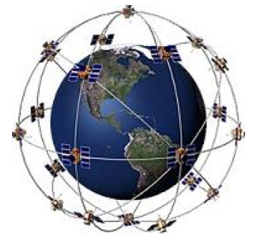

```
title: אני אנווט 
description: GPS - מערכת מיקום עולמית
author: דניאל בן טוב
date: 2008-11-01
layout: lesson
tags: ['GPS','מיקום','לווינים']
```

#הקדמה#

כולנו מוקפים היום במכשירים אלקטרוניים המשתמשים ביכולות המופלאות של ה- GPS. מטוסים,
רכבים, מכשירים סלולריים, גורמים בטחוניים ואפליקציות באינטרנט כגון פייסבוק וגוגל משתמשים ב- GPS באופן שוטף.
<br>
GPS – Global Positioning System 
או בתרגום לעברית, מערכת מיקום עולמית הינה המצאה
אמריקאית שיועדה בתחילה ליכולות צבאיות אך כיום כל אדם שבאמצעותו מקלט GPS יכול להשתמש בה.
<br><br>

המערכת פועלת באמצעות למעלה מ-24 לווינים המקיפים את כדור הארץ במסלול מסויים. 
 בנוסף קיימות תחנות קרקעיות המאפשרות שיפור דיוק ותיקון שגיאות משמעותי למערכת.
בפשטות, הלווינים משדרים אות לכיוון כדור הארץ. כל מקלט שקולט ארבעה לווינים יכול לחשב את מיקומו
באמצעות חישוב המרחק בינו לבין כל לווין.
<br><br>

חשוב לציין שאין הכוונה לדבר על נוסחאות מתמטיות מורכבות והשיטה המפורטת שבה עובדת המערכת.
<br><br>

###מטרת השיעור###
מטרת השיעור הינה להסביר את העקרונות היסודיים על פיהם פועל ה- GPS. 
לצורך ההפשטה אנו נתייחס לחיתוך של שלושה לווינים ולא ארבעה אשר 
דרושים לקבלת נקודה מדוייקת ונתעלם מהתחנות הקרקעיות המאפשרות דיוק משופר.
<br><br>
**ציוד לשיעור:**
* ארבעה צעיפים או חוטים באורך שווה (רצוי באורך של למעלה ממטר)
* דפי עבודה מודפסים 
* שתי מטפחות / צעיפים לקשירת עיניים
* כדורגל, כדורסל, כדור גלובוס או כל כדור אחר להדגמת פיזור הלווינים
<br><br>

**השיעור יתחלק לשלושה נושאים:**
<br>
1. חישוב מרחק על פי זמן  - משחק כיסאות.
<br>
2. חיתוכים של מעגלים - דיאגרמה ודפי עבודה.
<br>
3. מיקום לווינים - שרטוטים ומשחק בכיתה.
<br><br>

#1. חישוב מרחק על פי זמן:#

בחר 8 מתנדבים. הושב את כולם בשורה על הכסאות. 
קשור את עיניו של התלמיד הימני ביותר, הוצא תלמיד אחד מאמצע השורה. רשום פתק והעבר אותו מהילד היושב בכסא השמאלי ביותר עד לתלמיד עם העיניים המכוסות.
<br>
כעת, שאל את התלמיד שקיבל את הפתק כמה ילדים ישנם בין הכסא שעליו הוא יושב לבין הכסא השמאלי ביותר. 
סביר להניח שתשובתו תהא 8 (בהתבסס על זכרונו של כמות הילדים שנבחרה).
<br>
עתה, העבר פתק נוסף ובקש מהילדים להגיד את שמם כשהם מקבלים את הפתק.
ניתן להמשיך ולעבור להקראת המספר 1 כאשר כל תלמיד מקבל את הפתק.
לבסוף, בקש מהתלמידים לספור בצורה עולה, קרי 1,2,3,4,5,6,7,8. הסבר לתלמידים שבאופן זה גם אם יהיו 1,000,000 תלמידים בשורה, התלמיד האחרון ידע בדיוק כמה תלמידים היו בינו ובין התלמיד הראשון.
<br>
<u>
####הפעלה נוספת 1:####
</u>
ניתן להדגים כיצד ביכולתנו לחשב באופן די מדוייק את כמות התלמידים שהעבירו את הפתק מבלי שיצטרכו לספור בצורה עולה.
<br>
ראשית, עלינו למדוד כמה זמן <u>בממוצע</u> לוקח לכל תלמיד להעביר את הפתק.
חשוב להסביר לתלמידים שככל שנקח יותר תלמידים כך הממוצע יהיה יותר מדוייק.
שנית, יש למדוד את כמות הזמן מהרגע שהתחלנו להעביר את הפתק ועד שהוא הגיע לתלמיד עם העיניים המכוסות. לבסוף, נחלק את הזמן הכולל בזמן הממוצע להעברת פתק ונקבל את מספר התלמידים.
בשיטה זו גם אם התלמידים לא סופרים בצורה עולה (....,1,2) ניתן להעריך בצורה די מדוייקת כמה תלמידים העבירו את הפתק.
<br><br>
הערה: חשוב להסביר לתלמידים שעליהם להעביר את הפתק בקצב רגיל, תצפו לכך שמספר תלמידים "יתמהמהו" עם הפתק כדי לשבש את חישוב הממוצע.
<br>
<u>
####הפעלה נוספת 2:####
</u>
בחר 4 מתנדבים. סדר את המתנדבים כך שישבו בכל אחת מהפינות בכיתה. בחר מתנדב נוסף והעמד אותו במרכז הכיתה וכסה את עינייו. כל אחד מארבעת המתנדבים בפינות יקרא בתורו למתנדב שיעמוד במרכז הכיתה. הזז את התלמיד למספר מקומות שונים בכיתה. בכל נקודה כל אחד מארבעת התלמידים יקרא למתנדב שבמרכז הכיתה 
<u> בשמו של המתנדב</u>
בתורו. לפי עוצמת הקול הוא יוכל להעריך ליד איזה תלמיד הוא הכי קרוב.
<br><br>
הערה: חשוב להבהיר למתנדבים לקרוא למתנדב במרכז הכיתה בקול "רגיל" (הדגימו בעצמכם קריאה למתנדב במרכז הכיתה) ושאין באפשרותם לצעוק, אחרת הפעילות תפגע.


#2. חיתוכים של מעגלים:#

חלק את
[דף פעילות מספר 1](gps/appendix-a.html "")
. לאחר כ-5 דקות החל בהדגמה.
<br><br>
צייר מעגל.

<div id="container" align="center">

</div>

<br>
צייר מעגל נוסף שיצור חיתוך.
<br>

<div id="container" align="center">

</div>

<br>
בקש מהתלמידים לסמן את נקודות החיתוך בין המעגלים.
<br>
כעת, צייר שלושה מעגלים.
<br>

<div id="container" align="center">

</div>

<br>
בקש מהתלמידים לציין את נקודת החיתוך בציור של שלושת המעגלים.
הראה שהוא למעשה "מסנן" לנו אפשרות אחת מבין 2 האפשרויות שהיו לנו במצב הקודם (של 2 מעגלים נחתכים).
הראה שבחיתוך של שלושה מעגלים יש לנו נקודת חיתוך אחת (למעשה אזור אחד שניתן להתייחס אליו
כנקודה שחורה, באפשרותכם לצבוע את האזור כדי להבהיר את הנושא).
נשאיר את הציור של שלשות המעגלים בפינת הלוח ככלי עזר להמשך השיעור.
<br>
כעת בחר מתנדב וכסה את עיניו. הסבר לו מראש שכאשר הצעיף/חוט מתוח הוא במרחק של מטר ממך.
 למעשה, המתנדב ישמש כמקלט ואתה כלווין. 
  צור מתיחות (החוט מתוח ולא רפוי) על החוט (מעתה נשתמש רק במונח חוט) ושאל אותו למרחקו ממך.
  כעת שאל אותו מה מיקומו ביחס אליך.
הראה לו ולכיתה שהוא בעצם במרחק בעל רדיוס קבוע.
 ניתן להמחיש זאת בקלות.
בקש מהמתנדב 
להתחיל ללכת ימינה או שמאלה (לבחירתו) אך עליו לשמור על החוט מתוח במשך כל תנועתו. 
בפועל הוא יבצע מעגל סביבך. 
<br>
<br>
כעת בחר מתנדב נוסף. הוא ישמש כ"לווין" נוסף.
 כעת נראה לתלמידים שישנן רק שתי נקודות אפשריות (נזכיר שהחוטים באותו אורך). 
 בדיוק כמו בציור המעגלים.
<br>

<div id="container" align="center">

</div>

<br>
בקש מתנדב שלישי אשר ישמש כלווין שלישי והראה שכעת התלמיד לא יכול "להתקדם" למקום אחר
מבלי לקרוע את אחד החוטים.
<br>

<div id="container" align="center">

</div>

<br>
חזור לציור המעגלים והשווה בין הסיטואציה הנוכחית לחיתוך שלושת המעגלים.

#3. מיקום לווינים:#

בחר ארבעה מתנדבים. אחד ישמש כמקלט (יש לכסות את עיניו) ושלושה ישמשו כלווינים.
<br>
מקם את שלושת הלווינים בשורה בצמוד לאחת הדפנות בכיתה.
המחש לתלמידים שלא ניתן לייצר מצב בו כל שלושת החוטים מתוחים.
נסביר לתלמידים שבכל רגע נתון עלינו לייצר מצב שבו שלושה לוויינים מסתכלים עלינו.
 הסבירו שחוט מתוח מדמה את המצב שהלווין מסתכל עלינו (קשר עין בין הלווין למקלט). 
<br><br>
הערה: ניתן להסביר את המונח קשר עין בפשטות. בחרו תלמיד והסתכלו עליו - זה קשר עין. כעת התכופפו מתחת לשולחן והראו לתלמידים שבמצב הזה אין לכם קשר עין עם התלמיד הנ"ל.
<br><br>
לאחר הפעילות נשתמש בכדור שהבאנו. 
הכדור ידמה לנו את צורתו של כדור הארץ. 
בקש מהתלמידים פתרונות אפשריים לפריסת הלוויינים סביב הכדור כך שבכל רגע נתון על כל נקודה על פני הכדור יסתכלו לפחות שלושה לווינים.
<br><br>
<u>
####הרחבת הפעילות - אופציונאלי:####
</u>
הערה: הרחבה זו יותר מורכבת ותלויה ברמת הבנת הכיתה של החומר עד כה. 
במידה ואתם
חושבים שהרחבה זו לא מתאימה לכיתה או שלא נותר לכם זמן מספק פשוט וותרו על דוגמא זו ורק חלקו לתלמידים את הציור בדף פעילות מספר 2 המראה את פיזור הלווינים סביב כדור הארץ.
<br><br>
הסבר לתלמידים שהלווינים בחלל לא יכולים להשאר במקום ולכן עליהם להיות תנועה מתמדת.
בנקודה זו יש להסביר שחוט מתוח מדגים לנו קשר עין בין הלווין למקלט. אולם במציאות אורך החוט
(קרי, האות שנשלח מהלווין בחלל למקלט בכדור הארץ) אינו קבוע ומוגבל לאורך הצעיף.
 ניתן להמחיש זאת על ידי 2 תלמידים שינועו בין השולחנות בכיתה.
על התלמידים לחשוב על פתרון בו  בכל רגע נתון ישנם שלושה לווינים לפחות שנמצאים בקשר עין עם המקלט. 
פיזור של ארבעה לווינים (מעל לתקרה, מתחת לרצפה, מאחורי הכיתה ומלפניה) הוא פתרון טוב.
באותה מידה גם פתרון של שישה לווינים (מעבר כל דופן של הכיתה).
<br>
אך במידה וכל לווין עולה 200 מיליון דולר. 
כיצד נגיע למספר מינימלי (הקטן ביותר) של לווינים שיאפשרו לנו קשר עין עם כל מקלט על פני הכדור?
<br><br>
בשלב זה נראה לתלמידים את הפתרון על ידי הציור המצורף.
<br>
חלק לתלמידים את הציור ב
[דף פעילות מספר 2](gps/appendix-b.html "")
הסבר שזוהי החלוקה שהתבררה כנכונה ביותר - הלווינים נעים בתיאום, הכדור עצמו גם נע סביב עצמו וסך הכל אנו מייצרים חלוקת פלחים יעילה על פני הכדור.
בחלוקה זו ישנם בסך הכל שישה מסלולים ובכל מסלול ארבעה לווינים במרחק קבוע.
מסיבה זו המערכת חייבת להשתמש בכ-24 לווינים פעילים על מנת ליצור קשר עין עם כל מקלט על פני כדור הארץ.
<br>

<div id="container" align="center">

</div>

<br>

#סיכום#
נסכם בכך שהלווינים משדרים אות אותו קולט המקלט. 
 באמצעות תרגום זמן למרחק (חלק 1) ושיטות חיתוך (חלק 2) אנו יודעים למקם כל מקלט. 
  באמצעות חלוקה נכונה (חלק 3) אנו יכולים למצוא כל מקלט (חיתוך של נקודה כמו בציור של שלושת המעגלים בפינת הלוח) בעולם. 
<br><br>
שאלת בונוס לתלמידים – מתי בכל זאת אין קליטה? (התשובה המתבקשת הינה מנהרה). 
בקשו מהתלמידים שבפעם הבאה שאבא או אמא נוהגים עם GPS מתחת למנהרה להזכיר להם שה-GPS לא יעבוד כל עוד הם במנהרה.

<u>
####קישורים נוספים בנושא:####
</u>
1. [ויקיפדיה - ג'י.פי.אס](http://he.wikipedia.org/wiki/GPS)
<br>
2. [אנציקלופדיית Ynet– מערכת מיקום גלובלית](http://www.ynet.co.il/yaan/0,7340,L-168280-MTY4MjgwXzI4MTc3MjA2Nl8xNDg2ODcyMDAeq-FreeYaan,00.html)
<br>
3. [התאמה בין מקלט GPS למפה](http://www.jeepolog.com/forums/content.php?r=1452)
<br>
4. [סרטון המחשה של הטכניון – כיצד פועל GPS](http://www.geoinfo.technion.ac.il/_downloads/presentation.asp?fname=gps)
<br>
5. [בלוג לענייני מדע – איך זה עובד?](http://scienceblog.galbarak.co.il/?p=60)
<br>
6. [AGPS](http://he.wikipedia.org/wiki/AGPS)
