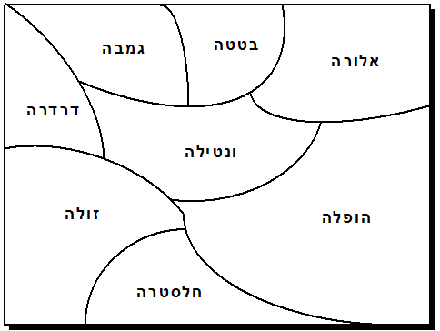

```
parent_lesson: graph-theory
order: 2
layout: appendix
```

#דף פעילות 2: צביעת מפה#

ציבעו את המפה שלפניכם במספר צבעים קטן ככל האפשר, כך שכל שתי ארצות שיש להן גבול משותף תהיינה צבועות בצבעים שונים. 

שני עותקי המפה זהים. אם עותק אחד נהייה מקושקש מדי, אפשר להשתמש בשני.

<div id="container" align="center">
  
</div>
<br>
<br>
<br>
<div id="container" align="center">
  
</div>
<br>
<br>
<br>