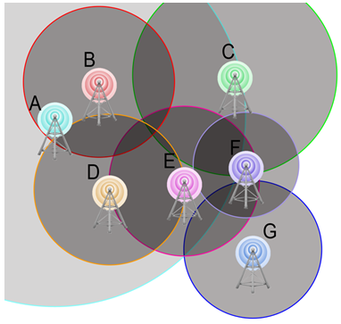

```
parent_lesson: graph-theory
order: 8
layout: appendix
```

#דף פעילות 8: הקצאת תדרים#

התבוננו במיצג הבא, שמתאר פריסה של שבע אנטנות סלולאריות באיזור מסוים בארץ. האנטנות מסומנות באותיות A עד G. 

<div id="container" align="center">
  
<br>
<h3>  מפת הפריסה של האנטנות </h3>
</div>
<br>
<br>
<br>
ציירו, על גבי מפת הפריסה שלמעלה, קוים שמחברים כל זוג אנטנות שקיימת ביניהן חפיפה. כעת ציירו באיזור הריק למטה גרף שמייצג את מפת הפריסה הנתונה. ייצגו כל אנטנה ע"י צומת, וכל חפיפה בין שתי אנטנות ע"י קשת. סמנו את הצמתים בגרף באותיות A עד G.
<br>
<br>
<br>
<br>
<br>
<br>
<br>
<br>
<br>
<br>
<br>
<br>
<br>
<br>
<br>
<br>
<br>
<br>
**שאלה**: התבוננו בגרף שציירתם. מה מספר התדרים הקטן ביותר בו אפשר להשתמש כדי לאפשר תקשורת תקינה ברשת הזאת?

רמז: צביעה.