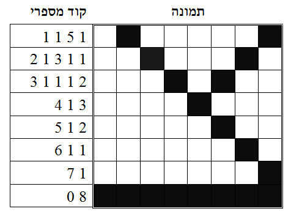
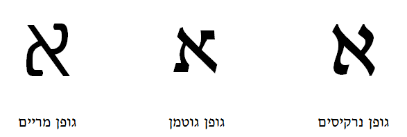
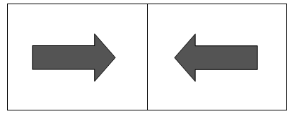

```
title: משחקי פיקסלים
description: ייצוג ועיבוד תמונות
author: שמעון שוקן
date: 2009-08-01
layout: lesson
tags: ['intro','page']
```

> *"אנשים רגילים מתפעלים מדברים מתוחכמים; אנשים מתוחכמים מתפעלים מדברים רגילים" (קונפוציוס)*

כפי שראינו בפעילויות קודמות, מחשבים בנויים לעבוד עם מספרים בינאריים. יחד עם זאת, חלק ניכר מהעבודה שלנו עם מחשבים עוסק בעצמים גרפיים כמו תמונות, ציורים, אנימציה, ווידאו. איך מחשב שיודע לעבוד רק עם אפסים ואחדים מסוגל להדפיס או להציג על המסך תמונות מרהיבות? התשובה, כרגיל, היא חוכמה אנושית. לאורך השנים, מדעני מחשב פיתחו מגוון גדול של טכניקות לטיפול דיגיטלי בעצמים גרפיים. הפעילות הנוכחית מדגימה את הבסיס המשותף של כל הטכניקות הללו: היכולת להציג, לנתח, ולשנות תמונות בעזרת מספרים. 

#שאלות פתיחה#

1. מתי מחשבים נדרשים לאחסן ולעבד עצמים גרפיים כמו תמונות וציורים?  
תשובה: כאשר עובדים עם יישומים גרפיים כגון תוכנות ציור, משחקי מחשב, אלבומי תמונות, וכדומה.
2. איך עצמים גרפיים מיוצגים בתוך המחשב?  
תשובה: כמו כל דבר אחר, ע"י מספרים. כל עצם גרפי, למשל תמונה, מאוחסן בקובץ נפרד. "קובץ" הוא סדרה ארוכה של מספרים שיש לה שם, כדי שאפשר יהיה למצוא אותה בקלות במחשב. 
3. מה עושה מדפסת?  
תשובה: מדפסת מקבלת קובץ מספרים מהמחשב והופכת אותו לדף מודפס.
4. מה עושה סורק (scanner)?  
תשובה: סורק מקבל דף מודפס מהמשתמש והופך אותו לקובץ מספרים שהמחשב יכול לאחסן.
5. מה עושה מכונת פקס?  
תשובה: מכונת פקס היא שילוב של סורק ומדפסת. היא יודעת איך לסרוק דף מודפס, להפוך אותו לקובץ מספרי, ולשלוח אותו דרך קו טלפון רגיל למכונת פקס אחרת. כשמכונת הפקס השנייה מקבלת את הקובץ, היא יודעת איך להדפיס אותו על נייר. הפעולות האלה נקראות "לשלוח פקס" ו- "לקבל פקס", בהתאמה.
6. מה עובר דרך קו הטלפון כששולחים פקס?  
תשובה: מספרים שמיוצגים ע"י סיביות (אפסים ואחדים), כמו שלמדנו בפרק 1.
7. איך אפשר לייצג תמונה ע"י מספרים? ואיך אפשר להפוך סדרת מספרים לתמונה?   
תשובה: זהו נושא הפעילות הנוכחית. 

#הדגמה#
מסכים של מכשירים דיגיטליים כגון מחשבים, טלפונים ניידים, וטלביזיות LCD, מחולקים לשתי וערב של נקודות קטנטנות שנקראות "פיקסלים" (באנגלית, המילה pixel היא קיצור של pictorial element). מסך מחשב טיפוסי מכיל בערך מיליון פיקסלים. בתוך המסך יש חומרה שיודעת לצבוע כל פיקסל בצבע מסוים, לפי הוראות המחשב ששולט במסך. לצורך הפשטות, בואו נניח בשלב זה שאנו עוסקים בתמונות ובמסכים שיש להם שני צבעים בלבד: שחור ולבן. הבה נתמקד בחלק קטן של המסך -- משבצת שגודלה שמונה שורות על שמונה עמודים -- 64 פיקסלים סך הכל. נניח שהתבקשנו להציג על משבצת כזאת ציור של האות "צ". איך אפשר לעשות זאת?

הצג  את דף הדגמה A. שרטט אות "צ" גדולה על הלוח, והסבר שהמטרה היא לייצג את הציור הזה בעזרת פיקסלים, כמיטב יכולתנו. כעת מלא את הפיקסלים על גבי הדף, לפני הכתה, כפי שרואים בצידו הימני של מיצג 1. הסבר שזאת אינה הדרך היחידה לייצג "צ" בעזרת פיקסלים. יחד עם זאת, התוצאה נראית סבירה. הסבר גם שככל שמקטינים ציור כזה, ריבועי הפיקסלים מיטשטשים והתמונה נראית טוב יותר לעין.

כדי לאחסן תמונה במחשב, צריך לתרגם אותה קודם לסדרת מספרים. התוצאה היא קוד מספרי, ולכן הפעולה הזאת נקראת לפעמים "קידוד". מיצג 1 מדגים שיטת קידוד תמונות מקובלת שמבוססת על העיקרון הבא. מתבוננים בכל שורה בתמונה בנפרד, מלמעלה למטה, וסופרים רצפים של פיקסלים לבנים ושחורים, משמאל לימין. המוסכמה היא שבכל שורת קוד, המספר הראשון מייצג תמיד את מספר הפיקסלים הלבנים בתחילת השורה. המספר השני מייצג את מספר הפיקסלים השחורים שבאים לאחר מכן, וכן הלאה.

<div id="container" align="center">
  
</div>

למשל, במיצג 1, השורה הראשונה בתמונה מתחילה ברצף של פיקסל לבן אחד (1). אחריו מופיע רצף של שחור אחד (1), רצף של 5 לבנים (5), ורצף אחרון של שחור אחד (1). התוצאה היא הקוד 1 5 1 1. השורה האחרונה מתחילה עם רצף של אפס לבנים שאחריו מופיע רצף של 8 שחורים, ולכן הקוד הוא 0 8. שימו לב: בכל שורה הקוד מתחיל תמיד עם אורך הרצף הלבן הראשון בשורה.

מלא יחד עם הילדים את כל שורות הקוד המספרי במיצג 1. בכל שורה בחר בילד אחר, ובקש ממנו להכתיב לך את קוד השורה. רשום את התוצאה לפני הילדים.

#פעילות 1: ייצוג אותיות#
חלק לילדים את דף פעילות 1, והנחה אותם לכתוב את הקוד המספרי של האות "ב". הזמן את אחד הילדים לכתוב את הקוד לפני הכתה, על דף פעילות 1. לאחר מכן, הנחה את הילדים לבחור שתי אותיות נוספות, לתכנן ולמלא את הייצוג הפיקסלי שלהם על דפי העבודה, ולכתוב את הקוד המספרי של הייצוג. מסיבות מובנות, את הפעילות הזאת רצוי לעשות עם עיפרון ומחק. בסיום הפעילות בקש מהילדים להחליף את דפי העבודה שלהם עם בני זוגם לשולחן. כל ילד צריך לוודא שהקוד המספרי בדף שבידו משקף נכונה את תמונת האות (אין צורך לבדוק אם ציור האות מוצלח, אלא רק את נכונות הקוד).

#פעילות 2: עיצוב גופנים#
כשעובדים עם מעבד תמלילים, התוכנה מאפשרת להציג על המסך או להדפיס על נייר את אותיות המסמך בעשרות סגנונות וגדלים שונים. הסגנונות האלה נקראים "גופנים", באנגלית fonts. גופן הוא סדרת ציורים שמגדירה למסך ולמדפסת איך להציג את כל אחת מאותיות האלף-בית. ליתר דיוק, גופן הוא סדרה של קודים מספריים של ציורי אותיות.

תכנון גופנים נעימים לעין הוא אמנות בפני עצמה, ורבים מהגופנים נקראים על שם המעצבים שהמציאו אותם. למשל, גופן "גוטמן" על שם שמואל גוטמן, גופן "נרקיסים" על שם צבי נרקיס, וכדומה. האותיות שמוצגות בדפי ההדגמה של הפרק הזה נכתבו בגופן ש"ש (שוקן-שור), וללא ספק יש מוצלחים מהם.

<div id="container" align="center">
  
</div>

בפעילות הבאה נתרגל עיצוב גופנים. הצג לפני הכתה את דף הדגמה B ופרט את שלושת הגופנים שמופיעים בו. דף זה מהווה דוגמא לפעילות הילדים, ולכן רצוי להשאירו מוצג לפני הכתה במהלך הפעילות. חלק את דף פעילות 2, והנחה את הילדים לבחור אות ולייצג אותה בעזרת שלושה גופנים (רגיל, מודגש, מוקטן).

#פעילות 3: שליחת מילה סודית#
מטרת המשחק היא להעביר מילה סודית בת שלוש אותיות בין שולח למקבל. חלק את הילדים לזוגות, כך שכל שני בני זוג יושבים רחוק אחד מהשני בכתה. כל אחד מבני הזוג יהיה גם שולח וגם מקבל. חלק לכל ילד עותק של דף 3-א ועותק של דף 3-ב. כל הילדים משחקים גם כשולחים וגם כמקבלים. כל ילד צריך לבחור מילה סודית בת שלוש אותיות, לצייר את שלושת האותיות בדף פעילות 3-א (אות ראשונה תהיה עליונה), לתרגם את שלושת הציורים לקודים מספריים, ולהעתיק את הקודים בלבד אל דף פעילות 3-ב. כעת, כל ילד שולח בוחר ילד מקבל, כותב את שמו בתחתית דף 3-ב, ומעביר את דף הקודים אל המקבל.

משימת המקבל היא לתרגם את הקודים המספריים לציורי האותיות שהם משקפים, וזאת כדי לגלות את המילה הסודית שנשלחה. פעילות התרגום מתבצעת בדף 3-ב'. כדי לבדוק את נכונות התהליך, שני בני הזוג משווים את המילה שהתקבלה למלה המקורית שנשלחה. האם התהליך עבר בהצלחה? האם היו טעויות "קטנות" (פיקסל אחד או שניים שגויים) או "גדולות" (אות שפוענחה באופן שגוי)? 

#פעילות 4: ייצוג ופיענוח ציורים#
כמו שבודאי שמתם לב, גופני האותיות שעיצבנו הם למעשה "ציורי פיקסלים" לכל דבר. בדיוק כמו שהצלחנו לייצג ולהעביר ציורי אותיות בעזרת קודים מספריים, אפשר לייצג ולהעביר ציורים כלשהם. המשחק הבא מדגים את היכולת הזאת.

נניח שמצאנו תקליטור מתגלגל ברחוב. אנחנו מכניסים את התקליטור לתוך המחשב ומגלים עליו שלושה קבצים. כרגיל, כל קובץ הוא רשימה של מספרים. אולי הקבצים האלה מייצגים תמונות? כדי לבדוק את ההשערה הזאת, אפשר לתרגם את המספרים לפיקסלים, ולבחון את התוצאה בעין.
חלק לכל ילד עותק של דף פעילות 4 והנחה אותם לבצע את הפעילות. פתרון הפעילות ניתן בדף 4-א.

#פעילות 5: עיבוד תמונות#
נניח שעל מסך המחשב מופיעה תמונה מסוימת, למשל חץ שמצביע ימינה, ואנו רוצים "להפוך" אותה כך שהחץ יצביע שמאלה. איך אפשר לעשות זאת? 

ובכן, כמו כל תמונה אחרת, החץ מיוצג במחשב ע"י קובץ שמכיל שורות של מספרים. כדי להפוך את התמונה מצד אחד לשני, כל מה שצריך לעשות זה לכתוב את המספרים בכל שורה בסדר הפוך.

חלק לילדים עותקים של דף פעילות 5, והנחה אותם לבצע את הפעילות. בסיום הפעילות הסבר לילדים שכך בדיוק תוכנות גרפיות מבצעות פעולות "flip horizontal" על תמונות.

<div id="container" align="center">
  
</div>

**שאלה**: נניח שרואים על המסך תמונה של ילד, ורוצים להעמיד אותו על ראשו. איך אפשר לעשות זאת? באופן כללי – איך הופכים תמונות מלמעלה למטה, או מלמטה למעלה (flip vertical)?

**תשובה**: כל מה שצריך לעשות זה להפוך את סדר השורות בקובץ המספרים שמייצג את התמונה. השורה הראשונה הופכת להיות השורה התחתונה, וכן הלאה.

בשלב זה, אם יש זמן ועניין, אפשר לדבר על סימטריה של תמונות. למשל, תמונת החץ במיצג 3 היא סימטרית ביחס לציר האופקי. לכן, פעולת היפוך מלמעלה למטה לא תשנה אותה. האם ניתן לגלות את תכונת הסימטריה של תמונה נתונה בלי לראות אותה בעין? תשובה: כן, כל מה שצריך לעשות זה לנתח את קובץ המספרים שמייצג את התמונה. דף פעילות 5 הוא דוגמא טובה לאבחנה הזאת.

#התמונה הגדולה#
השיטה הפשוטה ביותר לייצוג דיגיטלי של תמונות שחור-לבן היא לסמן כל פיקסל שחור ב 1 וכל פיקסל לבן ב 0.  הקוד המספרי שנוצר מהשיטה הזאת נקרא bit-map (אחת המשמעויות של המילה map היא "התאמה" – במקרה שלנו, התאמה בין פיקסלים לביטים). קבצי bit-map מהווים קלט טבעי ונוח למגוון אלגוריתמים שעוסקים בעיבוד תמונה. יחד עם זאת, הם מאד בזבזניים למטרות אחסון ותקשורת. בפרט, כפי שראינו במהלך הפרק, כמעט בכל תמונה קיימים רצפים ארוכים של פיקסלים בעלי אותו צבע. את התכונה הזאת ניתן לנצל כדי לדחוס את קובץ התמונה באופן משמעותי, כפי שעשינו בעזרת שיטת "קידוד אורך הרצפים" (באנגלית, Run-Length Encoding, או RLE) בה השתמשנו כאן.

בדרך כלל, קבצי תמונות שעברו דחיסה מצטמקים לבין פי 10 לפי 100  מגדלם המקורי. התוצאה היא חיסכון ניכר בשטחי אחסון על דיסקים ובקצבי שידור דרך קוי תקשורת. כידוע, חלק גדול מהמידע שעובר באינטרנט הוא קבצי תמונות. לכן, שיטות קידוד כמו אלה שהדגמנו בפרק גורמות לשיפור ניכר בביצועי הרשת. אם אפשר להקטין פי 10 את נפח התעבורה באינטרנט, המשמעות היא שאפשר לשרת פי 10 יותר משתמשים ללא שום שידרוג משאבים פיזי! זוהי דוגמא אופיינית של נצחון הרוח על החומר – איך  רעיון אלגוריתמי טוב חוסך השקעה מיותרת "בברזלים".

איך מחשבים מייצגים תמונות צבע? ראשית, צריך להבין את המושג "צבעי יסוד". צבעי יסוד, כמו למשל אדום, כחול, וירוק, הם צבעים שאם מערבבים אותם בכמויות שונות, ניתן להרכיב באמצעותם כל צבע שהעין האנושית מסוגלת לקלוט. מסכי מחשב וטלביזיה עושים שימוש בתכונה הזאת. בפרט, מסכי RGB (Red-Green-Blue) יכולים לצבוע כל פיקסל על המסך ב 256 גוונים שונים של אדום, 256 גוונים שונים של ירוק, ו- 256 גוונים שונים של כחול. התוצאה היא   אפשרויות, או למעלה ממיליון וחצי צבעים אפשריים בכל פיקסל! מסתבר שזה די והותר, מהסיבה הפשוטה שהעין האנושית מסוגלת להבחין בלא יותר מ- 10,000 צבעים שונים.

כמה סיביות צריך כדי לייצג 256 ערכים שונים? תשובה: 8 סיביות. יוצא שבשיטת RGB, כל פיקסל מיוצג ע"י   סיביות.  לעומת זאת, בקבצי שחור-לבן מספיקה סיבית אחת לכל פיקסל (1=שחור, 0=לבן). לכן, קבצי תמונות צבעונית "שוקלים" פי 24 יותר מקבצי תמונות שחור-לבן. יחד עם זאת, גם תמונות צבעוניות ניתנות לדחיסה משמעותית בעזרת שיטות קידוד כגון JPG או GIF.

טכניקות הייצוג והעיבוד הגרפי שהוצגו בפרק שייכות לתחום שנקרא "עיבוד תמונה" (image processing) – אחד מתחומי המחקר והפיתוח הפעילים ביותר במדעי המחשב.  בישראל פועלות עשרות חברות שעוסקות בעיבוד תמונה, וחלקן מובילות בעולם בתחומן. כל החידושים שאנחנו נהנים מהם במצלמות דיגיטליות, מסכי טלביזיה, מכשירי הדמייה רפואית, משחקי מחשב, ועוד, קיימים הודות לאלגוריתמים חכמים בעיבוד תמונה. חשוב לציין שכל האלגוריתמים הללו לא פועלים ישירות על תמונות, אלא על קבצי הקודים המספריים שמייצגים אותן. לכן, הם כולם מסתמכים על היכולת הבסיסית להפוך תמונה לקובץ מספרי, ולהיפך. שוב, אני רואים את התפקיד המרכזי של מספרים בעולם המחשבים.
