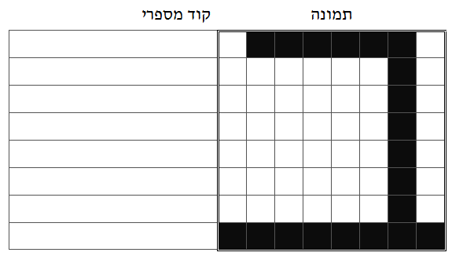
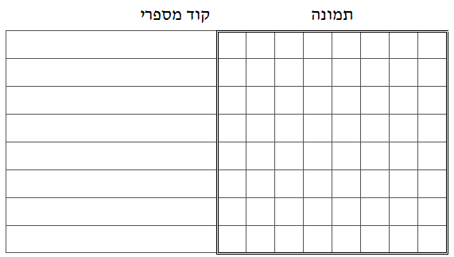

```
parent_lesson: image-processing
order: 2
layout: appendix
```

#דף פעילות 1

##א) מלאו את הקוד המספרי שמייצג את תמונת האות "ב" שבציור:

<div id="container" align="center">
  
</div>

##ב) ציירו תמונה של אות נוספת  (לא "ב" או "צ"), ומלאו את הקוד המספרי שמייצג אותה:

<div id="container" align="center">
  
</div>

##ג) כעת עשו אותו דבר עם אות נוספת:

<div id="container" align="center">
  
</div>