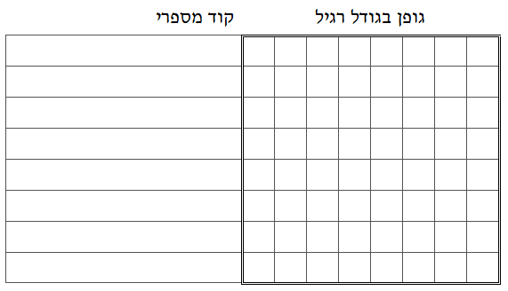
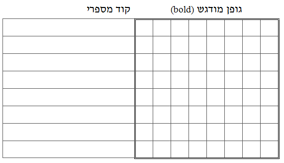
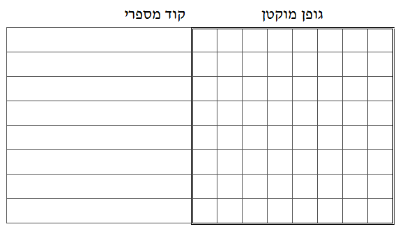

```
parent_lesson: image-processing
order: 4
layout: appendix
```

#דף פעילות 2
##בחר אות כלשהי (חוץ מ "ב" ו "צ"), ועצב עבורה את שלושת הגופנים הבאים:
<br/>
<br/>

<div id="container" align="center">
  
</div>

<br/>
  
<div id="container" align="center">
  
</div>

<br/>

<div id="container" align="center">
  
</div>