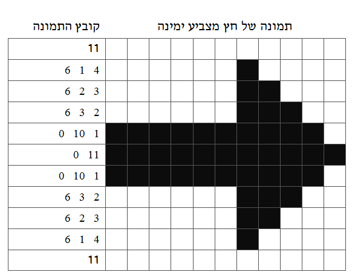
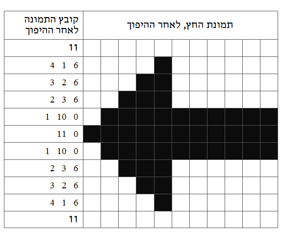

```
parent_lesson: image-processing
order: 10
layout: appendix
```

#דף 5-א: פתרון דף פעילות 5

<br/>

<div id="container" align="center">
  
</div>

<br/>
###כדי להפוך את החץ מימין לשמאל, הפוך את סדר המספרים בכל שורה, וכתוב את התוצאה בטור השמאלי של הטבלה למטה. כעת צייר את התמונה שהקוד החדש מייצג. מה קיבלת?
  
<div id="container" align="center">
  
</div>

<br/>
