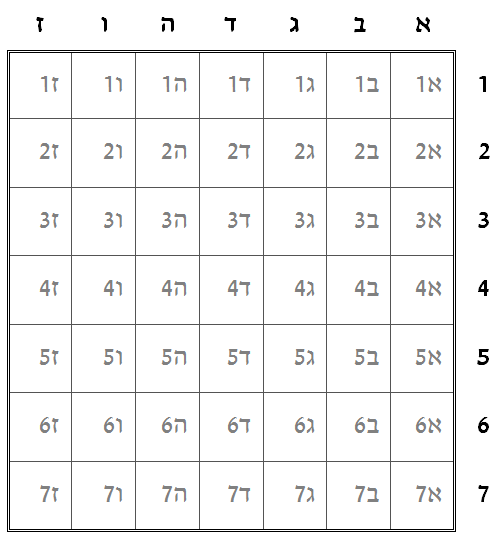

```
parent_lesson: search-algorithms
order: 2
layout: appendix
```

#דף פעילות 2#

##ציד צוללות: חיפוש יעיל##
חוקי המשחק כמו במשחק הקודם, בהבדל אחד: במקום להכריז על שם משבצת, בכל ניחוש מכריזים על טור (למשל "ג") **או** על שורה (למשל "4"). אם הצוללת נמצאת מימין לטור, היריב עונה "מימין"; אם משמאל לטור, עונים "משמאל". אם הצוללת נמצאת מעל השורה, עונים "מעל", ואם היא נמצאת מתחת לשורה, "מתחת". שימו לב: בכל ניחוש מכריזים או על טור, או על שורה, אבל לא על שניהם.

###הזירה שלי###
סמן את המשבצת בה אתה בוחר למקם את הצוללת שלך.
היריב צריך לגלות את המשבצת הזאת בסדרת ניחושים.

<div id="container" align="center">
  
</div>


###זירת היריב###
**המשימה**: לגלות באיזה משבצת היריב מיקם את הצוללת שלו.

המשימה: לגלות באיזה משבצת היריב מיקם את הצוללת שלו.

בכל ניחוש מכריזים על טור (אות) או שורה (מספר), והיריב עונה "מימין", "משמאל", "מלמטה", או "מלמעלה".

אחרי כל ניחוש מסמנים ב X את **כל המשבצות**
בהן לא נמצאת הצוללת. 

<div id="container" align="center">
  
</div>
<br>
<br>
<br>
##מספר הניחושים במשחק (שווה למספר ה X- ים בטבלה): _______________##