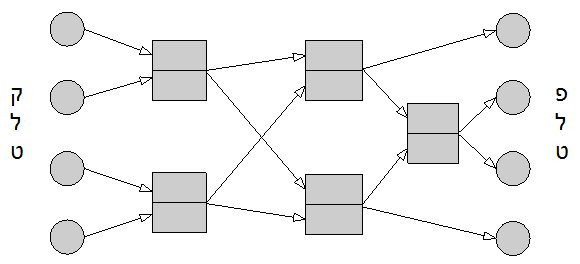

```
parent_lesson: sorting-networks
order: 1
layout: appendix
```

#דף פעילות 1#
שני עותקים זהים של רשת מיון לקלט בגודל 4.

בכל משימת מיון משתמשים בעותק אחד.  
או, אם עותק אחד נהייה יותר מדי מקושקש, אפשר להשתמש בשני.

<br>
<br>

<div id="container" align="center">
  
</div>
<br>
<br>
<br>
<div id="container" align="center">
  
</div>
<br>
<br>
<br>